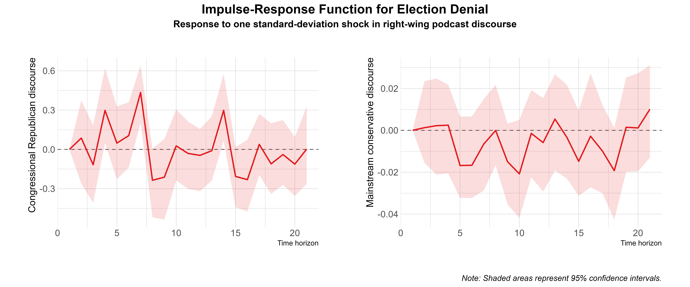

## PS 210 Introduction to Empirical Methods in Political Science

[Syllabus](https://jnseawright.github.io/ps210/syllabus.html)

### Class Materials

* [Tuesday, Sept. 16: Asking Social Science Questions](https://jnseawright.github.io/ps210/Slides/AskingQuestions.html#1)
* [Thursday, Sept. 18: Data](https://jnseawright.github.io/ps210/Slides/Data.html#1)
* [Tuesday, Sept. 23: Causation](https://jnseawright.github.io/ps210/Slides/Causation.html#1)
    NOTE: In place of attending class in person on Sept. 23, please read carefully, review the slides, watch the video at the following link, and contact Prof. Seawright and/or your TA with any relevant follow-up comments or questions! [https://northwestern.zoom.us/rec/share/Q3kWcjscgQ3fimzNfRoWnOa3rOKADBBlKiyGO8ZFH1nSRsaultN4gTRdPRs4LaKU.Q-qeQC3Cr8yDNS89](https://northwestern.zoom.us/rec/share/Q3kWcjscgQ3fimzNfRoWnOa3rOKADBBlKiyGO8ZFH1nSRsaultN4gTRdPRs4LaKU.Q-qeQC3Cr8yDNS89)
* Thursday, Sept. 25: Causal Inference in Action. Please read the article listed in the syllabus for this day before our class meeting: Morral, Andrew R., and Rosanna Smart. "Concealed Carry Laws and Violence in America." Annual Review of Criminology 9 (2025). [https://doi.org/10.1146/annurev-criminol-032924-013352](https://doi.org/10.1146/annurev-criminol-032924-013352).
* [Tuesday, Sept. 30: Experiments](https://jnseawright.github.io/ps210/Slides/Experiments.html#1)
* Thursday, Oct. 2: On your own or in a group of up to four, read the following two experiments:
    [https://doi.org/10.1016/j.vaccine.2021.03.080](https://doi.org/10.1016/j.vaccine.2021.03.080)
    [https://doi.org/10.1111/1475-6765.12334](https://doi.org/10.1111/1475-6765.12334)
  For a research question in the social sciences that interests you, suggest a design for an experiment that could be done as an honors thesis project. (You don't have to actually intend to do it, etc., but it has to be the kind of thing that could hypothetically be done.) Explain why you find the topic interesting and how your design helps answer your question. Evaluate the strengths and weaknesses of your design in comparison with the example experiments linked above. Please email your responses to the activity (which shouldn't be more than a couple of pages double-spaced) to Professor Seawright!
* [Tuesday, Oct. 7: Sampling and Survey Research](https://jnseawright.github.io/ps210/Slides/Surveys.html#1)
* [Thursday, Oct. 9: Confidence Intervals and Significance Tests](https://jnseawright.github.io/ps210/Slides/ConfidenceIntervals.html#1)
* [Tuesday, Oct. 14: Correlation and Regression](https://jnseawright.github.io/ps210/Slides/Regression.html#1)
  
### [Data](https://github.com/jnseawright/ps210/tree/main/Data)

### [PDF Versions of Class Slides](https://github.com/jnseawright/ps210/tree/main/Slides/PDFs/)

### Other Resources

* [Textbook: Jean Clipperton et al. 2022, Empirical Methods in Political Science: An Introduction](https://nulib-oer.github.io/empirical-methods-polisci/)
* Jaye Seawright: Office 316 Scott Hall, 3-5pm Tuesdays, email j-seawright@northwestern.edu

### Homework Assignments

* [First Homework, Due Oct. 9](https://jnseawright.github.io/ps210/Homework/hw1.html)

