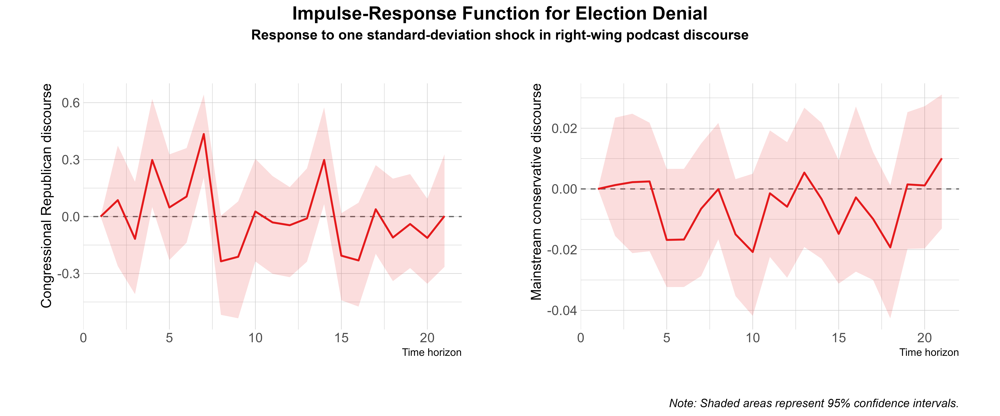

## PS 210 Introduction to Empirical Methods in Political Science

[Syllabus](https://jnseawright.github.io/ps210/syllabus.html)

### Midterm

* Tuesday, Nov. 3: Midterm exam (in class). Covers all material from Sept. 24 through Oct. 27. *(Study guide to be posted closer to the exam.)*

### Final

* Friday, Dec. 11: In-class final exam, 12:00–2:00 PM (open notes, closed devices). *(Study guide to be posted closer to the exam.)*

### Class Materials

* [Thursday, Sept. 24: Asking Social Science Questions](https://jnseawright.github.io/ps210/Slides/AskingQuestions.html#1)
* [Tuesday, Sept. 29: Data](https://jnseawright.github.io/ps210/Slides/Data.html#1)
* [Thursday, Oct. 1: Causation](https://jnseawright.github.io/ps210/Slides/Causation.html#1). Here is a set of [resources we will use in class discussion](https://jnseawright.github.io/ps210/Slides/CausationResources.html)
* [Tuesday, Oct. 6: Statistical Computing Lab I](https://jnseawright.github.io/ps210/Slides/StatisticalComputingLabSession1.html#1): Introduction to R for descriptive statistics and visualization. *(Hands-on lab; bring laptop with R & RStudio installed.)* [Practice exercises](https://jnseawright.github.io/ps210/Slides/Lab1Practice.html#1)
* Thursday, Oct. 8: Causal Inference in Action. Please read the article listed in the syllabus for this day before our class meeting: Morral, Andrew R., and Rosanna Smart. "Concealed Carry Laws and Violence in America." *Annual Review of Criminology* 9 (2026). [https://doi.org/10.1146/annurev-criminol-032924-013352](https://doi.org/10.1146/annurev-criminol-032924-013352). [Class slides](https://jnseawright.github.io/ps210/Slides/CausalInferenceInAction.html#1). **Due: First Homework.**
* [Tuesday, Oct. 13: Experiments](https://jnseawright.github.io/ps210/Slides/Experiments.html#1)
* [Thursday, Oct. 15: Applied Experiments](https://jnseawright.github.io/ps210/Slides/AppliedExperiments.html#1). On your own or in a group of up to four, read the following two experiments:
    [https://doi.org/10.1016/j.vaccine.2021.03.080](https://doi.org/10.1016/j.vaccine.2021.03.080)
    [https://doi.org/10.1111/1475-6765.12334](https://doi.org/10.1111/1475-6765.12334)
  For a research question in the social sciences that interests you, suggest a design for an experiment that could be done as an honors thesis project. (You don't have to actually intend to do it, etc., but it has to be the kind of thing that could hypothetically be done.) Explain why you find the topic interesting and how your design helps answer your question. Evaluate the strengths and weaknesses of your design in comparison with the example experiments linked above. Please email your responses to the activity (which shouldn't be more than a couple of pages double-spaced) to Professor Seawright!
* [Tuesday, Oct. 20: Sampling and Survey Research](https://jnseawright.github.io/ps210/Slides/Surveys.html#1)
* [Thursday, Oct. 22: Foundations of Statistical Inference and Bivariate Regression](https://jnseawright.github.io/ps210/Slides/FoundationsofInference.html#1) (confidence intervals, significance tests, correlation, bivariate regression)
* [Tuesday, Oct. 27: Multivariate Regression (conceptual)](https://jnseawright.github.io/ps210/Slides/MultivariateRegression.html#1)
* [Thursday, Oct. 29: Midterm Review](https://jnseawright.github.io/ps210/Slides/MidtermReview.html#1)
* Tuesday, Nov. 3: **Midterm exam** (in class). Covers all material from Sept. 24 through Oct. 27.
* [Thursday, Nov. 5: Statistical Computing Lab II](https://jnseawright.github.io/ps210/Slides/StatisticalComputingLabSession2.html#1): Introduction to R for basic regression. *(Hands-on lab.)* [Practice exercises](https://jnseawright.github.io/ps210/Slides/Lab2Practice.html#1)
* [Tuesday, Nov. 10: Machine Learning Concepts (Lecture & Demo)](https://jnseawright.github.io/ps210/Slides/MachineLearning.html#1). **Due: Second Homework.**
* [Thursday, Nov. 12: The Qualitative Comparative Method](https://jnseawright.github.io/ps210/Slides/qualitative.html#1)
* [Tuesday, Nov. 17: Applied Qualitative Methods](https://jnseawright.github.io/ps210/Slides/qualitativeexamples.html#1). *Readings:* Gibson, Edward L. "Boundary Control: Subnational Authoritarianism in Democratic Countries." *World Politics* 58, no. 1 (2005): 101–132. [https://doi.org/10.1353/wp.2006.0018](https://doi.org/10.1353/wp.2006.0018). Thurston, Chloe N. "Policy Feedback in the Public–Private Welfare State: Advocacy Groups and Access to Government Homeownership Programs, 1934–1954." *Studies in American Political Development* 29, no. 2 (2015): 250–267. Gerzso, Thalia. "Judicial Resistance During Electoral Disputes: Evidence from Kenya." *Electoral Studies* 85 (2023). [https://doi.org/10.1016/j.electstud.2023.102653](https://doi.org/10.1016/j.electstud.2023.102653).
* [Thursday, Nov. 19: Applied Text Methods, LLMs, and AI in Social Science](https://jnseawright.github.io/ps210/Slides/TextasData.html#1). *Reading:* Rossiter, Erin L. "Measuring Agenda Setting in Interactive Political Communication." *American Journal of Political Science* 66 (April 2022): 337–51.
* [Tuesday, Nov. 24: Ethics and Normative Concerns in Political Science](https://jnseawright.github.io/ps210/Slides/ethics.html#1). *Readings:* American Political Science Association (2020), *A Guide to Professional Ethics in Political Science* (3rd ed.), Chs. 1–2; Soss, Joe, et al. "The Illusion of Technique: How Method-Driven Research Leads Welfare Scholarship Astray." *Social Science Quarterly* 87 (Dec. 2006): 798–807 (reflection prompt on final exam). *Recommended:* Lupia, Arthur, and Colin Elman. "Openness in Political Science: Data Access and Research Transparency." *PS: Political Science & Politics* 47 (Jan. 2014): 19–42. **Third Homework due Wednesday, Nov. 25.**
* **No class:** Thursday, Nov. 26 (Thanksgiving break). WCAS Reading Period Nov. 27–Dec. 4 (no classes).

### [Data](https://github.com/jnseawright/ps210/tree/main/Data)

### [PDF Versions of Class Slides](https://github.com/jnseawright/ps210/tree/main/Slides/PDFs/)

### Other Resources

* [Textbook: Jean Clipperton et al. 2022, Empirical Methods in Political Science: An Introduction](https://nulib-oer.github.io/empirical-methods-polisci/)
* Jaye Seawright: Office 312 Scott Hall, 3-5pm Mondays, email j-seawright@northwestern.edu
* [Practice Final](https://jnseawright.github.io/ps210/Homework/Practice-Final.html)
* [Practice Final Rubric](https://jnseawright.github.io/ps210/Homework/practice-final-rubric.html)

### Homework Assignments

* [First Homework, Due Oct. 8](https://jnseawright.github.io/ps210/Homework/hw1.html)
* [Second Homework, Due Nov. 10](https://jnseawright.github.io/ps210/Homework/hw2.html)
* [Third Homework, Due Nov. 25](https://jnseawright.github.io/ps210/Homework/hw3.html)
