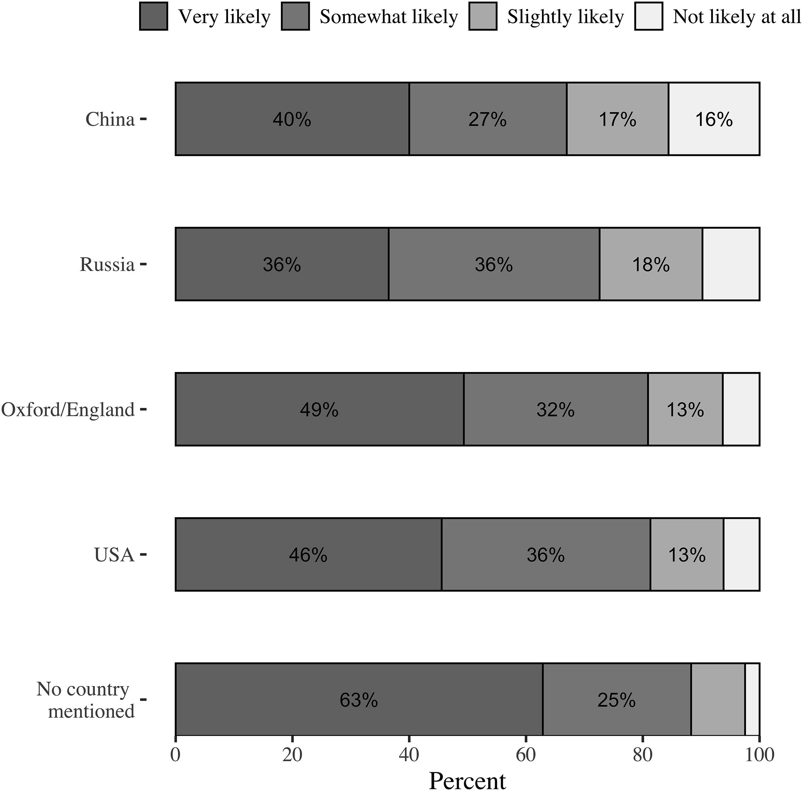
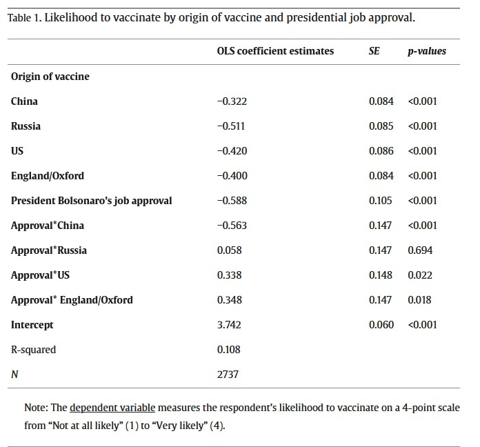

class: center, middle

```{css, echo=FALSE}
pre {
  max-height: 400px;
  overflow-y: auto;
}
pre[class] {
  max-height: 200px;
}
```

```{r, load_refs, include=FALSE, cache=FALSE}
library(RefManageR)
library(ggplot2)
library(dplyr)
library(knitr)
BibOptions(check.entries = FALSE, bib.style = "authoryear", max.names = 3, sorting = "nyt", cite.style = "authoryear", style = "markdown", hyperlink = FALSE, dashed = FALSE)
knitr::opts_chunk$set(warning = FALSE, message = FALSE)
```

```{r xaringan-themer, include=FALSE, warning=FALSE}
library(xaringanthemer, MnSymbol)
style_mono_accent(
  base_color = "#1c5253",
  header_font_google = google_font("Josefin Sans"),
  text_font_google   = google_font("Montserrat", "300", "300i"),
  code_font_google   = google_font("Fira Mono"),
  text_font_size = "1.6rem"
)
```

### Today's Goals

By the end of this session, you should be able to:

1. Evaluate the internal and external validity of a real survey experiment
2. Interpret heterogeneous treatment effects and explain why average effects can be misleading
3. Distinguish persuasion and mobilization as outcomes and explain why a treatment might affect them differently
4. Apply the experimental design checklist to critique a study's strengths and limitations
5. Propose an original experimental design for a political science question

---
### Today: Two real experiments

We'll see how experiments work in practice – and what we can learn from them about causal inference.

1. **Gramacho & Turgeon (2021)** – Does mentioning a vaccine's country of origin affect Brazilians' willingness to get vaccinated against COVID‑19?
2. **Bos et al. (2020)** – Do populist messages (blaming elites or immigrants) affect people's agreement with policy claims and their willingness to take political action?

---

### Study 1: Gramacho & Turgeon (2021)

**Research question:** Does the country of origin of a COVID‑19 vaccine affect vaccination acceptance in Brazil?

**Why this matters:** Brazil's president, Jair Bolsonaro, had publicly criticized China and the Chinese‑developed vaccine. He also downplayed the pandemic. This created a politically charged environment around vaccination.

---

### Experimental design

- **Online survey experiment**, national sample of 2,771 Brazilian adults (Sept‑Oct 2020).
- **Random assignment** to 5 groups:
  - **Control:** Asked about likelihood to vaccinate – no country mentioned.
  - **4 treatment groups:** Same question, but with vaccine origin specified: China, Russia, US, or England (Oxford).
- **Outcome:** Likelihood to vaccinate (4‑point scale: not likely at all to very likely).

---
```{r, echo = FALSE, out.width="90%", fig.retina = 1, fig.align='center', fig.alt="Gramacho & Turgeon Figure 1: stacked bar chart of vaccination likelihood by vaccine country of origin. No country mentioned: 63% very likely, 25% somewhat likely. Oxford/England: 49% very likely. USA: 46% very likely. Russia: 36% very likely, 36% somewhat likely. China: 40% very likely, 27% somewhat likely — the lowest combined likelihood to vaccinate. Naming any country substantially reduces vaccination acceptance compared to the no-country control."}

```

---

### Key results (Fig. 1)

- **Control:** 88.3% very or somewhat likely to vaccinate.
- **When a country is mentioned**, likelihood drops – especially for China (67.0%) and Russia (72.6%).
- Drops of 21.3 and 15.7 percentage points, both statistically significant.

---
```{r, echo = FALSE, out.width="90%", fig.retina = 1, fig.align='center', fig.alt="Gramacho & Turgeon Table 1: OLS regression of vaccination likelihood (4-point scale) on vaccine origin and Bolsonaro approval (N=2,737). All country treatments have significant negative main effects (China −0.32, Russia −0.51, US −0.42, England −0.40). Bolsonaro approval alone is also negative (−0.59). The China×Approval interaction is large and negative (−0.56, p<0.001), meaning Bolsonaro supporters are especially resistant to a Chinese vaccine. The US×Approval and England×Approval interactions are positive, meaning Bolsonaro supporters are less resistant to Western vaccines. R-squared = 0.108."}

```

---

### Political moderation (Table 1)

They also measured **approval of President Bolsonaro** (0‑1 scale).

- Among **control** respondents, higher Bolsonaro approval → lower likelihood to vaccinate ( –0.6 on 4‑point scale).
- But the drop is **much larger** for the **China treatment** (interaction coefficient –0.56).
- For the **US and England** treatments, the interaction is positive (Bolsonaro supporters actually less resistant? Actually positive coefficient means smaller drop).

**Takeaway:** The effect of country‑of‑origin information depends on political preferences. This is **heterogeneous treatment effect**.

---

### What makes this a good experiment?

| Strength | Explanation |
|----------|-------------|
| **Random assignment** | Groups balanced on observables and unobservables. |
| **Clear treatment** | Information about origin – simple manipulation. |
| **Measurable outcome** | Likelihood to vaccinate (4‑point scale). |
| **Relevant context** | Politicized environment makes the test meaningful. |

**Limitations:** Intention vs. actual behavior; online sample (Internet users are wealthier/more educated); one country.

---

### Study 2: Bos et al. (2020)

**Research question:** Do populist messages that blame elites or immigrants affect people's **agreement** with policy claims and their **willingness to take political action**?

**Context:** 15 countries, N = 7,286. Online experiment with a news article about declining purchasing power.

---

### Experimental design (2 × 2 + control)

| Condition | In‑group (the people) | Out‑group blamed |
|-----------|----------------------|------------------|
| Control | Not mentioned | None (factual only) |
| Anti‑elitist | Victimized | Political elites |
| Anti‑immigrant | Victimized | Immigrants |
| Combined (right‑wing populist) | Victimized | Both elites and immigrants |

**Outcomes:** 
- **Persuasion** (agreement that economy is declining and policy change is needed)
- **Mobilisation** (willingness to share the article, talk to a friend, sign a petition)

---

### Main findings (Bos et al.)

| Frame | Effect on persuasion | Effect on mobilisation |
|-------|----------------------|------------------------|
| Anti‑elitist | **Positive (+0.08)** | Not significant on average |
| Anti‑immigrant | **Negative (–0.12)** | **Negative (–0.23)** |
| Combined | Not significant | Not significant |

**But** – the anti‑elitist frame **mobilized** people with **high relative deprivation** (felt left out).  
The anti‑immigrant frame **demobilized** most, but not the highly deprived.

---

### What makes this a good experiment?

| Strength | Explanation |
|----------|-------------|
| **Random assignment** | Participants randomly assigned to 4 conditions + control, ensuring balance. |
| **Factorial design** | 2 × 2 design isolates effects of anti‑elite vs. anti‑immigrant cues and their interaction. |
| **Large, diverse sample** | 15 countries, N > 7,000 – increases external validity (though still online panels). |
| **Clear outcomes** | Persuasion (issue agreement) and mobilisation (behavioral intentions) measured on reliable scales. |
| **Heterogeneity testing** | Shows that effects differ by relative deprivation – a key conditional effect. |
| **Manipulation checks** | Confirmed that participants perceived the manipulations as intended. |
| **Replication across countries** | Pooled analysis with country fixed effects; individual country results mostly consistent. |

---

### Limitations

| Limitation | Explanation |
|------------|-------------|
| **Artificial, one‑shot stimulus** | A single news article may not reflect real‑world exposure to multiple populist messages over time. |
| **Online convenience sample** | Not fully representative; participants may be more politically engaged. |
| **Intentions vs. behavior** | Mobilisation measured as willingness to share, talk, sign – not actual actions. |
| **Negative findings on anti‑immigrant frame** | Could be context‑specific (Europe, 2017) or due to social desirability bias (reluctance to admit agreement). |
| **Short‑term effects** | No measure of long‑term persistence of persuasion or mobilisation. |
| **No pre‑test of dependent variable** | Between‑subjects design avoids priming but cannot track individual change. |

---

### What do these two experiments teach us together?

- **Gramacho & Turgeon** shows that information can backfire when it activates political animosity. The treatment effect is **heterogeneous** (depends on approval of Bolsonaro).
- **Bos et al.** shows that not all populist frames work; anti‑elite can persuade and (for some) mobilise, while anti‑immigrant can backfire. Effects also depend on individual vulnerability (relative deprivation).

**Key takeaway for your own experiments:** Always consider **heterogeneous treatment effects** – the average effect may hide important variation across subgroups.

---

### Group activity (next)

You will work in small groups to design an experiment for one of several political science questions.

- Choose a question.
- Identify treatment, control, outcome, sample, and design type (lab/field/survey).
- Evaluate strengths and weaknesses.

**Instructions on the next slide.**

---

### Group activity: Design an experiment

**Your task (15 minutes):**

1. Choose **one** research question from the list (next slide).
2. Propose an experiment to answer it. Include:
   - Treatment (what you manipulate)
   - Control condition
   - Outcome variable (how you measure it)
   - Sample (who are the subjects?)
   - Type: lab, field, or survey experiment?
3. Identify **one strength** and **one weakness** of your design (internal/external validity).
4. Be ready to share with the class.

---

### Research questions (choose one)

1. Does exposure to news about political violence increase support for authoritarian leaders?
2. Does obviously-AI news make people cynical about public life?
3. Does reminding voters of their past turnout increase the likelihood they will vote in an upcoming election?
4. Do negative political advertisements demobilize young voters more than older voters?
5. Does living in a diverse neighborhood reduce implicit racial bias?
6. Do fact‑check labels on social media reduce, increase, or not affect belief in false political claims?

---

### Bonus: What would you add to your design?

- Manipulation check (did the treatment work?)
- Attention filter (were people paying attention?)
- Pre‑treatment measure of the outcome (to increase precision)
- Subgroup analysis (age, partisanship, education)

---

### Next class: Sampling and survey research

We'll learn how to draw representative samples – and why it's harder than it sounds.
