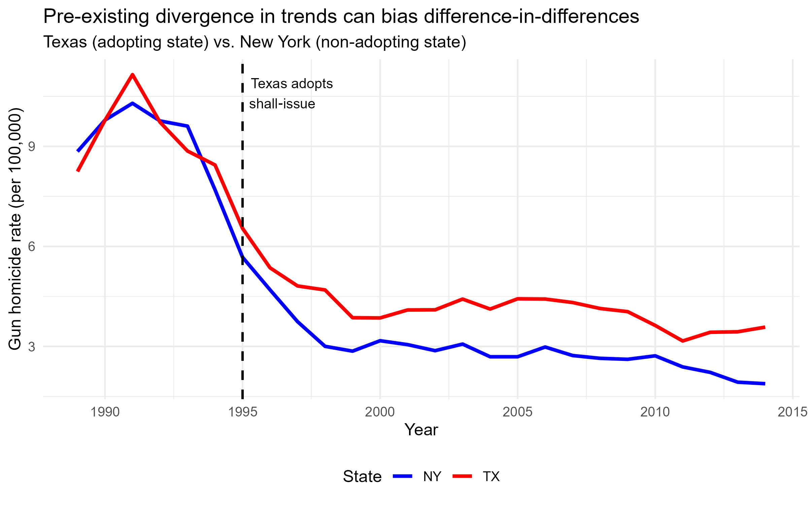
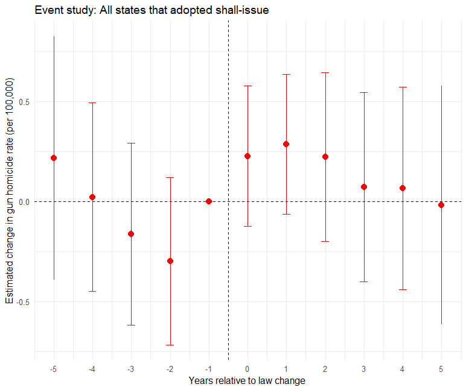
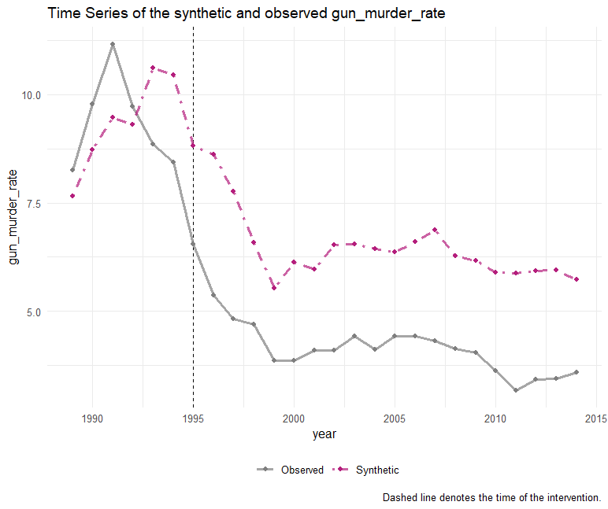

class: center, middle

```{css, echo=FALSE}
pre {
  max-height: 400px;
  overflow-y: auto;
}
pre[class] {
  max-height: 200px;
}
```

```{r, load_refs, include=FALSE, cache=FALSE}
library(RefManageR)
library(ggplot2)
library(dplyr)
library(knitr)
BibOptions(check.entries = FALSE, bib.style = "authoryear", max.names = 3, sorting = "nyt", cite.style = "authoryear", style = "markdown", hyperlink = FALSE, dashed = FALSE)
knitr::opts_chunk$set(warning = FALSE, message = FALSE)
```

```{r xaringan-themer, include=FALSE, warning=FALSE}
library(xaringanthemer, MnSymbol)
style_mono_accent(
  base_color = "#1c5253",
  header_font_google = google_font("Josefin Sans"),
  text_font_google   = google_font("Montserrat", "300", "300i"),
  code_font_google   = google_font("Fira Mono"),
  text_font_size = "1.6rem"
)
```

### Today's Goals

By the end of this session, you should be able to:

1. Explain why simple cross-sectional comparisons fail to establish causal effects of gun laws
2. State the parallel trends assumption and explain what happens when it is violated
3. Interpret an event study plot and explain what pre-trend coefficients tell us
4. Explain the logic of synthetic control as a counterfactual strategy
5. Describe how the evidence on shall-issue laws changed as methods improved

---
### Today: Do gun laws actually reduce violence?

Let's start with what many people believe.

---

### 1. The intuitive belief

> "Gun control probably helps reduce violent crime."

It feels obvious: fewer guns → fewer shootings.

But is that actually true? Or is it just something we tell each other to feel like there is something we *could* do?

---

### 2. How would we actually know?

What real‑world information would convince us that gun control does (or does not) help?

We need to compare:

- **Places with gun control** vs. **places without**
- **Times before a law changed** vs. **times after**

But each comparison has pitfalls. Let's think through them.

---

### 3. First obvious thought

> Compare places with gun control to places without.

**Example:** Compare states with restrictive concealed carry laws (e.g., California, New York) to states with permissive laws (e.g., Texas, Florida).

**What might go wrong?**

---

### Problems with simple cross‑sectional comparisons

| Problem | Explanation |
|---------|-------------|
| **Confounding** | High‑crime states might adopt *more* gun control *because* of crime. Or low‑crime states might feel safe enough to loosen laws. |
| **Reverse causation** | Does gun control reduce crime, or does crime cause gun control? |
| **Omitted variables** | States differ in policing, poverty, demographics, culture. |
| **Selection bias** | States that adopt laws are not randomly assigned. |

**Conclusion:** Simple comparisons won't convince a skeptic.

---

### 4. How can we improve our comparison?

> Compare **change over time** within places that impose gun control to **change over time** within places that stay the same.

**Difference‑in‑differences intuition:**

- Look at states that changed their concealed carry laws.
- Compare crime *before* vs. *after* the change.
- Also compare to states that *didn't* change (to control for nationwide trends).

This is exactly what the most famous study in this literature did.

---

### Enter Lott & Mustard (1996)

**Lott, John R., Jr., and David B. Mustard. "Crime, Deterrence, and Right‑to‑Carry Concealed Handguns." *University of Chicago Law & Economics Working Paper No. 41* (1996).**

- Used county‑level data (1977–1992) across the U.S.
- Compared states that adopted "shall‑issue" laws to states that didn't.
- Controlled for county fixed effects, year fixed effects, arrest rates, demographics, income.

**Their finding:** Shall‑issue laws dramatically reduced violent crime (murder ↓8.5%, rape ↓5%, aggravated assault ↓7%).

---

### Their estimated effects

If all states without shall‑issue laws had adopted them in 1992:

- 1,570 fewer murders
- 4,177 fewer rapes
- Over 60,000 fewer aggravated assaults

**Net benefit:** Over $6 billion annually (1992 dollars).

This was huge news. It shaped policy debates for decades.

---

### 5. Is this the final answer?

Probably not. Let's brainstorm: **What further issues might we worry about?**

(Pause for class discussion)

---

### Potential concerns (class brainstorm examples)

- **Measurement:** Are crime reports accurate? Do police report differently after law changes?
- **External validity:** Does the effect vary by place? (Urban vs. rural?)
- **Mechanisms:** Did deterrence happen, or something else?
- **Data quality:** Lott & Mustard used county data – but were the laws consistently enforced across counties?
- **Replication:** Can other researchers get the same results with different methods?
- **Publication bias:** Do we only see studies that find big effects?

---
### So what's wrong with Lott & Mustard?

Later researchers pointed out a critical flaw:

**The "parallel trends" assumption**

Lott & Mustard assumed that, in the absence of a law change, crime trends in states that *did* pass shall‑issue laws would have been the same as crime trends in states that *did not*.

But what if crime was already rising faster in the states that later passed laws?

---

### A simple picture: Pre‑trends

Imagine two states: State A (later adopts shall‑issue) and State B (never adopts).

Before the law:

- State A's crime rate is already **increasing faster** than State B's.

If that trend continues after the law passes, a simple before‑after comparison would **mistakenly attribute** the continued increase to the law – even if the law had no effect.

---

```{r, echo=FALSE, out.width="80%", fig.align='center', fig.alt="Line chart titled 'Pre-existing divergence in trends can bias difference-in-differences': Texas (red) and New York (blue) gun homicide rates per 100,000, 1988–2015. Before Texas adopts shall-issue in 1995 (dashed vertical line), both states' rates are declining, but Texas's rate is higher and their pre-law trajectories are not parallel — illustrating how a violated parallel trends assumption would bias a DiD estimate."}

```

---

### Solution 1: Event study (test pre‑trends)

An **event study** plots the estimated effect of the law for each year before and after adoption, comparing states that adopt the law at different time periods, as well as those that never adopt.

- If the coefficients for years **before** the law are close to zero (and not statistically significant), that supports the parallel trends assumption.
- If coefficients for years **after** the law change, that suggests a causal effect.

**This is the most common way to test for pre‑trends.**

---

```{r, echo=FALSE, out.width="80%", fig.align='center', fig.alt="Event study plot titled 'Event study: All states that adopted shall-issue': estimated change in gun homicide rate (per 100,000) at years –5 through +5 relative to law adoption, with 95% confidence intervals. Pre-law coefficients (years –5 to –1) are scattered around zero, providing no clear evidence of pre-existing trends; post-law coefficients are also near zero or slightly positive but imprecisely estimated, consistent with little or no causal effect."}

```

---

### Solution 2: Synthetic control

What if no single state makes a good comparison?

**Synthetic control** creates a *weighted average* of multiple states that best matches the adopting state's **pre‑policy** crime trends and other characteristics.

The "synthetic" state becomes a custom‑made counterfactual.

**Intuition:** Instead of comparing Texas to one other state, compare Texas to a "Frankenstein" state made from parts of several states that together look like pre‑law Texas.

---

### Synthetic control visual

```{r, echo=FALSE, out.width="80%", fig.align='center', fig.alt="Time series titled 'Time Series of the synthetic and observed gun_murder_rate': observed Texas gun murder rate (gray solid line) vs. synthetic control (pink dashed line), 1988–2015. After Texas adopts shall-issue in 1995 (dashed vertical line), the observed rate drops sharply to around 3–5 per 100,000, while the synthetic rate remains higher at around 6–7, illustrating the synthetic control method's counterfactual logic."}

```

---

### Solution 3: Staggered DiD (handling different adoption times)

Lott & Mustard treated all law changes the same, even though states adopted shall‑issue laws in **different years** (Florida 1987, Georgia 1989, etc.).

**Problem:** Early adopters might be different from late adopters. Using states that already changed as controls for states that change later can bias estimates.

**Solution:** New DiD methods (Callaway & Sant'Anna, 2021; Goodman‑Bacon, 2021) properly compare only "clean" control groups – e.g., not yet treated states – and avoid using already‑treated states as controls.

---

### Why these improvements matter

Later studies using these tools found:

- **No pre‑trends** – acceptable.
- But the **post‑law effect** flipped sign: from large *decreases* (Lott & Mustard) to small *increases* (modern studies).

**Example:** Donohue et al. (2019) used synthetic control and found a 7% increase in violent crime after shall‑issue laws, not a decrease.

---

### Takeaway for causal inference

- **Simple before‑after** is rarely enough.
- **Parallel trends** is a strong assumption, but you can test it (event study).
- **Synthetic control** provides a customized counterfactual.
- **Staggered adoption** requires careful handling.
- Methods improve over time – and so can our conclusions.

Now let's see what Morral & Smart (2026) conclude after applying these modern tools.

---

### The Morral & Smart (2026) review

**Morral, Andrew R., and Rosanna Smart. "Concealed Carry Laws and Violence in America." *Annual Review of Criminology* 9 (2026).**

Systematic review of all rigorous studies since Lott & Mustard.

**Key findings:**

- No rigorous study since 2005 has found that shall‑issue laws *decrease* violent crime.
- Most high‑quality studies find *increases* in homicide (2–7%) and violent crime (∼7.5%).
- Effects are larger in urban areas.
- Mechanisms not fully understood, but gun theft and reduced police effectiveness are plausible.

---

### Why did later studies differ from Lott & Mustard?

| Issue | Lott & Mustard (1996) | Later studies |
|-------|----------------------|---------------|
| **Data period** | 1977–1992 | More years, more law changes |
| **Methods** | County fixed effects + OLS | Synthetic control, event study, staggered DiD |
| **Confounding** | Limited controls for time‑varying confounders | Better handling of pre‑trends |
| **Heterogeneity** | Assumed uniform effect | Found variation (e.g., urban vs. rural) |
| **Permitless carry** | Not yet existed | Now studied separately |

---

### What does the best evidence now say?

**Bottom line from Morral & Smart:**

> *"Permissive concealed carry laws do not deter crime. On average, they increase homicides and violent crime."*

But the effect is modest (2–7%), and there is still uncertainty about *why* and *for whom*.

---

### Discussion: What have we learned about causal inference?

- The **four questions** helped us structure the debate.
- **Simple comparisons** are rarely convincing.
- **Difference‑in‑differences** and **synthetic controls** are powerful tools, but they rely on strong assumptions.
- **Evidence evolves** – early studies can be overturned as methods and data improve.
- **Policy implications** depend on the magnitude of the effect, not just its sign.

---

### Next class: Experiments

We'll see how experiments solve the fundamental problem of causal inference – and why they aren't always possible.
