class: center, middle

```{css, echo=FALSE}
pre {
  max-height: 400px;
  overflow-y: auto;
}

pre[class] {
  max-height: 200px;
}
```

```{r, load_refs, include=FALSE, cache=FALSE}
# Initializes
library(RefManageR)

library(ggplot2)
library(dplyr)
library(readr)
library(nlme)
library(jtools)
library(hrbrthemes)
library(mice)
library(knitr)
library(DiagrammeR)

BibOptions(check.entries = FALSE,
           bib.style = "authoryear", # Bibliography style
           max.names = 3, # Max author names displayed in bibliography
           sorting = "nyt", #Name, year, title sorting
           cite.style = "authoryear", # citation style
           style = "markdown",
           hyperlink = FALSE,
           dashed = FALSE)

```
```{r xaringan-themer, include=FALSE, warning=FALSE}
library(xaringanthemer,MnSymbol)
style_mono_accent(
  base_color = "#1c5253",
  header_font_google = google_font("Josefin Sans"),
  text_font_google   = google_font("Montserrat", "300", "300i"),
  code_font_google   = google_font("Fira Mono"),
  text_font_size = "1.6rem"
)

```
### How do citizen attitudes affect the survival of democracy?

---
```{r, echo = FALSE, out.width="90%", fig.retina = 1, fig.align='center'}
include_graphics("images/Chiopris.png")
```

---

### Causation

```{r, echo=FALSE, out.width="80%", fig.retina = 1, fig.align='center'}
bivariate_graph <-
    create_graph() %>%
    add_node(label="Uncertainty") %>%
    add_node(label="Backsliding") %>%
    add_edge(from = 1, to = 2)

render_graph(bivariate_graph, layout="nicely")
```

---

### Reverse Causation

```{r, echo=FALSE, out.width="80%", fig.retina = 1, fig.align='center'}
reverse_graph <-
    create_graph() %>%
    add_node(label="Uncertainty") %>%
    add_node(label="Backsliding") %>%
    add_edge(from = 2, to = 1)

render_graph(reverse_graph, layout="nicely")
```
---

### Reciprocal Causation

```{r, echo=FALSE, out.width="80%", fig.retina = 1, fig.align='center'}
twoway_graph <-
    create_graph() %>%
    add_node(label="Uncertainty") %>%
    add_node(label="Backsliding") %>%
    add_edge(from = 1, to = 2) %>%
    add_edge(from = 2, to = 1)

render_graph(twoway_graph, layout="nicely")
```
---

### Confounding

```{r, echo=FALSE, out.width="80%", fig.retina = 1, fig.align='center'}
confounder_graph <-
    create_graph() %>%
    add_node(label="Uncertainty") %>%
    add_node(label="Backsliding") %>%
    add_node(label="Social Media") %>%
    add_edge(from = 1, to = 2) %>%
    add_edge(from = 3, to = 2) %>%
    add_edge(from = 3, to = 1)

render_graph(confounder_graph, layout="nicely")
```

---

### Post-Treatment

```{r, echo=FALSE, out.width="80%", fig.retina = 1, fig.align='center'}
posttreat_graph <-
    create_graph() %>%
    add_node(label="Uncertainty") %>%
    add_node(label="Backsliding") %>%
    add_node(label="Favorability") %>%
    add_edge(from = 1, to = 2) %>%
    add_edge(from = 3, to = 2) %>%
    add_edge(from = 1, to = 3)

render_graph(posttreat_graph, layout="nicely")
```

---

### Instrument

```{r, echo=FALSE, out.width="80%", fig.retina = 1, fig.align='center'}
instrument_graph <-
    create_graph() %>%
    add_node(label="Uncertainty") %>%
    add_node(label="Backsliding") %>%
    add_node(label="Country Size") %>%
    add_edge(from = 1, to = 2) %>%
    add_edge(from = 3, to = 1) 

render_graph(instrument_graph, layout="nicely")
```

---
### Fundamental Problem of Causal Inference

We can't usually tell by looking at data which of the graphs we just looked at reflects the real world, so we can't tell if we have a causal understanding or a distortion.

---
### Fundamental Problem of Causal Inference

There are some questions we can ask to reason about that help us pinpoint what we know, or don't yet know, about a causal relationship. 

---
### The Four Questions

1.  Is there a relationship between the treatment and the outcome?


---
```{r, echo = FALSE, out.width="90%", fig.retina = 1, fig.align='center'}
include_graphics("images/Chiopris2.png")
```


---
### The Four Questions

1.  Is there a relationship between the treatment and the outcome?

2.  Could the outcome cause the treatment?


---
```{r, echo = FALSE, out.width="90%", fig.retina = 1, fig.align='center'}
include_graphics("images/Chiopris3.png")
```


---
### The Four Questions

1.  Is there a relationship between the treatment and the outcome?

2.  Could the outcome cause the treatment?

3.  Is there evidence of a causal pathway from the treatment to the
    outcome?

---

In our study, not too much; there isn't that much data about how people translated views about the policy into decisions.

---
### The Four Questions

1.  Is there a relationship between the treatment and the outcome?

2.  Could the outcome cause the treatment?

3.  Is there evidence of a causal pathway from the treatment to the
    outcome?

4.  Have confounding variables been ruled out?

---
```{r, echo = FALSE, out.width="70%", fig.retina = 1, fig.align='center'}
include_graphics("images/Chiopris4.png")
```

---
### Controlling for Confounders

**Controlling for a confounder** is choosing a set of cases that all
have the same score on the confounding variable and looking at the
relationship between the treatment and the outcome in only those cases.


---
### Problems with Controlling for Confounders

-   You can only control for variables that you actually think of
    controlling for.

-   If you control for too many variables, you may not have very many
    cases left in each category.

---
### Do Mask Mandates Work?


---
```{r, echo = FALSE, out.width="90%", fig.retina = 1, fig.align='center'}
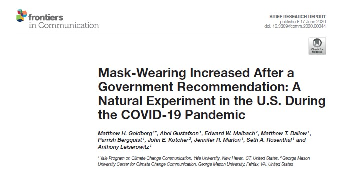
```

---
```{r, echo = FALSE, out.width="90%", fig.retina = 1, fig.align='center'}
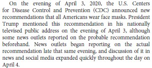
```

---
```{r, echo = FALSE, out.width="90%", fig.retina = 1, fig.align='center'}
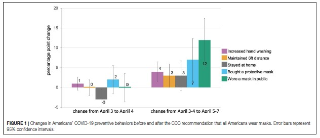
```


---
```{r, echo = FALSE, out.width="70%", fig.retina = 1, fig.align='center'}
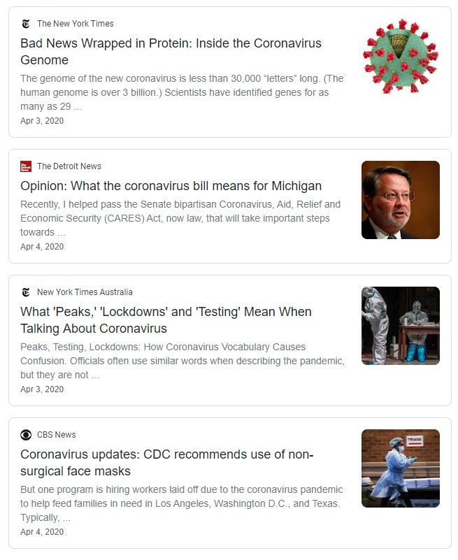
```

---
```{r, echo = FALSE, out.width="70%", fig.retina = 1, fig.align='center'}

```

---
```{r, echo = FALSE, out.width="90%", fig.retina = 1, fig.align='center'}
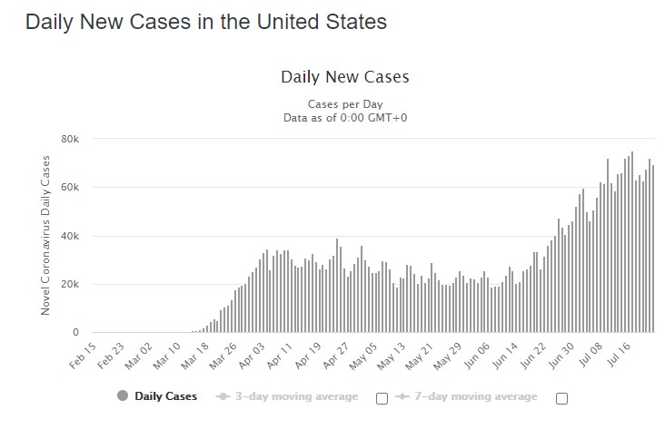
```

---
```{r, echo = FALSE, out.width="90%", fig.retina = 1, fig.align='center'}
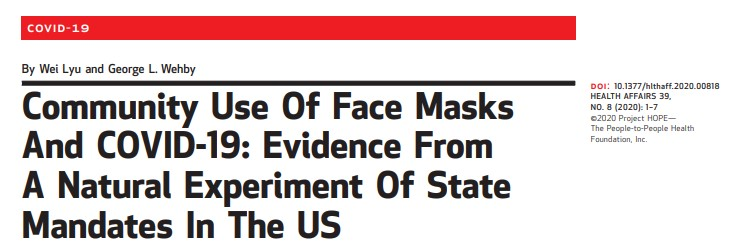
```

---
```{r, echo = FALSE, out.width="70%", fig.retina = 1, fig.align='center'}
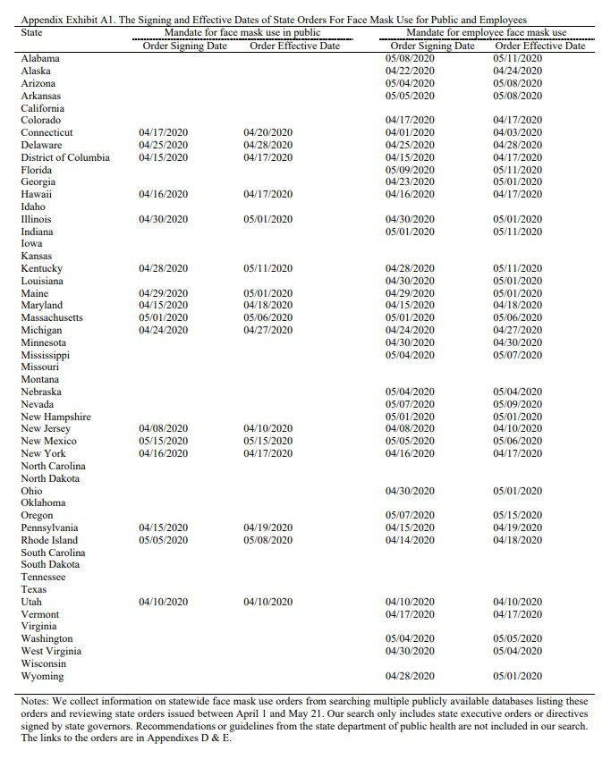
```

---
```{r, echo = FALSE, out.width="65%", fig.retina = 1, fig.align='center'}
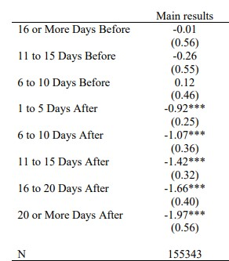
```

---
```{r, echo = FALSE, out.width="90%", fig.retina = 1, fig.align='center'}
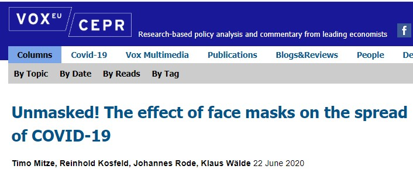
```

---
```{r, echo = FALSE, out.width="90%", fig.retina = 1, fig.align='center'}
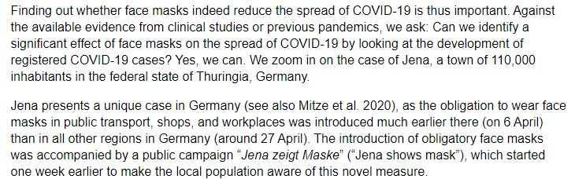
```

---
```{r, echo = FALSE, out.width="90%", fig.retina = 1, fig.align='center'}
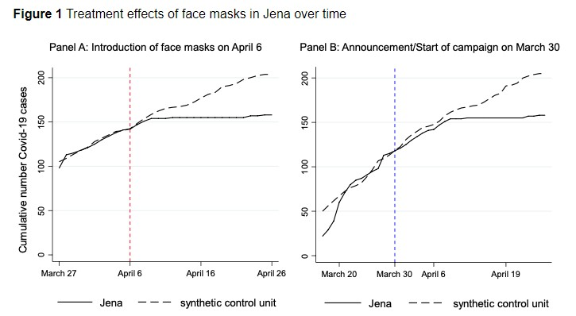
```

