class: center, middle

```{css, echo=FALSE}
pre {
  max-height: 400px;
  overflow-y: auto;
}

pre[class] {
  max-height: 200px;
}
```

```{r, load_refs, include=FALSE, cache=FALSE}
# Initializes
library(RefManageR)

library(ggplot2)
library(dplyr)
library(readr)
library(nlme)
library(jtools)
library(mice)
library(knitr)
library(DiagrammeR)

BibOptions(check.entries = FALSE,
           bib.style = "authoryear", # Bibliography style
           max.names = 3, # Max author names displayed in bibliography
           sorting = "nyt", #Name, year, title sorting
           cite.style = "authoryear", # citation style
           style = "markdown",
           hyperlink = FALSE,
           dashed = FALSE)

```
```{r xaringan-themer, include=FALSE, warning=FALSE}
library(xaringanthemer,MnSymbol)
style_mono_accent(
  base_color = "#1c5253",
  header_font_google = google_font("Josefin Sans"),
  text_font_google   = google_font("Montserrat", "300", "300i"),
  code_font_google   = google_font("Fira Mono"),
  text_font_size = "1.6rem"
)

```

---
### Today's Goals

By the end of this session, you should be able to:

1. Distinguish causation from correlation and explain the fundamental problem of causal inference
2. Apply the four causal inference questions to any empirical claim
3. Identify threats to causal inference: reverse causation, confounding, and post-treatment bias
4. Explain how laboratory experiments, natural experiments, and field experiments help establish causal claims
---

### How do citizen attitudes affect the survival of democracy?

---
```{r, echo = FALSE, out.width="90%", fig.retina = 1, fig.align='center', fig.alt="Chiopris, Nalepa & Vanberg: 'A Wolf in Sheep's Clothing: Citizen Uncertainty and Democratic Backsliding.' Abstract: citizens who support incumbents may inadvertently enable backsliding even if they oppose authoritarianism; a survey experiment in Poland supports the model."}
include_graphics("images/Chiopris.png")
```


---

### Causation

```{r, echo=FALSE, out.width="80%", fig.retina = 1, fig.align='center'}
bivariate_graph <-
    create_graph() %>%
    add_node(label="Uncertainty") %>%
    add_node(label="Backsliding") %>%
    add_edge(from = 1, to = 2)

render_graph(bivariate_graph, layout="nicely")
```

---

### Reverse Causation

```{r, echo=FALSE, out.width="80%", fig.retina = 1, fig.align='center'}
reverse_graph <-
    create_graph() %>%
    add_node(label="Uncertainty") %>%
    add_node(label="Backsliding") %>%
    add_edge(from = 2, to = 1)

render_graph(reverse_graph, layout="nicely")
```
---

### Reciprocal Causation

```{r, echo=FALSE, out.width="80%", fig.retina = 1, fig.align='center'}
twoway_graph <-
    create_graph() %>%
    add_node(label="Uncertainty") %>%
    add_node(label="Backsliding") %>%
    add_edge(from = 1, to = 2) %>%
    add_edge(from = 2, to = 1)

render_graph(twoway_graph, layout="nicely")
```
---

### Confounding

```{r, echo=FALSE, out.width="80%", fig.retina = 1, fig.align='center'}
confounder_graph <-
    create_graph() %>%
    add_node(label="Uncertainty") %>%
    add_node(label="Backsliding") %>%
    add_node(label="Social Media") %>%
    add_edge(from = 1, to = 2) %>%
    add_edge(from = 3, to = 2) %>%
    add_edge(from = 3, to = 1)

render_graph(confounder_graph, layout="nicely")
```

---

### Post-Treatment

```{r, echo=FALSE, out.width="80%", fig.retina = 1, fig.align='center'}
posttreat_graph <-
    create_graph() %>%
    add_node(label="Uncertainty") %>%
    add_node(label="Backsliding") %>%
    add_node(label="Favorability") %>%
    add_edge(from = 1, to = 2) %>%
    add_edge(from = 3, to = 2) %>%
    add_edge(from = 1, to = 3)

render_graph(posttreat_graph, layout="nicely")
```

---

### Instrument (More Advanced)

```{r, echo=FALSE, out.width="80%", fig.retina = 1, fig.align='center'}
instrument_graph <-
    create_graph() %>%
    add_node(label="Uncertainty") %>%
    add_node(label="Backsliding") %>%
    add_node(label="Country Size") %>%
    add_edge(from = 1, to = 2) %>%
    add_edge(from = 3, to = 1) 

render_graph(instrument_graph, layout="nicely")
```

---
### Fundamental Problem of Causal Inference

We can't usually tell by looking at data which of the graphs we just looked at reflects the real world, so we can't tell if we have a causal understanding or a distortion.

---
### Fundamental Problem of Causal Inference

There are some questions we can ask to reason about that help us pinpoint what we know, or don't yet know, about a causal relationship. 

---
### The Four Questions

1.  Is there a relationship between the treatment and the outcome?


---
```{r, echo = FALSE, out.width="90%", fig.retina = 1, fig.align='center', fig.alt="Chiopris et al. Figure 6: conditional average marginal component effect of an undemocratic reform proposal on punishment (vote against incumbent), by how undemocratic respondents perceived the reform to be (Low, Mid-Low, Mid-High, High). All estimates are negative, growing larger at higher perceived undemocratic assessment."}
include_graphics("images/Chiopris2.png")
```


---
### The Four Questions

1.  Is there a relationship between the treatment and the outcome?

2.  Could the outcome cause the treatment?


---
```{r, echo = FALSE, out.width="90%", fig.retina = 1, fig.align='center', fig.alt="Chiopris et al. Table 3: conjoint experiment vignette. Candidate A supports EU relations and expanded voting access; Candidate B supports Christian values, Polish sovereignty, and proposes extending parliamentary terms and postponing elections in emergencies — the undemocratic treatment."}
include_graphics("images/Chiopris3.png")
```


---
### The Four Questions

1.  Is there a relationship between the treatment and the outcome?

2.  Could the outcome cause the treatment?

3.  Is there evidence of a causal pathway from the treatment to the
    outcome?

---

In our study, not too much; there isn't that much data about how people translated views about the policy into decisions.

---

A different scholar with a different agenda might have tried to study the causal pathways in the Chiopris et al. article by, e.g,

* Interviewing policymakers about their decision-making regarding policies that (might have) helped undermine the rule of law
* Analyzing the text of legislative debates about proposed laws that might enable, prevent, or accelerate democratic backsliding
* Exploring the history of politics within one or a few districts where citizen support for incumbents changed, to see if that shift led to differences over time in locally-elected politicians' defense of democratic norms

---
### The Four Questions

1.  Is there a relationship between the treatment and the outcome?

2.  Could the outcome cause the treatment?

3.  Is there evidence of a causal pathway from the treatment to the
    outcome?

4.  Have confounding variables been ruled out?

---
```{r, echo = FALSE, out.width="70%", fig.retina = 1, fig.align='center', fig.alt="Chiopris et al. Table 5: covariate balance across treatment and control groups at Low, Mid-Low, Mid-High, and High levels of perceived undemocratic assessment. Variables include Democracy Index, age, education, gender, religiosity, and town size — groups are well-balanced, supporting causal identification."}
include_graphics("images/Chiopris4.png")
```

---
### Controlling for Confounders

**Controlling for a confounder** is choosing a set of cases that all
have the same score on the confounding variable and looking at the
relationship between the treatment and the outcome in only those cases.


---
### Problems with Controlling for Confounders

-   You can only control for variables that you actually think of
    controlling for.

-   If you control for too many variables, you may not have very many
    cases left in each category.

---
### Do Gender Quotas Elect More Women?

Many countries have adopted **gender quotas** to increase women's representation in legislatures — reserved seats, candidate quotas requiring parties to nominate a minimum share of women, or placement mandates determining list positions.

Do they work?

---
### The Descriptive Pattern

Women hold roughly **26%** of seats in national parliaments worldwide (IPU, 2024).

Countries with legislated gender quotas average meaningfully higher female representation than those without.

At first glance, the evidence looks compelling: quotas → more women elected.

---
### Let's ask the four questions

**Question 1: Is there a relationship?**

Yes. Across countries, places with quotas tend to have more women in office. Within countries, districts or councils with reserved seats reliably elect women to those seats.

This part of the causal case is on solid ground.

---

**Question 2: Could the outcome cause the treatment?**

Could having *more women in office* cause *quotas to be adopted*?

Plausibly yes — countries with stronger gender equality norms might both elect more women voluntarily *and* be more likely to pass quota legislation.

If so, the quota isn't doing the causal work; progressive culture is driving both variables.

---

**Question 3: Is there evidence of a causal pathway?**

The most obvious pathway: quotas put more women on ballots, so more win.

But a deeper question is *why* women aren't already running and winning without quotas. Two competing explanations:

- **Pipeline problem:** Not enough women are recruited or nominated as candidates
- **Voter discrimination:** Voters penalize women, so parties and women avoid running

Which mechanism is at work matters enormously for policy.

---

**Question 4: Have confounding variables been ruled out?**

This is the hard one. Countries that adopt quotas may differ from those that don't in:

- Cultural attitudes toward gender equality
- Economic development
- Legal and political institutions
- Existing female political participation

Any of these could explain both quota adoption and higher female representation, making cross-country comparisons unreliable.

---
### A Natural Experiment: Mumbai's Reserved Seats

```{r, echo = FALSE, out.width="90%", fig.retina = 1, fig.align='center', fig.alt="Bhavnani (2009), 'Do Electoral Quotas Work after They Are Withdrawn? Evidence from a Natural Experiment in India,' APSR 103(1). Abstract: using Mumbai's lottery-assigned seat reservations, women who won reserved seats were approximately five times more likely to win again after reservations were withdrawn."}
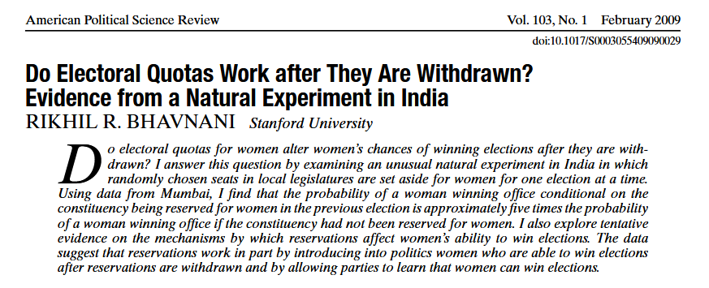
```

---

Mumbai city council seats were **randomly assigned** for reservation by lottery — one election at a time.

The key question: after reservations are *withdrawn*, do women still win?

---
### The Design

```{r, echo = FALSE, out.width="80%", fig.retina = 1, fig.align='center', fig.alt="Bhavnani Figure 1: 2x2 diagram of control and treatment groups. Treatment = Reserved in 1997, Open in 2002 (n=37); Control = Open in 1997, Open in 2002 (n=81). Wards reserved in both years (n=18) and newly reserved in 2002 (n=37) are excluded from the main analysis."}
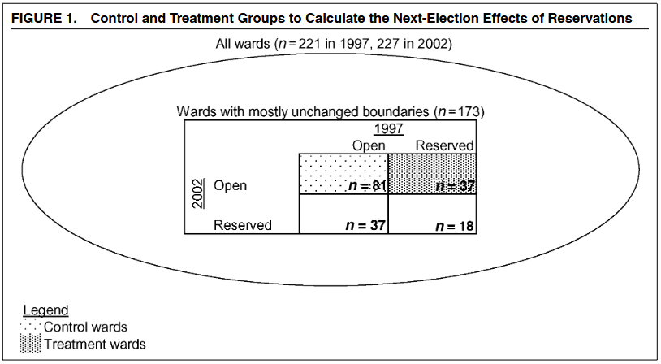
```

---

Treatment = **Reserved in 1997, Open in 2002** (n = 37)

Control = **Open in 1997, Open in 2002** (n = 81)

The lottery makes these groups equivalent before treatment — so any difference in 2002 is causal.

---
### Scale of the Reservations

```{r, echo = FALSE, out.width="85%", fig.retina = 1, fig.align='center', fig.alt="Bhavnani Table 1: constituency-wise reservations in Mumbai in 1997 and 2002. Of 221 total constituencies in 1997, 73 (33.9%) were reserved for women; of 227 in 2002, 76 (33.0%) were reserved for women. Reservations were randomly assigned within caste categories."}
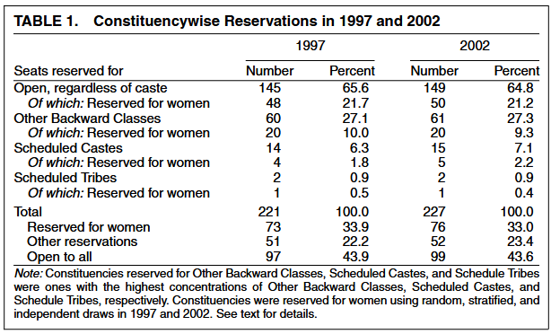
```

---
### The Results

```{r, echo = FALSE, out.width="90%", fig.retina = 1, fig.align='center', fig.alt="Bhavnani Table 3: next-election effects of 1997 reservations on 2002 outcomes. Treatment wards (reserved 1997, open 2002) vs. control wards (open both years): 21.6% vs 3.7% female winners (+17.9pp***); 73% vs 35.8% of wards with at least one female candidate (+37.2pp***). Sixteen outcome measures shown, most significantly favoring treatment."}
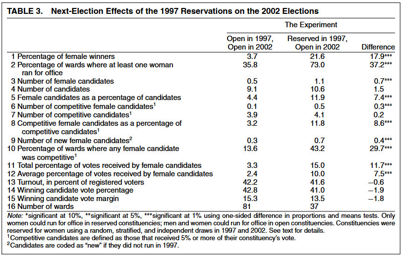
```

---

Row 1: **21.6% vs 3.7%** — women won in previously reserved wards at nearly six times the rate of never-reserved wards.

Row 2: **73% vs 35.8%** of previously reserved wards had at least one female candidate — the pipeline effect.

The quota introduced women into politics. After it was gone, they kept winning.

---
### What the Lottery Design Solves

Because reservation was assigned by lottery:

- **Question 2 (reverse causation):** Constituencies didn't earn reservations by already having strong female candidates. The treatment was assigned before the outcome.

- **Question 4 (confounding):** Reserved and non-reserved constituencies were identical on average before the lottery. Any difference in outcomes reflects the quota's causal effect.

The persistence of the effect after quotas are *withdrawn* suggests reservations change which women run — and teach parties that women can win.

---
### A Field Experiment on Electing Women

```{r, echo = FALSE, out.width="85%", fig.retina = 1, fig.align='center', fig.alt="Karpowitz, Monson & Preece (2017), 'How to Elect More Women: Gender and Candidate Success in a Field Experiment,' AJPS. Abstract: a field experiment in 1,842 Utah Republican caucus precincts tests supply (encourage women to run) and demand (encourage voters to support women) interventions; both supply and demand treatments increase women's election as delegates, especially combined."}
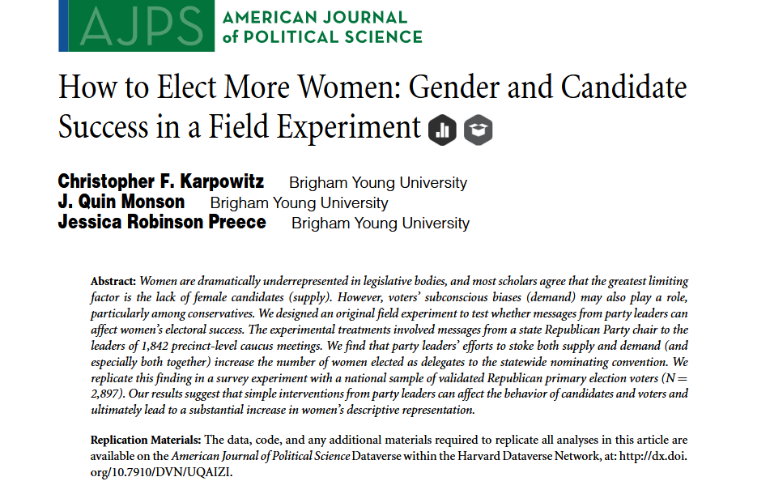
```

---

Karpowitz, Monson & Preece (2017) randomly assigned Utah Republican caucus precincts to one of four conditions:

- **Control:** no intervention
- **Supply:** messages encouraging women to run as delegates
- **Demand:** messages from party leaders encouraging voters to support female candidates
- **Supply + Demand:** both interventions combined

---

```{r, echo = FALSE, out.width="70%", fig.retina = 1, fig.align='center', fig.alt="Karpowitz et al. Figure 2: proportion of precincts electing at least one woman as state delegate by condition. Control ~38%, Supply ~44%, Demand ~44%, Supply+Demand ~46%. All treatment conditions are higher than control with overlapping 95% confidence intervals."}
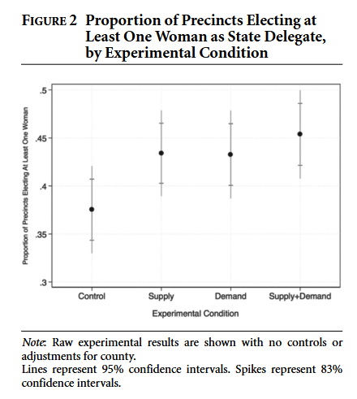
```

---

```{r, echo = FALSE, out.width="70%", fig.retina = 1, fig.align='center', fig.alt="Karpowitz et al. Figure 3: estimated proportion of state delegates who are women by condition. Control ~24%, Supply ~26%, Demand ~27%, Supply+Demand ~30%. The Supply+Demand condition shows the largest gain, with confidence intervals not overlapping the control."}
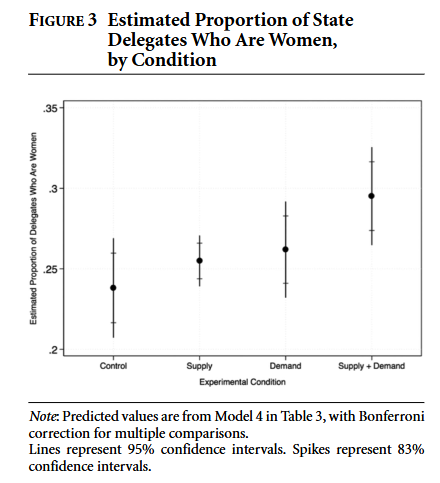
```

---

Both supply and demand interventions raised women's representation. Combined, they worked best.

The finding challenges a simple "pipeline only" story: **voter demand matters too**, but simple party-leader messages can move it.

Most importantly: random assignment means we can trust these are causal effects, not just correlations.

---
### Is Voter Bias the Real Problem?

If voters systematically punish female candidates, that would be a major causal pathway *against* women's election — and would limit what quotas can accomplish once lifted.

Two recent studies address this head-on.

---
### What Voters Actually Do (Schwarz & Coppock 2022)

```{r, echo = FALSE, out.width="85%", fig.retina = 1, fig.align='center', fig.alt="Schwarz & Coppock (2022), 'What Have We Learned about Gender from Candidate Choice Experiments? A Meta-Analysis of Sixty-Seven Factorial Survey Experiments,' JOP. Abstract: pooling 67 conjoint/vignette studies, the average effect of female candidate gender is a gain of approximately 2 percentage points; voter preferences are not a major factor explaining women's underrepresentation."}
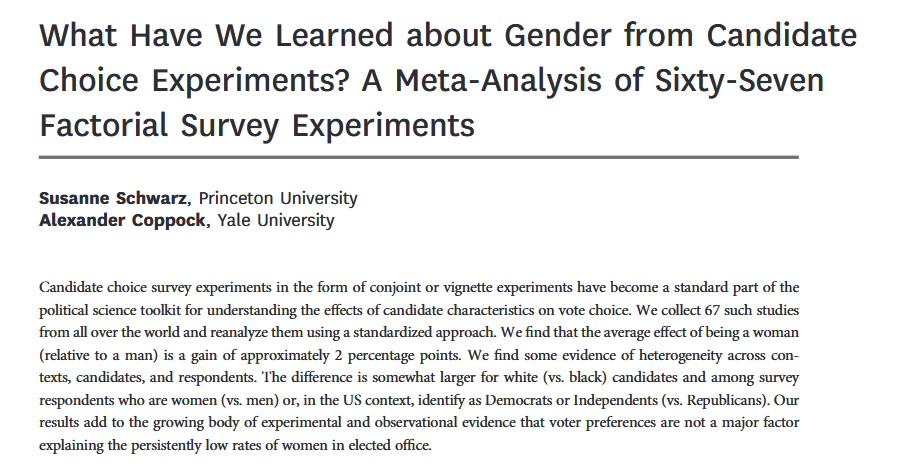
```

---

```{r, echo = FALSE, out.width="55%", fig.retina = 1, fig.align='center', fig.alt="Schwarz & Coppock Figure 1: forest plot of AMCE estimates for female candidate gender across 67 studies. Each row is one study; most estimates cluster near or slightly above zero (slight advantage for women), confirming no systematic voter penalty for female candidates."}
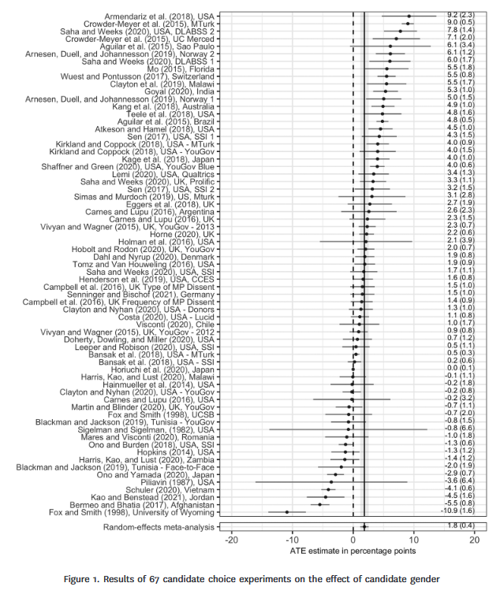
```

---

Each row is one of 67 studies. Most estimates cluster near zero — or slightly *positive* for women.

The average effect of being a female candidate: **+2 percentage points** in voter choice.

Voters don't penalize women. If anything, they very slightly prefer them. This means voter preferences cannot explain women's underrepresentation.

---
### Voter Bias Under Low Information (Eyméoud & Vertier 2023)

```{r, echo = FALSE, out.width="75%", fig.retina = 1, fig.align='center', fig.alt="Eyméoud & Vertier (2023), 'Gender Biases: Evidence from a Natural Experiment in French Local Elections,' Economic Policy. A 2015 reform required gender-balanced candidate pairs; alphabetical ordering determined which gender appeared first on the ballot, creating an as-if random treatment."}
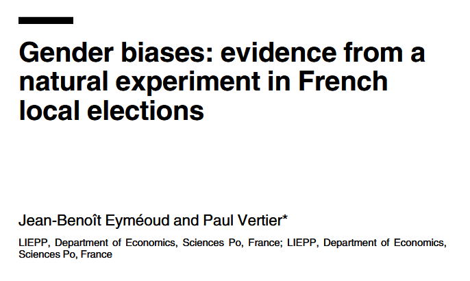
```

---

A 2015 French reform required gender-balanced candidate pairs. **Alphabetical ordering** determined which gender appeared first on the ballot — effectively random.

```{r, echo = FALSE, out.width="85%", fig.retina = 1, fig.align='center', fig.alt="Eyméoud & Vertier Figure 1: examples of valid French local election ballots showing three layout variants. Each ballot lists a main candidate and a substitute (remplaçant/e); candidate order varies by alphabetical name ordering, providing the natural experiment variation."}
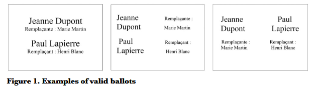
```

---

```{r, echo = FALSE, out.width="85%", fig.retina = 1, fig.align='center', fig.alt="Eyméoud & Vertier regression results: effect of 'Woman first' on ballot by voter ideology (XLeft, Left, Right, XRight). The penalty is statistically significant only among right-leaning voters (Right column: -1.397**, p=0.016). Left-leaning and far-right voters show no significant effect."}
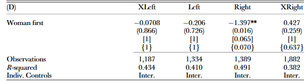
```

---

The "Woman first" penalty is significant only in the **Right** column (−1.4pp\*\*).

Right-leaning voters penalized women who appeared first on the ballot. Left-leaning voters did not.

And this bias decreases with higher newspaper circulation — more information reduces discrimination.

---
### Reconciling the Two Voter Bias Findings

Survey experiments (Schwarz & Coppock): voters evaluate candidates in a deliberate, information-rich setting → no penalty for women, slight advantage.

Real low-information elections (Eyméoud & Vertier): right-leaning voters show a small negative bias — but only under low information.

Voter discrimination is **real, narrow, and context-dependent** — concentrated among right-leaning voters and reducible by information. Not the primary bottleneck.

---
### Quotas: The Four Questions Answered

1. **Relationship?** Yes: documented in Mumbai via lottery (Bhavnani) and via field experiment (Karpowitz et al.)
2. **Reverse causation?** Blocked in all four studies by lottery assignment, experimental randomization, or ballot-order instrument
3. **Causal pathway?** Primarily candidacy supply and party behavior; voter bias is real but small and reducible by information (Schwarz & Coppock; Eyméoud & Vertier)
4. **Confounders ruled out?** Yes: in each study by design, though not in simple cross-country comparisons
