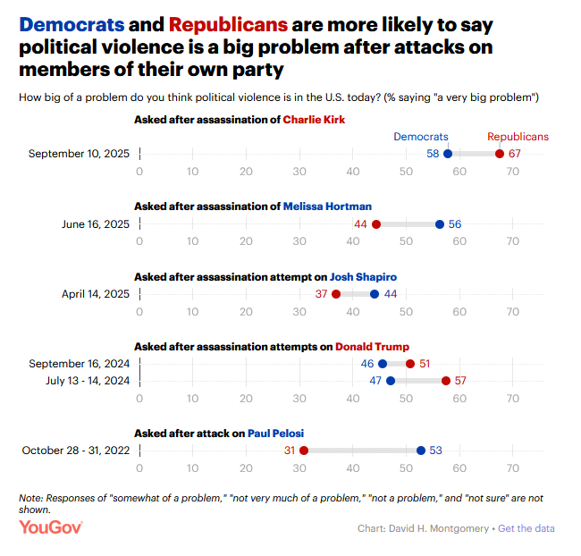
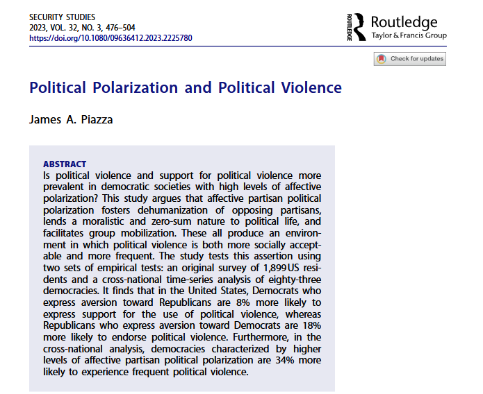
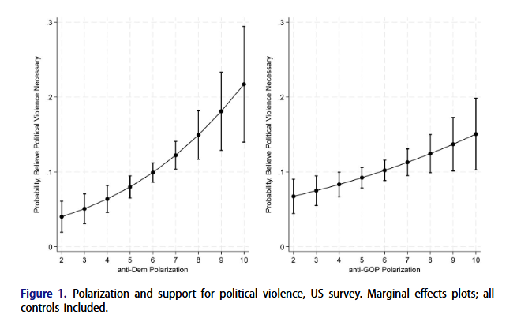
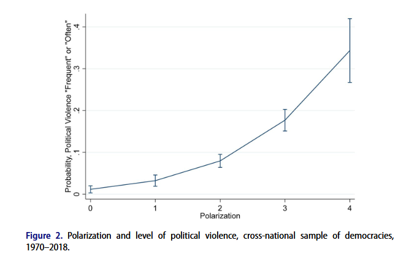

class: center, middle

```{css, echo=FALSE}
pre {
  max-height: 400px;
  overflow-y: auto;
}

pre[class] {
  max-height: 200px;
}
```

```{r, load_refs, include=FALSE, cache=FALSE}
# Initializes
library(RefManageR)

library(ggplot2)
library(dplyr)
library(readr)
library(nlme)
library(jtools)
library(mice)
library(knitr)
library(DiagrammeR)

BibOptions(check.entries = FALSE,
           bib.style = "authoryear", # Bibliography style
           max.names = 3, # Max author names displayed in bibliography
           sorting = "nyt", #Name, year, title sorting
           cite.style = "authoryear", # citation style
           style = "markdown",
           hyperlink = FALSE,
           dashed = FALSE)

```
```{r xaringan-themer, include=FALSE, warning=FALSE}
library(xaringanthemer,MnSymbol)
style_mono_accent(
  base_color = "#1c5253",
  header_font_google = google_font("Josefin Sans"),
  text_font_google   = google_font("Montserrat", "300", "300i"),
  code_font_google   = google_font("Fira Mono"),
  text_font_size = "1.6rem"
)

```

### Attitudes about Violence

```{r, echo = FALSE, out.width="80%", fig.retina = 1, fig.align='center'}

```

---

Looking just at the most recent results, how confident should we be that the 67%
for Republicans is really higher than the 58% for Democrats? Or is it possible this
is a coincidence of sampling?

---

* We can use statistics to ask: if we generated samples at random, how often would 
we get samples of this size where the difference between the two groups was at least
this big if the true underlying difference was zero?

* There are about 1000 respondents in each party at each time period.

---

```{r sampling-distribution, echo=FALSE, fig.width=8, fig.height=4, warning=FALSE, message=FALSE}
# Parameters from the first comparison (Democrats 58% vs Republicans 67%, n=1000 each)
p1 <- 580/1000   # 0.58
p2 <- 670/1000   # 0.67
n1 <- 1000
n2 <- 1000

# Pooled proportion under null
p_pool <- (580 + 670) / (n1 + n2)  # 0.625

# Standard error of the difference under null
se_diff <- sqrt(p_pool * (1 - p_pool) * (1/n1 + 1/n2))  # ≈ 0.02165

# Observed difference
obs_diff <- p2 - p1  # 0.09

# Create a sequence of x values (differences) spanning ±4 SE
x <- seq(-4*se_diff, 4*se_diff, length.out = 200)
# Normal density with mean 0 and sd = se_diff
y <- dnorm(x, mean = 0, sd = se_diff)

# Data frame for plotting
df <- data.frame(x = x, y = y)

# Identify which x values are beyond the observed difference (right tail)
# and also beyond the negative of observed difference (left tail) for two-tailed
tail_right <- x >= obs_diff
tail_left <- x <= -obs_diff

library(ggplot2)
ggplot(df, aes(x = x, y = y)) +
  geom_line(color = "black", size = 1) +
  # Shade the right tail
  geom_area(data = subset(df, tail_right), aes(x = x, y = y),
            fill = "red", alpha = 0.3) +
  # Shade the left tail (optional, for two-tailed test)
  geom_area(data = subset(df, tail_left), aes(x = x, y = y),
            fill = "red", alpha = 0.3) +
  # Vertical line at observed difference
  geom_vline(xintercept = obs_diff, color = "red", linetype = "dashed", size = 1) +
  # Vertical line at negative observed difference (for symmetry)
  geom_vline(xintercept = -obs_diff, color = "red", linetype = "dashed", size = 1) +
  # Labels
  labs(
    title = "Sampling Distribution of the Difference in Proportions (Under Null)",
    subtitle = paste0("Observed difference = ", round(obs_diff, 3),
                     "\nStandard error = ", round(se_diff, 4)),
    x = "Difference (Republican - Democrat)",
    y = "Density"
  ) +
  theme_minimal() +
  # Optional: add text annotation for p-value
  annotate("text", x = obs_diff + 0.01, y = max(y)*0.8,
           label = "p-value = 2 × P(diff ≥ 0.09)", hjust = 0, size = 4)
```

---

```{r, echo=TRUE}
prop.test(c(580,670),c(1000,1000))
```

---

For another comparison, how confident should we be that the 67% of Republicans who
see political violence as a serious problem in September of 2025 is higher than the 44% with
the same opinion in June of 2025?

---

```{r sampling-distribution_2, echo=FALSE, fig.width=8, fig.height=4, warning=FALSE, message=FALSE}
# Parameters from the second comparison (June 44% vs September 67%, n=1000 each)
p1 <- 440/1000  
p2 <- 670/1000 
n1 <- 1000
n2 <- 1000

# Pooled proportion under null
p_pool <- (440 + 670) / (n1 + n2) 

# Standard error of the difference under null
se_diff <- sqrt(p_pool * (1 - p_pool) * (1/n1 + 1/n2))  # ≈ 0.02165

# Observed difference
obs_diff <- p2 - p1  # 0.09

# Create a sequence of x values (differences) spanning ±4 SE
x <- seq(-4*se_diff, 4*se_diff, length.out = 200)
# Normal density with mean 0 and sd = se_diff
y <- dnorm(x, mean = 0, sd = se_diff)

# Data frame for plotting
df <- data.frame(x = x, y = y)

# Identify which x values are beyond the observed difference (right tail)
# and also beyond the negative of observed difference (left tail) for two-tailed
tail_right <- x >= obs_diff
tail_left <- x <= -obs_diff

library(ggplot2)
ggplot(df, aes(x = x, y = y)) +
  geom_line(color = "black", size = 1) +
  # Shade the right tail
  geom_area(data = subset(df, tail_right), aes(x = x, y = y),
            fill = "red", alpha = 0.3) +
  # Shade the left tail (optional, for two-tailed test)
  geom_area(data = subset(df, tail_left), aes(x = x, y = y),
            fill = "red", alpha = 0.3) +
  # Vertical line at observed difference
  geom_vline(xintercept = obs_diff, color = "red", linetype = "dashed", size = 1) +
  # Vertical line at negative observed difference (for symmetry)
  geom_vline(xintercept = -obs_diff, color = "red", linetype = "dashed", size = 1) +
  # Labels
  labs(
    title = "Sampling Distribution of the Difference in Proportions (Under Null)",
    subtitle = paste0("Observed difference = ", round(obs_diff, 3),
                     "\nStandard error = ", round(se_diff, 4)),
    x = "Difference (September - June)",
    y = "Density"
  ) +
  theme_minimal() +
  # Optional: add text annotation for p-value
  annotate("text", x = obs_diff + 0.01, y = max(y)*0.8,
           label = "p-value = 2 × P(diff ≥ 0.23)", hjust = 0, size = 4)
```


---

```{r, echo=TRUE}
prop.test(c(440,670),c(1000,1000))
```

---

The tests we've been doing are most useful when we have two very similar samples with *no confounding.* What do we do when our research design can't guarantee that?

---

An **observational study** is a research project in which we don't get
to assign values on the independent variable. Instead, we just observe
what happens in the normal course of events.


---
### Observational Studies

-   Observational studies can sometimes be quite good at external
    validity.

-   However, confounding variables are a major problem for internal
    validity.

-   Such studies might be strongest at answering questions other than
    "why" questions.


---
### Large-N Methods

**Large-N methods** are the statistical approach to analyzing
observational studies.

The core idea: use many cases and statistical techniques to approximate the logic of comparison that experiments achieve through randomization by deliberately and carefully balancing groups.

---
### Large-N Approaches to Political Violence

---

```{r, echo = FALSE, out.width="90%", fig.retina = 1, fig.align='center'}

```

---

```{r, echo = FALSE, out.width="90%", fig.retina = 1, fig.align='center'}

```

---

```{r, echo = FALSE, out.width="90%", fig.retina = 1, fig.align='center'}

```

---

The Piazza study isn't comparing two neatly defined groups like 'Democrats' and 'Republicans.' It's asking whether countries with more polarization have more political violence. Polarization is *continuous*, not binary. And there are many other differences between countries that might matter. We need methods that can handle multiple variables at once and control for confounders.
