class: center, middle

```{css, echo=FALSE}
pre {
  max-height: 400px;
  overflow-y: auto;
}

pre[class] {
  max-height: 200px;
}
```

```{r, load_refs, include=FALSE, cache=FALSE}
# Initializes
library(RefManageR)

library(ggplot2)
library(dplyr)
library(readr)
library(nlme)
library(jtools)
library(mice)
library(knitr)
library(DiagrammeR)

BibOptions(check.entries = FALSE,
           bib.style = "authoryear", # Bibliography style
           max.names = 3, # Max author names displayed in bibliography
           sorting = "nyt", #Name, year, title sorting
           cite.style = "authoryear", # citation style
           style = "markdown",
           hyperlink = FALSE,
           dashed = FALSE)

```
```{r xaringan-themer, include=FALSE, warning=FALSE}
library(xaringanthemer,MnSymbol)
style_mono_accent(
  base_color = "#1c5253",
  header_font_google = google_font("Josefin Sans"),
  text_font_google   = google_font("Montserrat", "300", "300i"),
  code_font_google   = google_font("Fira Mono"),
  text_font_size = "1.6rem"
)

```

### Experiments

-   The fundamental problem of causal inference is that we can't compare
    a world with the cause to a world without the cause.

-   But if we take two large random samples, we know they are pretty
    much the same as each other.


---
### In-Class Example


---
### Experiments

-   So, we can apply the cause to one group but not the other.


---
### Experiments

-   There are two prerequisites:

    -   We need to be able to take two large random samples of
        independent cases.

    -   We need to be able to manipulate the cause that we're interested
        in.


---
### Example: Do Media Retractions Work?

```{r, echo = FALSE, out.width="90%", fig.retina = 1, fig.align='center'}
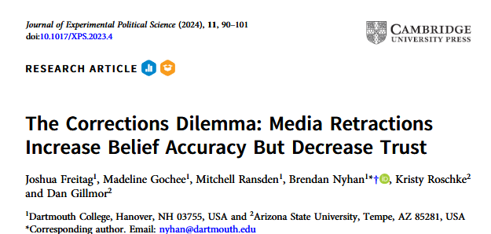
```


---

```{r, echo = FALSE, out.width="90%", fig.retina = 1, fig.align='center'}
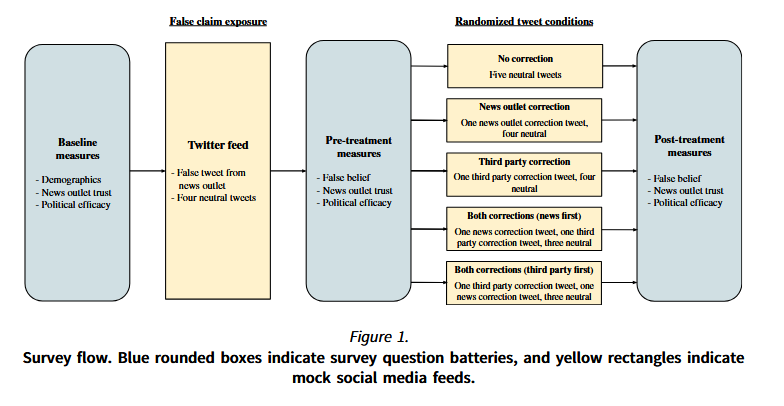
```


---

```{r, echo = FALSE, out.width="90%", fig.retina = 1, fig.align='center'}
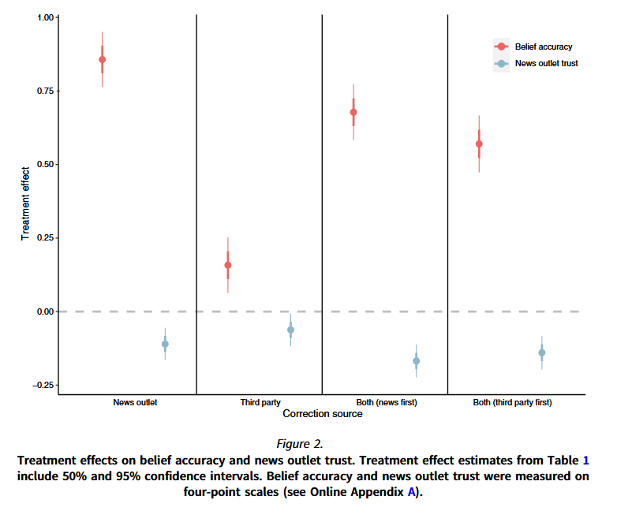
```


---
### What do we need to assume for the previous slide's results to be causal?

---
### Causal Inference with Experiments

-   Measure the dependent variable somehow.

-   Look for a difference on the dependent variable between the
    treatment group and the control group or between different treatment
    groups.


---
### Evaluating Causal Inferences

-   Internal validity: does the treatment seem to cause the dependent
    variable for the cases under study?

-   External validity: does the causal claim in question seem to
    generalize appropriately to the desired population, and does the
    experiment seem to capture the desired concepts?


---
### Internal Validity

-   As long as the randomization procedure was done correctly, an
    experiment always ranks high on internal validity.


---
### External Validity

-   Most experiments are much weaker on external validity than they are
    on internal validity.

    -   The subjects for an experiment may not be a random sample of the
        relevant population.

    -   The experimental treatment may differ from the real-world
        independent variable.

    -   Our descriptive inferences about the dependent variable may not
        be done well.


---
### Questions to Ask about Experiments

To figure out about internal validity (AKA confounding variables,
whether causation moves in the right order), ask:

1.  Was the treatment randomly assigned?

2.  Was the sample size large?

3.  Was treatment compliance pretty good?

4.  Was there evidence of fraud, manipulation, or other failures?

---
### Questions to Ask about Experiments

To figure out about external validity (AKA whether we can generalize to
the population of interest), ask:

1.  Is the set of experimental subjects representative of the population
    of interest?

2.  Is the experimental treatment similar enough to the independent
    variable in the theory?
    
3.  Is the dependent variable measured well enough?


---
```{r, echo = FALSE, out.width="90%", fig.retina = 1, fig.align='center'}
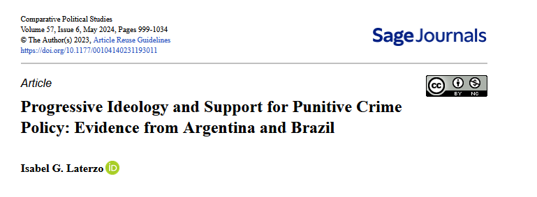
```

---
```{r, echo = FALSE, out.width="90%", fig.retina = 1, fig.align='center'}
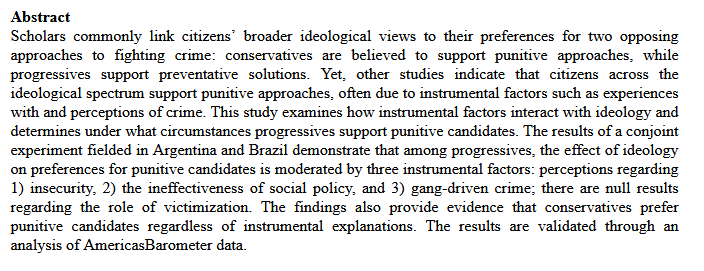
```

---
```{r, echo = FALSE, out.width="90%", fig.retina = 1, fig.align='center'}
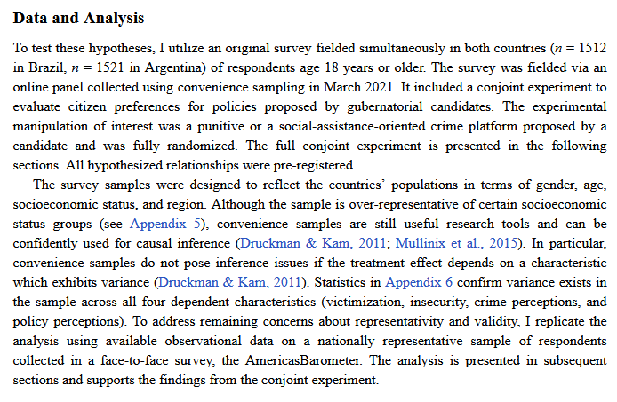
```

---
```{r, echo = FALSE, out.width="90%", fig.retina = 1, fig.align='center'}
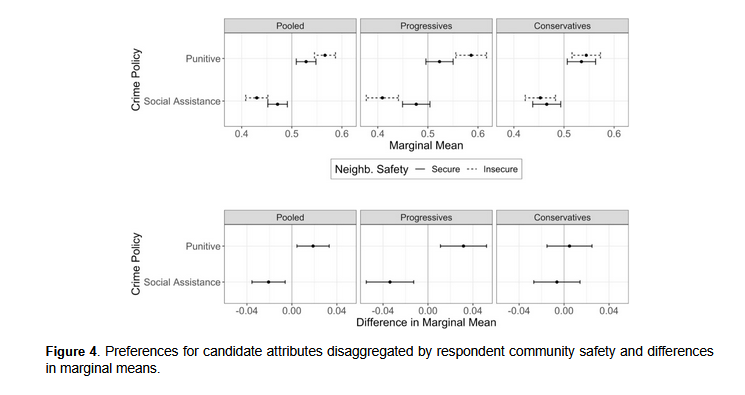
```

---

D. Hangartner, G. Gennaro, S. Alasiri, N. Bahrich, A. Bornhoft, J. Boucher, B.B. Demirci, L. Derksen, A. Hall, M. Jochum, M.M. Munoz, M. Richter, F. Vogel, S. Wittwer, F. Wuthrich, F. Gilardi, & K. Donnay, Empathy-based counterspeech can reduce racist hate speech in a social media field experiment, Proc. Natl. Acad. Sci. U.S.A. 118 (50) e2116310118, [https://doi.org/10.1073/pnas.2116310118](https://doi.org/10.1073/pnas.2116310118) (2021).

---
```{r, echo = FALSE, out.width="70%", fig.retina = 1, fig.align='center'}
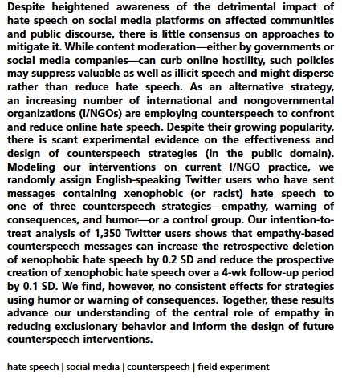
```

---
```{r, echo = FALSE, out.width="90%", fig.retina = 1, fig.align='center'}
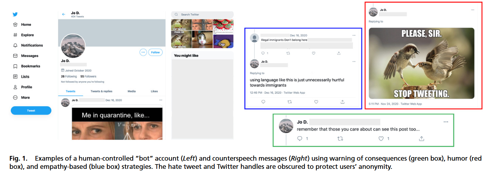
```

---
```{r, echo = FALSE, out.width="90%", fig.retina = 1, fig.align='center'}
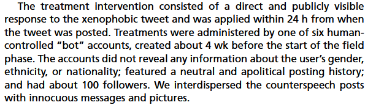
```

---
```{r, echo = FALSE, out.width="90%", fig.retina = 1, fig.align='center'}
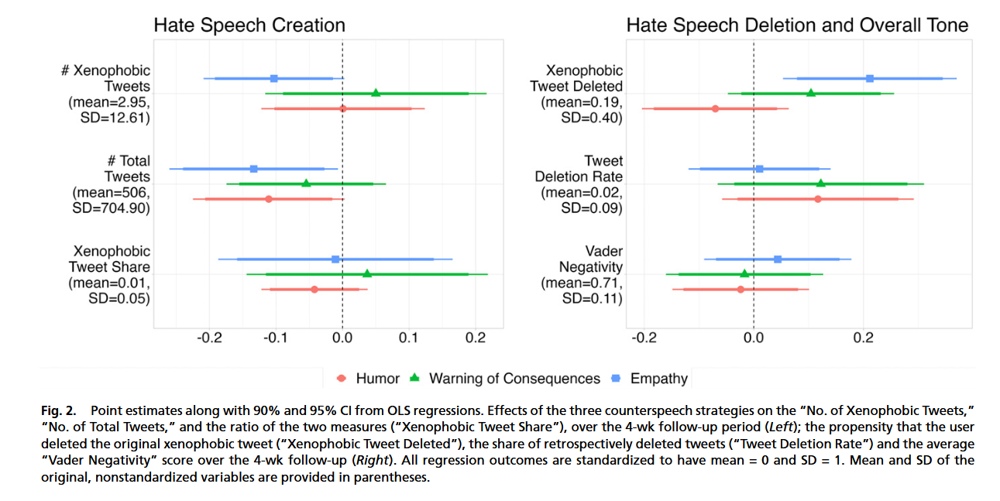
```

---
### Three Types of Experiments

1.  Lab Experiment: Carefully controlled, structured environment in which treatments and outcomes are administered usually in person
2.  Field Experiment: Real-world intervention in which a treatment is administered at random to treatment and control groups
3.  Survey Experiment: Experiments in which treatments are administered usually through digital devices as part of a survey 

---
### Oct. 2 Class 

For a research question in the social sciences that interests you, suggest a design for an experiment that could be done as an honors thesis project. (You don't have to actually intend to do it, etc., but it has to be the kind of thing that could hypothetically be done.) Explain why you find the topic interesting and how your design helps answer your question. Evaluate the strengths and weaknesses of your design in comparison with the example experiments in the syllabus.

---

What an experimental design includes:

* Treatment
* Outcome
* Sample
* Lab/field/survey?
* Any other clever design features (e.g., manipulation checks, attention filters, placebo treatments)

---

Your response might be structured as:

1-2 paragraphs of justification for why the topic is interesting and how your experiment contributes
1-2 paragraphs explaining the design details from the previous slide
1-2 paragraphs comparing strengths and weaknesses in terms of internal and external validity relative to the example experiments