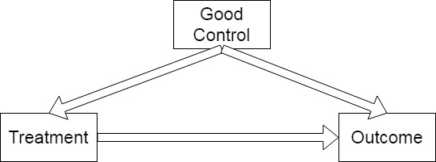
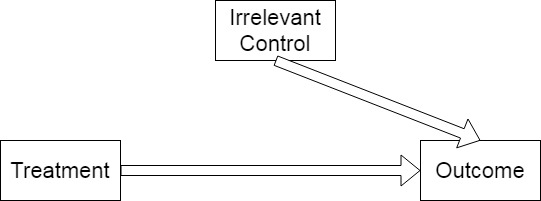

class: center, middle

```{css, echo=FALSE}
pre {
  max-height: 400px;
  overflow-y: auto;
}
pre[class] {
  max-height: 200px;
}
```

```{r, load_refs, include=FALSE, cache=FALSE}
library(RefManageR)
library(ggplot2)
library(dplyr)
library(readr)
library(nlme)
library(jtools)
library(mice)
library(knitr)
library(DiagrammeR)

BibOptions(check.entries = FALSE,
           bib.style = "authoryear",
           max.names = 3,
           sorting = "nyt",
           cite.style = "authoryear",
           style = "markdown",
           hyperlink = FALSE,
           dashed = FALSE)
```

```{r xaringan-themer, include=FALSE, warning=FALSE}
library(xaringanthemer, MnSymbol)
style_mono_accent(
  base_color = "#1c5253",
  header_font_google = google_font("Josefin Sans"),
  text_font_google   = google_font("Montserrat", "300", "300i"),
  code_font_google   = google_font("Fira Mono"),
  text_font_size = "1.6rem"
)
```

### Today's Goals

By the end of this session, you should be able to:

1. Explain what a multivariate regression coefficient means and how it differs from a bivariate coefficient
2. Identify potential confounders and explain why controlling for them changes estimates
3. Distinguish good controls, irrelevant controls, and harmful controls using causal diagrams
4. Explain collider bias
5. Explain post-treatment bias and identify when including a variable in a regression would block a causal path of interest

---

### Recall from Last Time

We found a positive association between support for transgender bathroom laws (transbathroom) and opposition to carbon regulations (carbonregulations):

$$ \scriptsize CarbonRegulations_i = 1.02 + 0.37 \times TransBathroom_i $$

But we know that **partisanship** might be driving both attitudes.

---

### The Problem of Confounding

What are some possible *confounding variables* for this relationship?

- Partisanship
- Ideology
- Religious beliefs
- Education
- ...

Today we'll add a control for **party identification** and see how the relationship changes.

---

### Multivariate Regression

We extend the bivariate model to include additional predictors:

$$\scriptsize CarbonRegulations_i = \alpha + \beta_1 TransBathroom_i + \beta_2 PartyID_i + \epsilon_i$$

Now $\beta_1$ is the effect of TransBathroom *subtracting off the relationship with party identification*.

---

### Measuring Party Identification

```{r, echo = TRUE, out.width="100%", fig.retina = 1, fig.align='center'}
anes2024 <- read.csv("https://raw.githubusercontent.com/jnseawright/ps210/refs/heads/main/Data/anes2024.csv")

anes2024$transbathroom <- ifelse(anes2024$V241372x < 0, NA, anes2024$V241372x)
anes2024$carbonregulations <- ifelse(anes2024$V242324x < 0, NA, anes2024$V242324x)

anes2024$partyid <- ifelse(anes2024$V241227x < 0, NA, anes2024$V241227x)

table(anes2024$partyid)
```

Party ID is coded 1 = Strong Democrat, 7 = Strong Republican.

---

### Running the Multivariate Regression

```{r, echo = TRUE, out.width="100%", fig.retina = 1, fig.align='center'}
transcarbonlm2 <- lm(carbonregulations ~ transbathroom + partyid, data = anes2024)

summary(transcarbonlm2)
```

---

### Interpreting the Results

- **transbathroom coefficient** = 0.12 (down from 0.24 in the bivariate model). The relationship is weaker after controlling for party.
- **partyid coefficient** = 0.21: each step toward stronger Republican identification is associated with 0.21 units more opposition to carbon regulation.
- Both variables are statistically significant.

**What happened?** Partisanship was a confounder: Republicans tend to be more conservative on both issues, so part of the original association was spurious.

---

### How Do We Choose Controls?

Not every variable should be included in a regression. We can classify controls into three types:

---

1\. **Good controls**: Variables that are potential confounders (like partisanship). They help isolate the causal effect.

---

2\. **Irrelevant controls**: Variables that are unrelated to both the treatment and the outcome. They don't harm much but don't help either.

---

3\. **Harmful controls**: Variables that introduce bias—for example, *colliders* (variables caused by both the treatment and the outcome) or *post-treatment* variables (affected by the treatment).

---

### Good Control

```{r, echo = FALSE, out.width="80%", fig.retina = 1, fig.align='center', fig.alt="DAG illustrating a good control: the Good Control node sits above Treatment and Outcome, with arrows pointing FROM it TO both Treatment and Outcome — making it a common cause (confounder). A direct arrow also runs from Treatment to Outcome. Including this variable in a regression blocks the backdoor path and isolates the causal effect of Treatment."}

```

A good control is a common cause of both the treatment and the outcome. Including it blocks a backdoor path.

---

### Irrelevant Control

```{r, echo = FALSE, out.width="80%", fig.retina = 1, fig.align='center', fig.alt="DAG illustrating an irrelevant control: the Irrelevant Control node sits above Outcome with an arrow pointing only TO Outcome — no connection to Treatment. A direct arrow runs from Treatment to Outcome. Because this variable is unrelated to Treatment, it is not a confounder and does not bias the estimate; including it merely uses up degrees of freedom."}

```

An irrelevant control is unrelated to the treatment or the outcome. It doesn't bias the estimate, but it may reduce precision. Adding unnecessary control variables uses up information we could otherwise use for productive purposes.

---

### Harmful Control: Collider

```{r, echo = FALSE, out.width="80%", fig.retina = 1, fig.align='center', fig.alt="DAG illustrating a harmful control — collider: the Harmful Control node sits above Treatment and Outcome, with arrows pointing FROM both Treatment and Outcome INTO it (both variables cause the control). A direct arrow also runs from Treatment to Outcome. Conditioning on this collider opens a spurious path between Treatment and Outcome, biasing the estimate even though there is no genuine confounding."}

```

A collider is a variable caused by both the treatment and the outcome. Conditioning on it can create a spurious association.

---

### Harmful Control: Post-Treatment

```{r, echo = FALSE, out.width="80%", fig.retina = 1, fig.align='center', fig.alt="DAG illustrating a harmful control — post-treatment variable: Treatment points TO the Harmful Control, which in turn points TO Outcome. A direct arrow also runs from Treatment to Outcome. Controlling for this variable blocks the indirect causal path (Treatment → Control → Outcome), understating the total effect and potentially introducing collider bias if the mediator also has unmeasured causes."}

```

A post-treatment variable is affected by the treatment.

---

### Post-Treatment Bias

When we control for a variable that is *caused by the treatment*, we can block part of the causal path and introduce bias.

---

```{r posttreatment-dag, echo=FALSE, fig.width=6, fig.height=4, fig.align='center', fig.alt="DiagrammeR DAG with three nodes: Treatment (Trans Bathroom) → Post-Treatment (Mediator) → Outcome (Carbon Regs), with an additional direct arrow from Treatment → Outcome. Illustrates that the total causal effect of Treatment on Outcome includes both the direct path and the indirect path through the mediator; controlling for the mediator removes the indirect path and underestimates the total effect."}
library(DiagrammeR)

posttreat_dag <- 
  create_graph() %>%
  add_node(label = "Treatment\n(Trans Bathroom)") %>%
  add_node(label = "Post-Treatment\n(Mediator)") %>%
  add_node(label = "Outcome\n(Carbon Regs)") %>%
  add_edge(from = 1, to = 2) %>%
  add_edge(from = 1, to = 3) %>%
  add_edge(from = 2, to = 3)

render_graph(posttreat_dag, layout = "nicely")
```

---

- The **total causal effect** of Treatment on Outcome is the sum of the direct path (1→3) and the indirect path through the Post-Treatment variable (1→2→3).
- If we **control for the Post-Treatment variable** (e.g., include it in a regression), we block the indirect path and only estimate the direct effect.
- This can severely understate the total effect and, if the post-treatment variable is also affected by confounders, introduce collider bias.

---

**Example**: In our transgender bathroom example, suppose we controlled for "support for Trump" after measuring treatment. But support for Trump might be *caused* in part by the bathroom attitude itself. If so, controlling for it would remove part of the effect we want to measure.

We would be asking: 'What's the effect of bathroom attitudes on carbon opinions among people with the same level of Trump support?' But if bathroom attitudes shape Trump support, that's the wrong question! We're conditioning away part of the causal effect we care about.

---

### Summary: Multivariate Regression

- Allows us to control for confounders and get closer to causal estimates.
- The coefficient for a treatment variable changes when we add relevant controls.
- But not all controls are beneficial—some can introduce bias.

**Key takeaway**: Choosing controls requires *theoretical reasoning* about the causal structure, not just throwing in every variable you have.

---

### Next Steps

- We'll continue with statistical computing labs to practice these techniques.
- Then we'll see examples of quantitative political science research that use multivariate regression and other tools.
- Later in the quarter, we'll introduce machine learning as an alternative approach to handling many variables.
