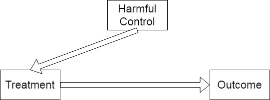

class: center, middle

```{css, echo=FALSE}
pre {
  max-height: 400px;
  overflow-y: auto;
}

pre[class] {
  max-height: 200px;
}
```

```{r, load_refs, include=FALSE, cache=FALSE}
# Initializes
library(RefManageR)

library(ggplot2)
library(dplyr)
library(readr)
library(nlme)
library(jtools)
library(hrbrthemes)
library(mice)
library(knitr)
library(DiagrammeR)
library(extrafont)
loadfonts(device="win")

BibOptions(check.entries = FALSE,
           bib.style = "authoryear", # Bibliography style
           max.names = 3, # Max author names displayed in bibliography
           sorting = "nyt", #Name, year, title sorting
           cite.style = "authoryear", # citation style
           style = "markdown",
           hyperlink = FALSE,
           dashed = FALSE)

```
```{r xaringan-themer, include=FALSE, warning=FALSE}
library(xaringanthemer,MnSymbol)
style_mono_accent(
  base_color = "#1c5253",
  header_font_google = google_font("Josefin Sans"),
  text_font_google   = google_font("Montserrat", "300", "300i"),
  code_font_google   = google_font("Fira Mono"),
  text_font_size = "1.6rem"
)

```

---

We have two problems:

1. What if our independent variable is quantitative?

2. What if we have multiple control variables?

---
### Regression Analysis

-   Regression analysis is a tool that fits a line to a scatter plot.

---

Remember from your studies that the algebraic formula for a line is: $Y = mX + b$.


---
### Regression Analysis

When we pivot from geometry to regression, two important changes!

1.  Instead of $m$ usually call the slope $\beta$ or $b$, and instead of
    $b$ we usually call the intercept $\alpha$, $a$, or sometimes
    $\beta_0$.

2.  We add a term at the end of the equation for error/noise above and
    below the line. This term is called $e_i$ or $\epsilon_i$.

---

-   How do we get numbers for $\alpha$ and $\beta$ in regression analysis?

-   Data plus calculus!


---

```{r, echo = TRUE, out.width="100%", fig.retina = 1, fig.align='center'}

anes2024 <- read.csv("https://raw.githubusercontent.com/jnseawright/ps210/refs/heads/main/Data/anes2024.csv")

anes2024$transbathroom <- ifelse(anes2024$V241372x < 0, NA, anes2024$V241372x)

table(anes2024$transbathroom)

```

---

```{r, echo = TRUE, out.width="100%", fig.retina = 1, fig.align='center'}

anes2024$carbonregulations <- ifelse(anes2024$V242324x < 0, NA, anes2024$V242324x)

table(anes2024$carbonregulations)

```


---

```{r, echo = TRUE, out.width="100%", fig.retina = 1, fig.align='center'}
library(ggplot2)
library(hrbrthemes)

transcarbonplot <- anes2024 %>% ggplot(aes(x=transbathroom,y=carbonregulations)) + 
  geom_point( color="#69b3a2") +
  theme_ipsum()
```

---

```{r, echo = TRUE, out.width="55%", fig.retina = 1, fig.align='center'}
transcarbonplot
``` 

---

```{r, echo = TRUE, out.width="100%", fig.retina = 1, fig.align='center'}
transcarbonjitterplot <- anes2024 %>% ggplot(aes(x=transbathroom,y=carbonregulations)) + 
  geom_point( color="#69b3a2") +
  geom_jitter() +
  theme_ipsum()
```

---

```{r, echo = TRUE, out.width="55%", fig.retina = 1, fig.align='center'}
transcarbonjitterplot
``` 


---

$CarbonRegulations_{i} = \alpha + \beta TransBathroom_{i} + \epsilon_{i}$

---

```{r, echo = TRUE, out.width="100%", fig.retina = 1, fig.align='center'}
transcarbonlm <- lm(carbonregulations ~ transbathroom, data=anes2024)

summary(transcarbonlm)
``` 

---

```{r, echo = TRUE, out.width="100%", fig.retina = 1, fig.align='center'}
transcarbonlmplot <- anes2024 %>% ggplot(aes(x=transbathroom,y=carbonregulations)) + 
  geom_point( color="#69b3a2") +
  geom_jitter() +
  geom_smooth(method=lm , color="red", se=TRUE) +  
  theme_ipsum()
```

---

```{r, echo = TRUE, out.width="55%", fig.retina = 1, fig.align='center', warning=FALSE, message=FALSE}
transcarbonlmplot
``` 

---

What are some possible *confounding variables* for this relationship?

---

$\tiny CarbonRegulations_{i} = \alpha + \beta_{1} TransBathroom_{i} + \beta_{2} Partisanship_{i} + \epsilon_{i}$

---

```{r, echo = TRUE, out.width="100%", fig.retina = 1, fig.align='center'}

anes2024$partyid <- ifelse(anes2024$V241227x < 0, NA, anes2024$V241227x)

table(anes2024$partyid)

```

---

```{r, echo = TRUE, out.width="100%", fig.retina = 1, fig.align='center'}
transcarbonlm2 <- lm(carbonregulations ~ transbathroom + partyid, data=anes2024)

summary(transcarbonlm2)
``` 

---

```{r, echo = FALSE, out.width="80%", fig.retina = 1, fig.align='center'}
include_graphics("images/goodcontrol.jpg")
```


---

```{r, echo = FALSE, out.width="80%", fig.retina = 1, fig.align='center'}
include_graphics("images/irrelevantcontrol1.jpg")
```

---

```{r, echo = FALSE, out.width="80%", fig.retina = 1, fig.align='center'}

```

---

```{r, echo = FALSE, out.width="80%", fig.retina = 1, fig.align='center'}
include_graphics("images/harmfulcontrol2.jpg")
```

---

```{r, echo = FALSE, out.width="80%", fig.retina = 1, fig.align='center'}

```