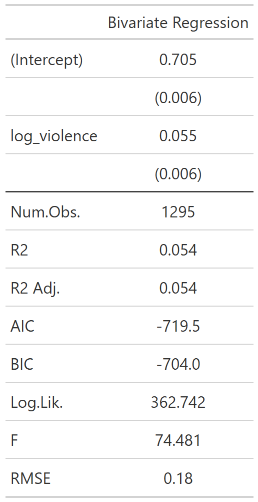
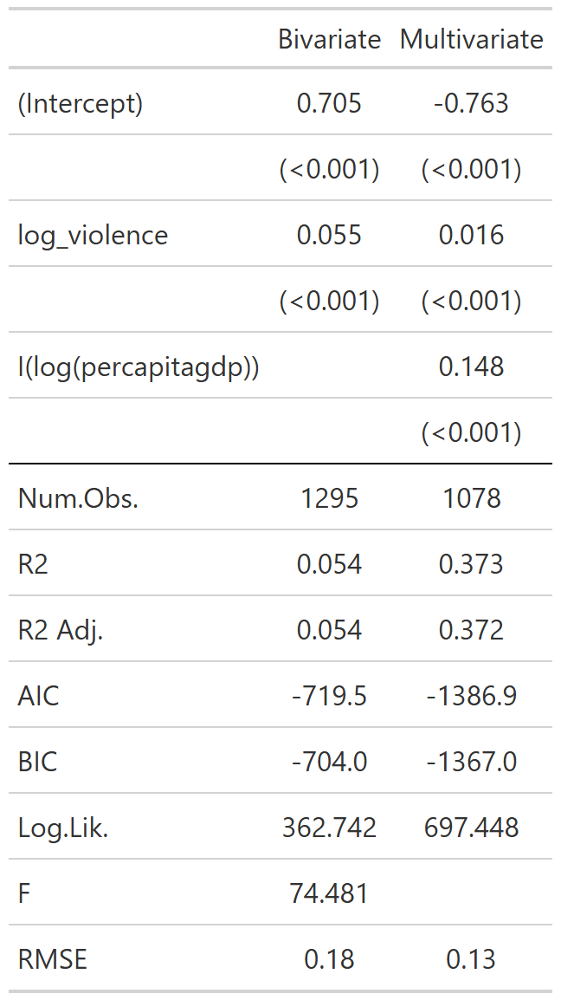

class: center, middle

```{css, echo=FALSE}
pre {
  max-height: 400px;
  overflow-y: auto;
}

pre[class] {
  max-height: 200px;
}
```

```{r setup, include=FALSE}
knitr::opts_chunk$set(echo = TRUE, warning = FALSE, message = FALSE)
library(tidyverse)
library(ggplot2)
library(modelsummary)
```

```{r xaringan-themer, include=FALSE, warning=FALSE}
library(xaringanthemer)
style_mono_accent(
  base_color = "#1c5253",
  header_font_google = google_font("Josefin Sans"),
  text_font_google   = google_font("Montserrat", "300", "300i"),
  code_font_google   = google_font("Fira Mono"),
  text_font_size = "1.6rem"
)
```

# Lab 2: Introduction to Regression in R

## Today's Goals

- Load and combine the QOG and right‑wing violence (RTV) datasets
- Create a country‑year dataset with democracy scores and violence counts
- Fit and interpret a **bivariate regression** (violence → democracy)

---

## Today's Goals

- Add a control variable and fit a **multivariate regression**
- Visualize the results and discuss limitations
- Connect these skills to Homework 2

---
class: inverse, center, middle

# Part 1: Quick Recap – Merging Datasets

---
### Load the Data

```{r, eval=TRUE}
# QOG dataset (country‑year level)
qog_small <- read.csv("https://github.com/jnseawright/ps210/raw/refs/heads/main/Data/qogsmall.csv")

# Right-wing violence incidents (event-level)
rtv <- read.csv("https://raw.githubusercontent.com/jnseawright/ps210/main/Data/rtv.csv")
```

---
### Examine the Data

```{r, eval=TRUE}
head(qog_small)
```

---
### Examine the Data

```{r, eval=TRUE}
head(rtv)
```

---

**Questions:**
- What variables does each dataset have?
- How can we connect them? (country, year)

---
### Merge and Count (Tidyverse Version)

```{r, eval=TRUE}
# Count incidents per country‑year
event_counts <- rtv %>%
  group_by(country_name, year) %>%
  summarise(violence_count = n(), .groups = "drop")

# Join to QOG
qog_merged <- left_join(qog_small, event_counts,
                        by = c("cname" = "country_name", "year" = "year"))

# Replace NA with 0 (no violence)
qog_merged$violence_count[is.na(qog_merged$violence_count)] <- 0

# Keep only countries that appear in RTV (optional)
qog_merged <- qog_merged %>% filter(cname %in% rtv$country_name)
```

---
### Check the Result

```{r, eval=TRUE}
head(qog_merged)
```

---
### Check the Result

```{r, eval=TRUE}
summary(qog_merged$violence_count)
```

Now we have a dataset ready for regression: democracy scores and violence counts for each country‑year.

---
class: inverse, center, middle

# Part 2: Bivariate Regression

---
### Research Question

Does right‑wing violence affect the level of democracy?

**Hypothesis:** Countries with more right‑wing violence have lower democracy scores.

---
### Visualize the Relationship

```{r, eval=TRUE}
bivarplot <- ggplot(qog_merged, aes(x = violence_count, y = democracy)) +
  geom_point(alpha = 0.3) +
  geom_smooth(method = "lm", color = "red") +
  labs(title = "Democracy by Right-Wing Violence",
       x = "Number of violent incidents",
       y = "Democracy score") +
  theme_minimal()
```

---

```{r, eval=TRUE}
bivarplot
```

---

**Discuss:** What do you see? Any issues? (Skew, outliers)

---
### Log Transformation

Because violence is highly skewed, we often use `log(1 + violence)`.

```{r, eval=TRUE}
qog_merged <- qog_merged %>%
  mutate(log_violence = log(1 + violence_count))

logbivarplot <- ggplot(qog_merged, aes(x = log_violence, y = democracy)) +
  geom_point(alpha = 0.3) +
  geom_smooth(method = "lm", color = "red") +
  labs(title = "Democracy by Logged Right-Wing Violence",
       x = "Log(1 + violence)",
       y = "Democracy score") +
  theme_minimal()
```

---

```{r, eval=TRUE}
logbivarplot
```

---
### Fit the Bivariate Regression

```{r, eval=TRUE}
model1 <- lm(democracy ~ log_violence, data = qog_merged)
summary(model1)
```

---

**Interpretation:**
- Intercept: predicted democracy when violence = 0 (log = 0)
- Slope: for a 1‑unit increase in log_violence, democracy changes by ______
- Is the slope statistically significant?

---
### Better Regression Table

```{r, eval=TRUE, results='asis'}
modelsummary(list("Bivariate Regression" = model1),
             output = "gt") %>%
  gt::gtsave(filename = "images\\regression_table.png")
```

---

```{r, echo = FALSE, out.width="40%", fig.retina = 1, fig.align='center'}
library(knitr)

```

---

This is easier to read and is recommended for Homework 2.

---
class: inverse, center, middle

# Part 3: Multivariate Regression

---
### The Problem of Confounding

Violence might be correlated with other factors that also affect democracy, e.g., **economic development** (per capita GDP).

Let's add `percapitagdp` as a control.

---
### Check the Control Variable

```{r, eval=TRUE}
summary(qog_merged$percapitagdp)
```

Some missing values. We'll need to handle them. For now, `lm()` will drop rows with NA in any predictor.

---
### Fit the Multivariate Model

```{r, eval=TRUE}
model2 <- lm(democracy ~ log_violence + I(log(percapitagdp)), data = qog_merged)
summary(model2)
```

---

We use I(log(...)) to create the log transformation directly in the formula.

---
### Compare Models

```{r, eval=TRUE}
modelsummary(list("Bivariate" = model1, "Multivariate" = model2),
             statistic = "p.value", output = "gt") %>%
  gt::gtsave(filename = "images\\regression_comparison_table.png")
```

---

```{r, echo = FALSE, out.width="40%", fig.retina = 1, fig.align='center'}
library(knitr)

```

---

**Discuss:**
- How did the coefficient for `log_violence` change after adding GDP?
- What does this tell us about confounding?

---
### Visualizing the Multivariate Relationship

We can't easily plot 3 dimensions, but we can look at partial effects.

For now, we'll rely on the regression table.

---
class: inverse, center, middle

# Part 4: Your Turn (20 min)

*Now open the Lab2_Practice.Rmd file and work through the exercises. We'll circulate to help.*

---
class: inverse, center, middle

# Part 5: Connecting to Homework 2

---
### How Today's Lab Maps to Homework 2

| Lab Skill | Homework 2 Task |
|-----------|-----------------|
| Merging datasets and creating counts | Problem 1: Combine grants and election data |
| Visualizing relationship | Problem 1: Scatter plot of funding vs. Trump vote |
| Bivariate regression | Problem 1: Interpret slope and significance |

---
### How Today's Lab Maps to Homework 2

| Lab Skill | Homework 2 Task |
|-----------|-----------------|
| Adding a control variable | Problem 2: Add population as control, compare coefficients |
| Using `modelsummary` | Problem 2: Present and interpret regression tables |
| Interpreting confounding | Problem 3: Discuss whether population is a confounder |

---
### Before You Leave

**Check that you can:**
- [ ] Merge two datasets and create a country‑year analysis file
- [ ] Fit a bivariate regression and interpret the output
- [ ] Fit a multivariate regression with a control variable
- [ ] Compare coefficients across models
- [ ] Use `modelsummary` to present results

---
### Questions?

- TAs available in lab and office hours
- Email the professor or TAs, or reach out to your peers
- Start Homework 2 early!