class: center, middle

```{css, echo=FALSE}
pre {
  max-height: 400px;
  overflow-y: auto;
}

pre[class] {
  max-height: 200px;
}
```

```{r, load_refs, include=FALSE, cache=FALSE}
# Initializes
library(RefManageR)

library(ggplot2)
library(dplyr)
library(readr)
library(nlme)
library(jtools)
library(hrbrthemes)
library(mice)
library(knitr)
library(DiagrammeR)

BibOptions(check.entries = FALSE,
           bib.style = "authoryear", # Bibliography style
           max.names = 3, # Max author names displayed in bibliography
           sorting = "nyt", #Name, year, title sorting
           cite.style = "authoryear", # citation style
           style = "markdown",
           hyperlink = FALSE,
           dashed = FALSE)

```
```{r xaringan-themer, include=FALSE, warning=FALSE}
library(xaringanthemer,MnSymbol)
style_mono_accent(
  base_color = "#1c5253",
  header_font_google = google_font("Josefin Sans"),
  text_font_google   = google_font("Montserrat", "300", "300i"),
  code_font_google   = google_font("Fira Mono"),
  text_font_size = "1.6rem"
)

```

---
### Stages of Survey Research

-   Select a set of individuals to answer the survey.

-   Ask each individual a set of pre-selected questions.

-   Analyze the results.


---
### Define the Population


---
### Choose a Sampling Rule

-   Sometimes we can study all of the cases in a population.

-   Sometimes we need to focus more narrowly.

    -   We need a systematic way of deciding which cases to focus on ---
        a **sampling rule**.

    -   We hope that our sampling rule will give us correct results: we
        want our samples to be like the population.


---
### Samples of Convenience

A **sample of convenience** is a sampling rule where the researchers
simply select the cases that are easily available.


---

```{r, echo = FALSE, out.width="90%", fig.retina = 1, fig.align='center'}
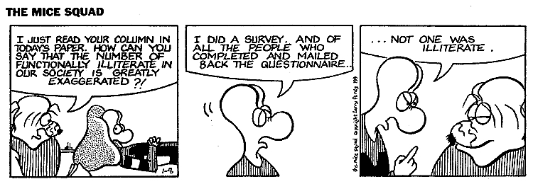
```

---

In October of 2016, news began to circulate online that the major
polling firms were producing badly biased results.


---

Bill O'Reilly contributed to this conversation, according to various
online news sources, by hiring graduate students to "call 250 people
from each party's voting rolls in all 50 states."


---

```{r, echo = FALSE, out.width="90%", fig.retina = 1, fig.align='center'}
include_graphics("images/oreillypoll.jpg")
```

---

```{r, echo = FALSE, out.width="90%", fig.retina = 1, fig.align='center'}
include_graphics("images/trumpvoterfraud.jpg")
```

---
But, oops, O'Reilly never actually hired anyone to do a giant telephone
survey.

```{r, echo = FALSE, out.width="90%", fig.retina = 1, fig.align='center'}
include_graphics("images/oreillywebpoll.jpg")
```

---
### Quota Sampling

A **quota sample** is where the researchers modify a sample of
convenience by making sure the sample is like the population in
specific, predetermined ways.


---

```{r, echo = FALSE, out.width="90%", fig.retina = 1, fig.align='center'}
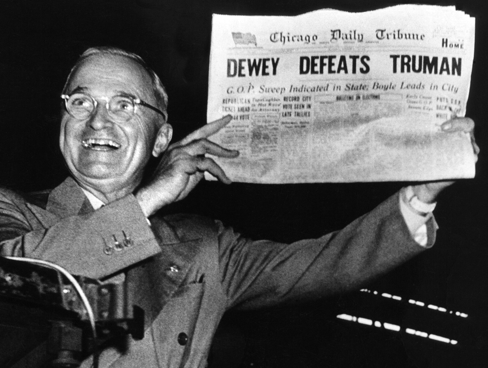
```

---
### Random Sampling

A **random sample** is a sample where each case has a known probability
of selection.

---
### Random Sampling

The *law of large numbers* tells us that, with a large enough sample, random
sampling basically guarantees that our sample will be like the
population.

---
### Random Sampling

Kinds of random samples:

-   Simple random sample.

-   Cluster sample.

-   Stratified random sample.

---
### What Can Go Wrong?

Non-response; some people just don't want to participate in surveys.

-   Non-response is usually non-random, which means that it spoils most
    of our random samples.

-   What can we do to deal with non-response?


---
### The New World

Response rates have basically collapsed in surveys in much of the world.


---

```{r, echo = FALSE, out.width="90%", fig.retina = 1, fig.align='center'}
include_graphics("images/govtsurveyresponserates.jpg")
```

---

```{r, echo = FALSE, out.width="90%", fig.retina = 1, fig.align='center'}
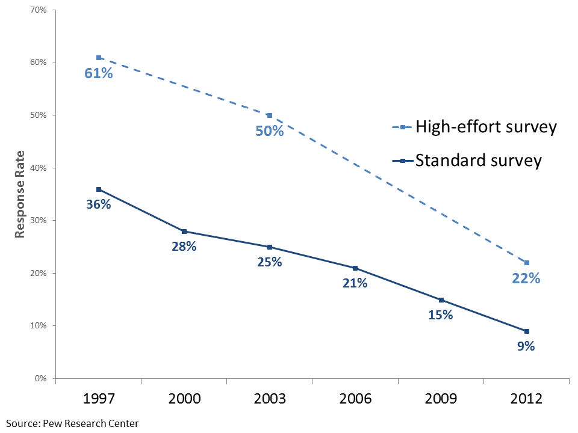
```

---

```{r, echo = FALSE, out.width="90%", fig.retina = 1, fig.align='center'}
include_graphics("images/nonresponsecorrelations.jpg")
```

---

```{r, echo = FALSE, out.width="90%", fig.retina = 1, fig.align='center'}
include_graphics("images/Stantcheva1.png")
```

---

```{r, echo = FALSE, out.width="90%", fig.retina = 1, fig.align='center'}
include_graphics("images/Stantcheva2.png")
```

---

```{r, echo = FALSE, out.width="90%", fig.retina = 1, fig.align='center'}
include_graphics("images/Stantcheva3.png")
```

---

```{r, echo = FALSE, out.width="90%", fig.retina = 1, fig.align='center'}
include_graphics("images/Stantcheva4.png")
```

---
### What about 2016 and 2020?


---
### Was 2016 a Polling Miss?

```{r, echo = FALSE, out.width="90%", fig.retina = 1, fig.align='center'}
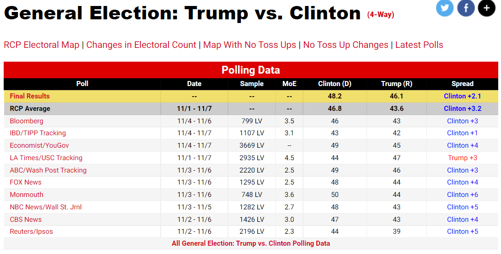
```

---
### Was 2016 a Polling Miss?

```{r, echo = FALSE, out.width="70%", fig.retina = 1, fig.align='center'}
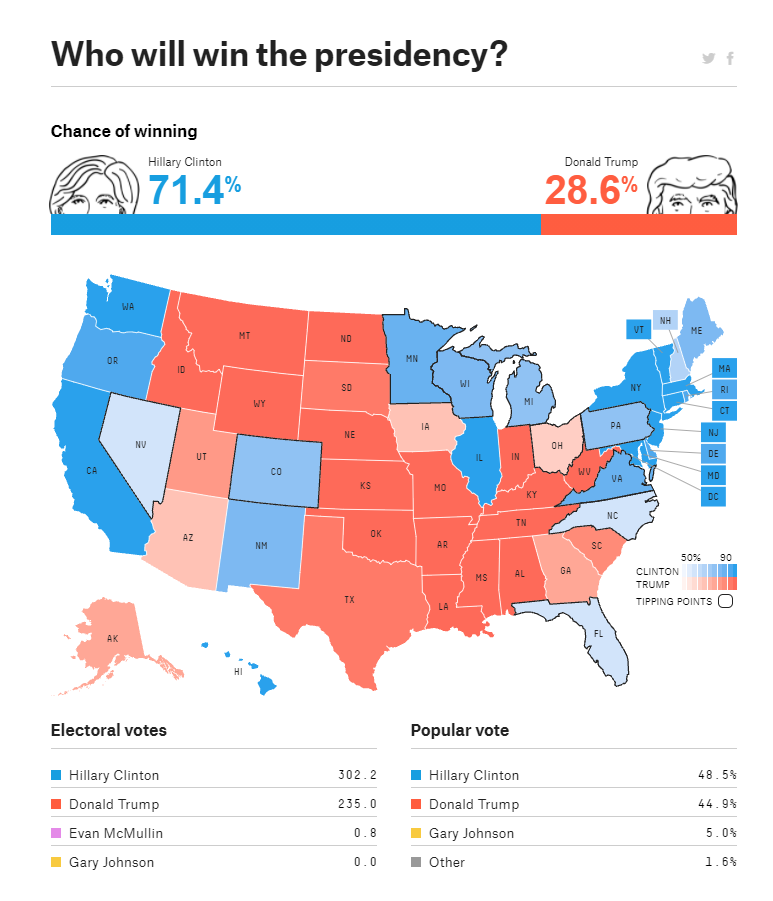
```

---
### Was 2016 a Polling Miss?

```{r, echo = FALSE, out.width="90%", fig.retina = 1, fig.align='center'}
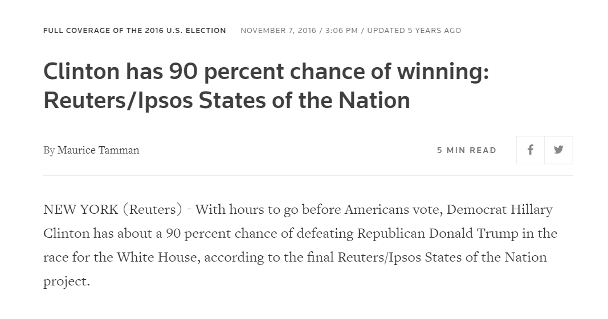
```

---
### Was 2020 a Polling Miss?

```{r, echo = FALSE, out.width="90%", fig.retina = 1, fig.align='center'}
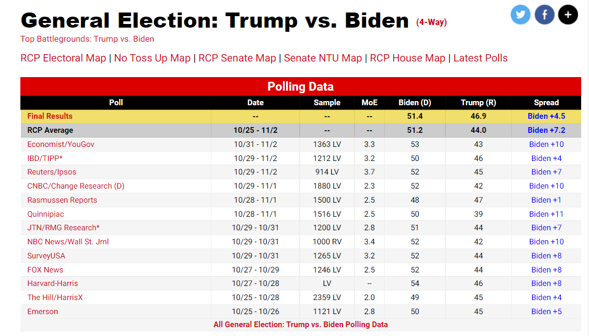
```

---

```{r, echo = FALSE, out.width="90%", fig.retina = 1, fig.align='center'}
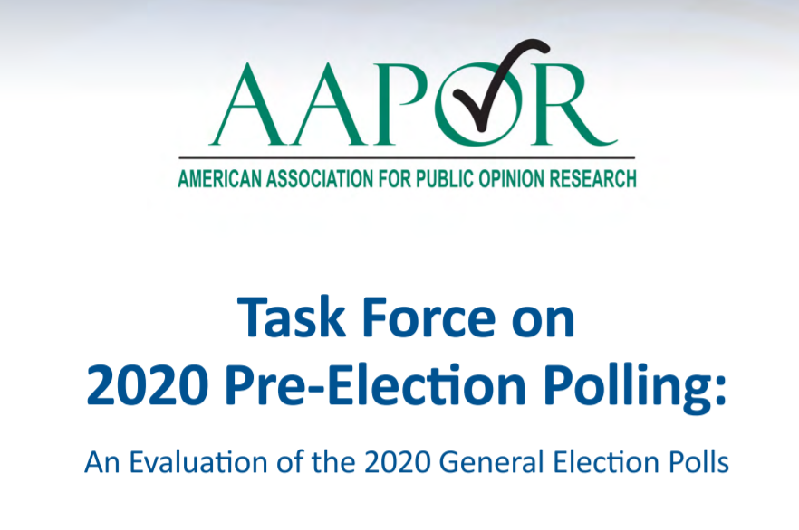
```

---

```{r, echo = FALSE, out.width="90%", fig.retina = 1, fig.align='center'}
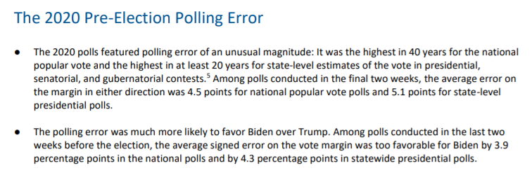
```

---

```{r, echo = FALSE, out.width="90%", fig.retina = 1, fig.align='center'}
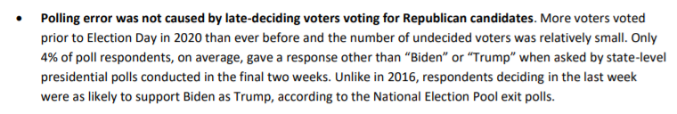
```

---

```{r, echo = FALSE, out.width="90%", fig.retina = 1, fig.align='center'}
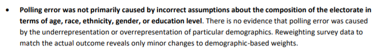
```

---

```{r, echo = FALSE, out.width="90%", fig.retina = 1, fig.align='center'}
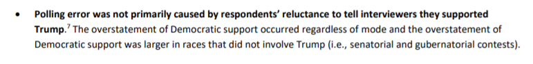
```

---

```{r, echo = FALSE, out.width="90%", fig.retina = 1, fig.align='center'}
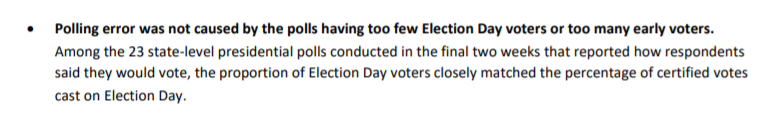
```

---

```{r, echo = FALSE, out.width="90%", fig.retina = 1, fig.align='center'}
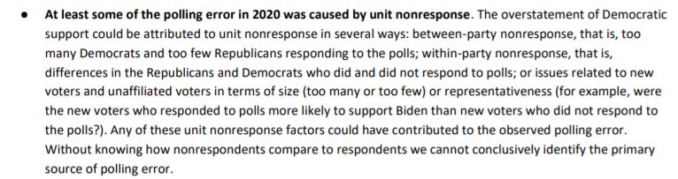
```

---

```{r, echo = FALSE, out.width="90%", fig.retina = 1, fig.align='center'}
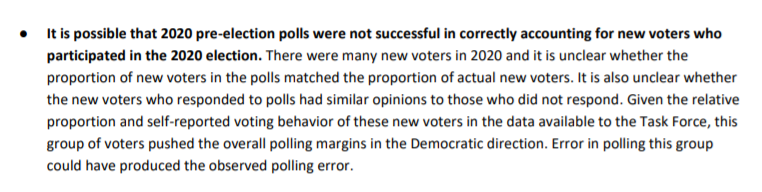
```

---

How much does question wording matter?

---

```{r, echo = FALSE, out.width="90%", fig.retina = 1, fig.align='center'}
include_graphics("images/Bruinsma1.png")
```

---

```{r, echo = FALSE, out.width="90%", fig.retina = 1, fig.align='center'}
include_graphics("images/Bruinsma2.png")
```

---

There's no way to generate a perfectly neutral survey question, but the key is to
ask things as simply as possible.