class: center, middle

```{css, echo=FALSE}
pre {
  max-height: 400px;
  overflow-y: auto;
}

pre[class] {
  max-height: 200px;
}
```

```{r, load_refs, include=FALSE, cache=FALSE}
# Initializes
library(RefManageR)

library(ggplot2)
library(dplyr)
library(readr)
library(nlme)
library(jtools)
library(mice)
library(knitr)
library(DiagrammeR)

BibOptions(check.entries = FALSE,
           bib.style = "authoryear", # Bibliography style
           max.names = 3, # Max author names displayed in bibliography
           sorting = "nyt", #Name, year, title sorting
           cite.style = "authoryear", # citation style
           style = "markdown",
           hyperlink = FALSE,
           dashed = FALSE)

```
```{r xaringan-themer, include=FALSE, warning=FALSE}
library(xaringanthemer,MnSymbol)
style_mono_accent(
  base_color = "#1c5253",
  header_font_google = google_font("Josefin Sans"),
  text_font_google   = google_font("Montserrat", "300", "300i"),
  code_font_google   = google_font("Fira Mono"),
  text_font_size = "1.6rem"
)

```

---
### Today's Goals

By the end of this session, you should be able to:

1. Describe the stages of survey research and define the key sampling concepts
2. Explain why convenience samples can produce misleading results — and identify when they aren't a problem
3. Distinguish simple random, quota, and cluster sampling strategies
4. Identify the main sources of non-response bias and explain why they threaten inference
5. Evaluate what the 2016 and 2020 polling errors reveal about the limits of modern survey research

---
### Stages of Survey Research

-   Select a set of individuals to answer the survey.

-   Ask each individual a set of pre-selected questions.

-   Analyze the results.


---
### Define the Population


---
### Choose a Sampling Rule

-   Sometimes we can study all of the cases in a population.

-   Sometimes we need to focus more narrowly.

    -   We need a systematic way of deciding which cases to focus on ---
        a **sampling rule**.

    -   We hope that our sampling rule will give us correct results: we
        want our samples to be like the population.


---
### Samples of Convenience

A **sample of convenience** is a sampling rule where the researchers
simply select the cases that are easily available.


---

```{r, echo = FALSE, out.width="90%", fig.retina = 1, fig.align='center', fig.alt="'The Mice Squad' comic strip: a critic challenges a researcher who claimed functional illiteracy is exaggerated. The researcher replies: 'I did a survey, and of all the people who completed and mailed back the questionnaire... not one was illiterate.' The punchline illustrates convenience sample bias — a mail survey about illiteracy only reaches literate respondents."}
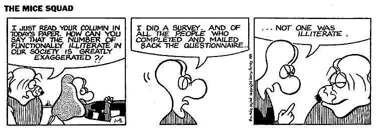
```

---

In November 2022, shortly after Elon Musk took control of Twitter, he faced a major policy question: should former President Donald Trump's account — banned since January 6, 2021 — be reinstated?

---

Musk had previously promised to form a "content moderation council with widely diverse viewpoints" before restoring any suspended accounts. Instead, he put it to a vote.

---

```{r, echo = FALSE, out.width="90%", fig.retina = 1, fig.align='center', fig.alt="Elon Musk's Twitter poll posted Nov. 19, 2022 asking 'Reinstate former President Trump' — Yes or No. Final results: 15,085,458 votes, with Yes winning 51.8% to 48.2%."}
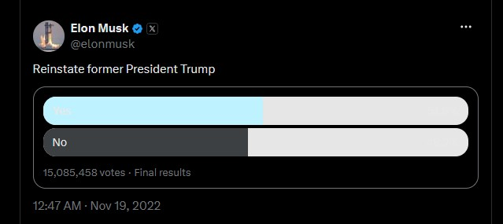
```

---

```{r, echo = FALSE, out.width="90%", fig.retina = 1, fig.align='center', fig.alt="Elon Musk tweet, Nov. 20, 2022: 'The people have spoken. Trump will be reinstated. Vox Populi, Vox Dei.' — quoting his earlier poll as justification for the reinstatement decision."}
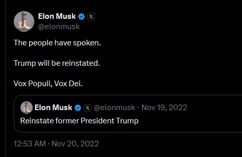
```

---

The poll drew over **15 million votes** in 24 hours. The "yes" side won with 51.8%. Musk declared the matter settled: *"The people have spoken. Trump will be reinstated. Vox Populi, Vox Dei."*

---

```{r, echo = FALSE, out.width="90%", fig.retina = 1, fig.align='center', fig.alt="Elon Musk tweet, Nov. 19, 2022: 'Bot & troll armies might be running out of steam soon. Some interesting lessons to clean up future polls.' — Musk acknowledging that bots and trolls likely participated in the very poll he used to justify reinstating Trump."}

```

---

How much do we actually trust what these 15 million votes tell us about what "the people" want?

---
### But are convenience samples *always* useless?

No—but it depends on what you're trying to learn.

Researchers often face tradeoffs:
- Representative samples are expensive and difficult to obtain
- Convenience samples are cheaper and faster
- The question is: *do convenience samples give us the wrong answers?*

---

### A Direct Test: Ellis, Savchenko, and Messer (2023)

**Research question:** Do people's purchasing decisions differ between a non-representative convenience sample and a representative sample?

**The setup:**
- Both studies used the *same experiment* about consumer attitudes toward food produced with recycled water
- One sample: in-person convenience sample (314 adults recruited at DMV, farmer's market, mall)
- One sample: online representative sample (546 adults matched to US mid-Atlantic demographics)

---

```{r, echo = FALSE, out.width="90%", fig.retina = 1, fig.align='center', fig.alt="Ellis et al. Figure 1: two US maps showing regional distribution of participants by ZIP code. Left: in-person non-representative sample (n=314), concentrated in mid-Atlantic states. Right: online representative sample (n=546), more broadly distributed across the country. Illustrates the geographic clustering typical of convenience samples."}
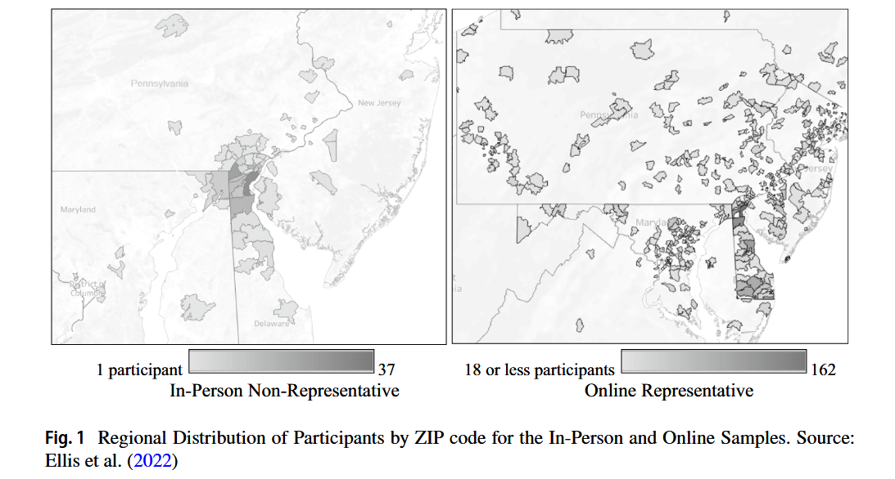
```

---

### What Did They Find?

**The key result:** No meaningful differences in the *key behaviors of interest* between the two samples.

- Both samples showed the same pattern: products made with recycled water were less likely to be purchased
- Both samples showed that passing recycled water through an aquifer removed the stigma
- Both samples showed that products higher in the food chain (meat, cheese) were less stigmatized than plants or water

---

```{r, echo = FALSE, out.width="90%", fig.retina = 1, fig.align='center', fig.alt="Ellis et al. Figure 2: horizontal bar chart of regression-estimated effects on likelihood of purchasing by trophic level (zero, one, two) and water type (recycled, aquifer recharge, ground). Dark bars show the online representative sample; light bars show the in-person convenience sample. The two samples' confidence intervals overlap closely across nearly all conditions, showing no meaningful difference in purchase behavior between samples."}
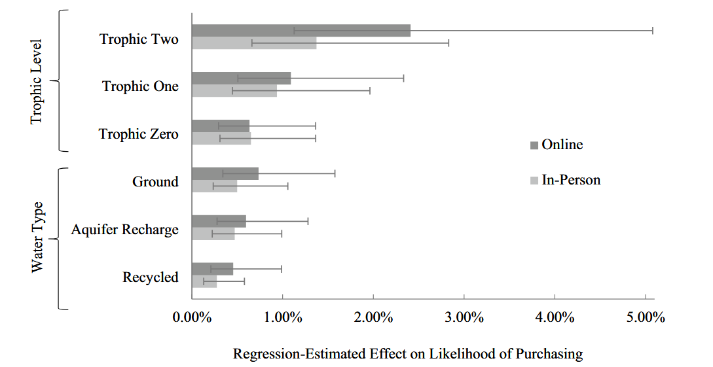
```

*Source: Ellis et al. 2023, Figure 2. Regression-estimated probability of purchasing by trophic level and water type. The samples overlap statistically.*

---

### Where Did They Find Differences?

Only two small differences emerged:

1. **Trophic level one (plants):** The stigma-reducing effect of moving from water to plants was weaker in the in-person sample—suggesting this effect may be small and tenuous.

2. **Perishable products:** In-person participants were less likely to purchase fresh lamb and cheese, perhaps because carrying perishables around a mall or DMV is inconvenient. Online participants knew products would be shipped on ice.

---

### What Does This Tell Us?

**Convenience samples can be useful when:**

- You're studying behaviors that aren't highly sensitive to context
- You're testing *relationships between variables* rather than precise population estimates
- You're in the early stages of research, testing whether an effect exists at all

---

### What Does This Tell Us?

**Convenience samples come with risks:**
- Logistical factors (like carrying perishables) can distort choices
- You can't reliably estimate population averages (like "what percentage of Americans would buy this?")

---

### The Tradeoff

| Sample Type | Cost | Difficulty | External Validity | When to Use |
|-------------|------|------------|-------------------|-------------|
| Representative | High | High | High | When you need precise population estimates |
| Convenience | Low | Low | Moderate | When testing relationships, mechanisms, or theories |

Ellis et al.'s conclusion:

> "Requiring every study to have a representative sample could create unnecessary barriers to research that stifles scientific progress. These tradeoffs should be kept in mind when considering sample selection."

---

### Back to Musk

The problem with Musk's poll wasn't just that it used a convenience sample — though it was self-selected in ways that made it deeply unrepresentative. It was that it was used to make a high-stakes, irreversible decision and presented as the voice of the people.

- The population: Twitter users who happened to see Musk's tweet and chose to vote
- Who is missing: the vast majority of Americans, including those most affected by Trump's return to the platform
- Musk himself acknowledged bots and trolls likely participated

**The lesson:** Convenience samples can be useful tools, but *honesty about what they are* is non-negotiable — especially when decisions have real consequences.

---
### Quota Sampling

A **quota sample** is where the researchers modify a sample of
convenience by making sure the sample is like the population in
specific, predetermined ways.


---

```{r, echo = FALSE, out.width="90%", fig.retina = 1, fig.align='center', fig.alt="President Harry Truman grinning and holding up a Chicago Daily Tribune with the erroneous headline 'DEWEY DEFEATS TRUMAN' — the famous 1948 polling failure. The Tribune's prediction relied on a quota sample that overrepresented higher-income, Republican-leaning respondents and missed the surge of working-class Truman voters."}
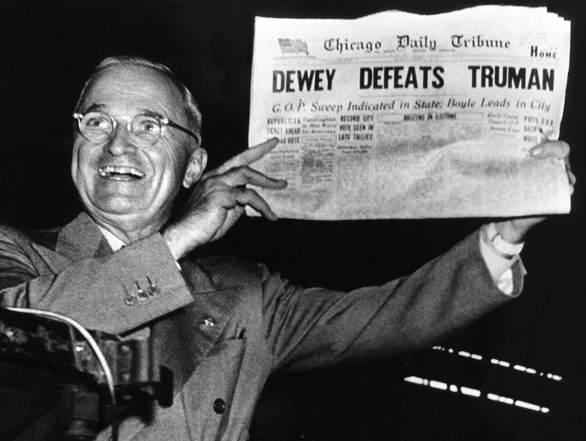
```

---
### Random Sampling

A **random sample** is a sample where each case has a known probability
of selection.

---
### Random Sampling

The *law of large numbers* tells us that, with a large enough sample, random
sampling basically guarantees that our sample will be like the
population.

---
### Random Sampling

Kinds of random samples:

-   Simple random sample.

-   Cluster sample.

-   Stratified random sample.

---
### What Can Go Wrong?

Non-response; some people just don't want to participate in surveys.

-   Non-response is usually non-random, which means that it spoils most
    of our random samples.

-   What can we do to deal with non-response?


---
### The New World

Response rates have basically collapsed in surveys in much of the world.


---

```{r, echo = FALSE, out.width="90%", fig.retina = 1, fig.align='center', fig.alt="Figure III.1: line chart of response rates for seven major U.S. government surveys (CPS, MCBS, MEPS, NHANES, NHIS, NIS, NSDUH) from 1995 to 2015. Most surveys begin at 85–95% response rates in the mid-1990s and decline steadily; by 2015 several have fallen to 70–80%, with NHANES dropping most sharply. All surveys show a consistent downward trend."}
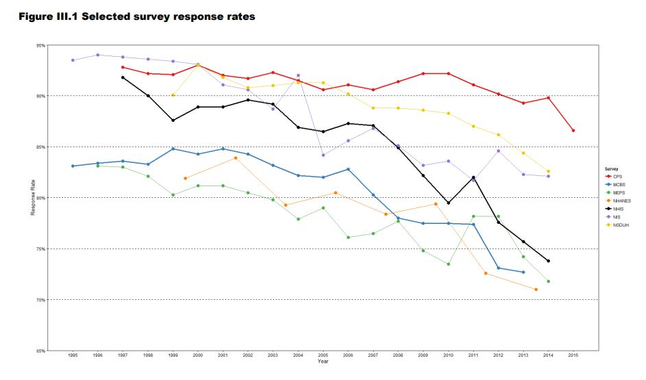
```

---

```{r, echo = FALSE, out.width="90%", fig.retina = 1, fig.align='center', fig.alt="Pew Research Center line chart of private-sector survey response rates, 1997–2012. High-effort surveys (dashed line) dropped from 61% to 22%; standard surveys (solid line) dropped from 36% to 9%. Both show steep, sustained decline — by 2012 even intensive outreach efforts could not reach most sampled respondents."}
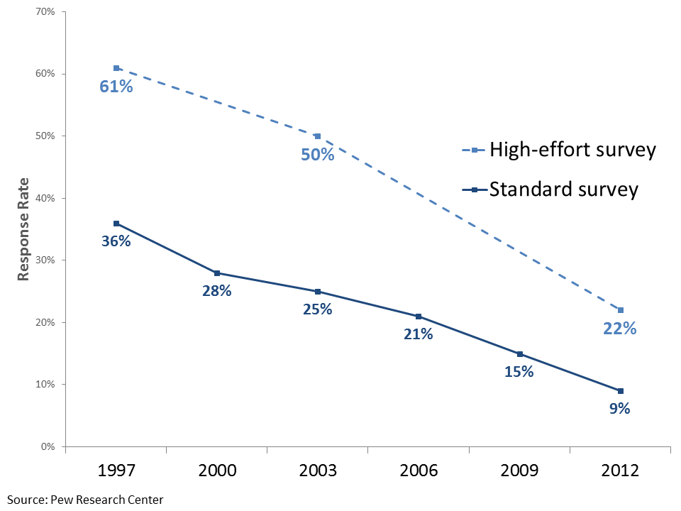
```

---

```{r, echo = FALSE, out.width="90%", fig.retina = 1, fig.align='center', fig.alt="Table 3: correlations between total survey nonresponse and social-environmental factors across four national surveys (NHIS, GSS, NHES, NIS), 1996–2007. Bolded values indicate consistent correlates across all surveys: single-person households (r ≈ +0.63 to +0.95), violent crime rate (r ≈ −0.65 to −0.91), and long commute times (r ≈ +0.78 to +0.97). Areas with more isolation, more crime, and longer commutes have systematically higher nonresponse."}
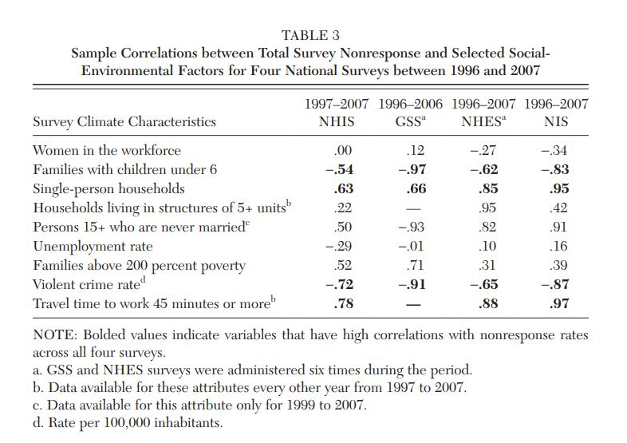
```

---

```{r, echo = FALSE, out.width="90%", fig.retina = 1, fig.align='center', fig.alt="Stantcheva (Annual Review of Economics), 'How to Run Surveys: A Guide to Creating Your Own Identifying Variation and Revealing the Invisible.' Author: Stefanie Stantcheva, Harvard University / NBER / CEPR."}
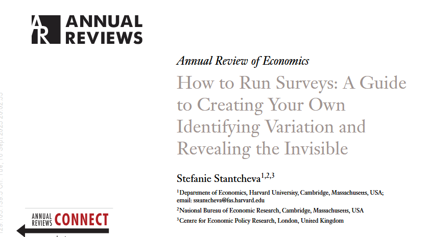
```

---

```{r, echo = FALSE, out.width="90%", fig.retina = 1, fig.align='center', fig.alt="Stantcheva excerpt listing types of survey channels: nationally representative panels (Knowledge Panel, AmeriSpeak, Understanding America Study); commercial quota-sampled panels (Qualtrics, Dynata, Prolific Academic); commercial marketplaces (Lucid); convenience samples (university students, conference participants); online work platforms like MTurk; targeted expert groups; and government/institutional surveys (Statistics Denmark, Survey of Consumer Expectations)."}
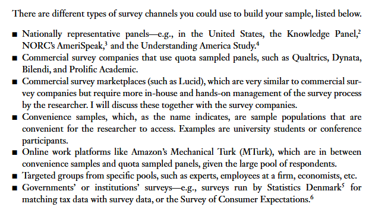
```

---

```{r, echo = FALSE, out.width="90%", fig.retina = 1, fig.align='center', fig.alt="Stantcheva section 2.2.3 comparing online samples to nationally representative samples: online panels represent middle incomes ($25k–$100k) reasonably well, but undersample the very poor and very rich. They tend to oversample white, more educated, and Democratic respondents; Black respondents are typically undersampled."}
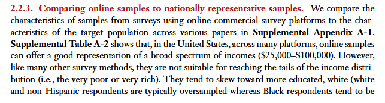
```

---

```{r, echo = FALSE, out.width="90%", fig.retina = 1, fig.align='center', fig.alt="Stantcheva continued: online samples overrepresent large urban areas and underrepresent medium/small urban and rural areas. Some papers successfully use online platforms to replicate studies from representative or convenience samples. In developing and middle-income countries, online samples represent the internet-connected population rather than the national population."}
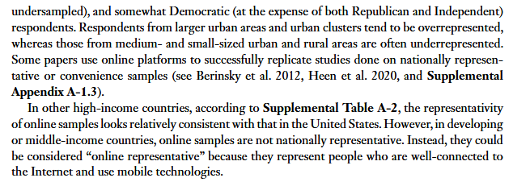
```

---
### What about 2016 and 2020?


---
### Was 2016 a Polling Miss?

```{r, echo = FALSE, out.width="90%", fig.retina = 1, fig.align='center', fig.alt="RCP polling average table for the 2016 Trump vs. Clinton general election. Final results: Clinton 48.2%, Trump 46.1% (Clinton +2.1). RCP Average from final week: Clinton 46.8%, Trump 43.6% (Clinton +3.2). Nearly all individual polls showed Clinton leading by 1–6 points; only the LA Times/USC Tracking poll showed Trump ahead (+3). The RCP Average overestimated Clinton's margin by about one point."}
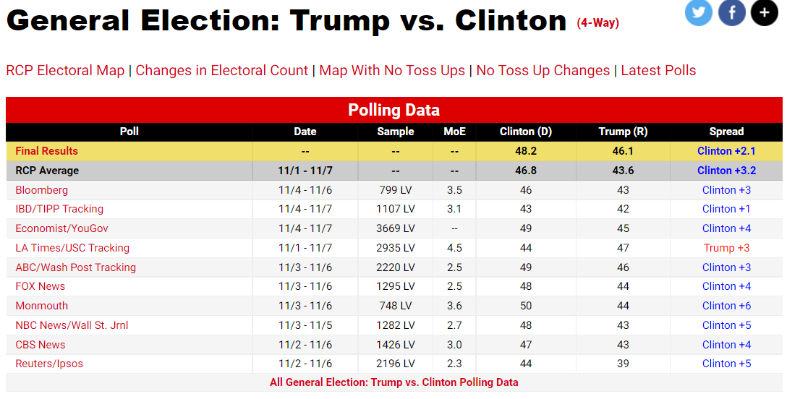
```

---
### Was 2016 a Polling Miss?

```{r, echo = FALSE, out.width="70%", fig.retina = 1, fig.align='center', fig.alt="FiveThirtyEight's 2016 presidential forecast on election eve: Hillary Clinton given a 71.4% chance of winning, Donald Trump 28.6%. Electoral vote projections: Clinton 302, Trump 235. A color-coded US map shows Clinton favored (blue) in most coastal and Great Lakes states, Trump favored (red/orange) across the South and interior West, with several toss-up states."}
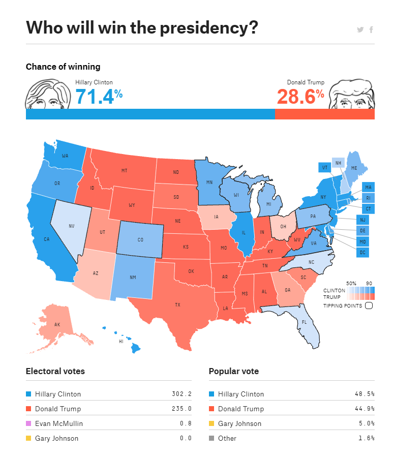
```

---
### Was 2016 a Polling Miss?

```{r, echo = FALSE, out.width="90%", fig.retina = 1, fig.align='center', fig.alt="Reuters headline from November 7, 2016 — the day before Election Day: 'Clinton has 90 percent chance of winning: Reuters/Ipsos States of the Nation.' The article states Clinton had about a 90% chance of defeating Trump according to the final Reuters/Ipsos model."}
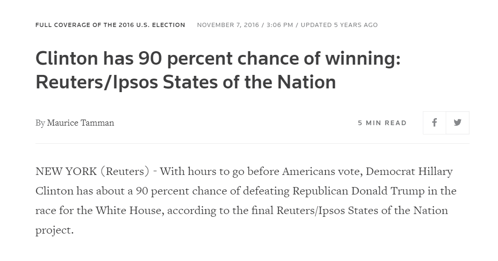
```

---
### Was 2020 a Polling Miss?

```{r, echo = FALSE, out.width="90%", fig.retina = 1, fig.align='center', fig.alt="RCP polling average table for the 2020 Trump vs. Biden general election. Final results: Biden 51.4%, Trump 46.9% (Biden +4.5). RCP Average from final week: Biden 51.2%, Trump 44.0% (Biden +7.2). Individual polls showed Biden leads ranging from +4 (IBD/TIPP) to +11 (Quinnipiac); only Rasmussen came close to the actual margin at Biden +1. The RCP Average overestimated Biden's lead by about 2.7 points."}
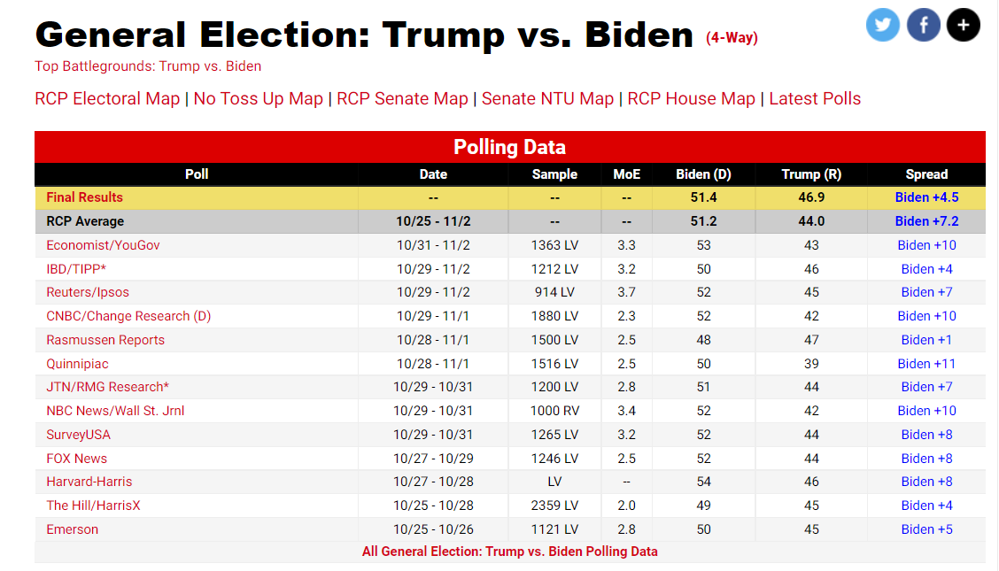
```

---

```{r, echo = FALSE, out.width="90%", fig.retina = 1, fig.align='center', fig.alt="Cover slide for the AAPOR (American Association for Public Opinion Research) Task Force on 2020 Pre-Election Polling: 'An Evaluation of the 2020 General Election Polls.'"}
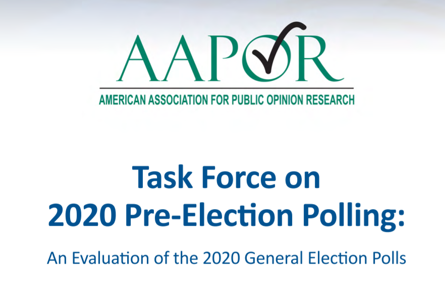
```

---

```{r, echo = FALSE, out.width="90%", fig.retina = 1, fig.align='center', fig.alt="AAPOR Task Force finding 1: The 2020 polls had the highest polling error in 40 years for the national popular vote and at least 20 years for state-level estimates. In the final two weeks, average error was 4.5 points for national polls and 5.1 points for state-level polls. The error systematically favored Biden: average signed error was 3.9 points nationally and 4.3 points in statewide presidential polls."}
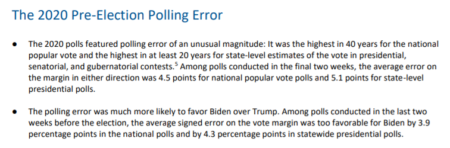
```

---

```{r, echo = FALSE, out.width="90%", fig.retina = 1, fig.align='center', fig.alt="AAPOR Task Force finding 2: The 2020 polling error was not caused by late-deciding voters switching to Republicans. Only 4% of respondents were undecided in the final two weeks, and unlike 2016, late deciders were as likely to support Biden as Trump according to National Election Pool exit polls."}
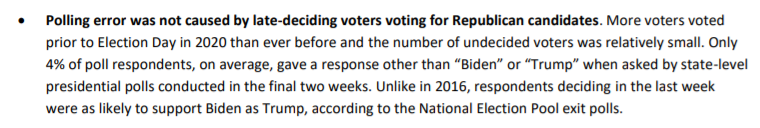
```

---

```{r, echo = FALSE, out.width="90%", fig.retina = 1, fig.align='center', fig.alt="AAPOR Task Force finding 3: The 2020 polling error was not primarily caused by incorrect assumptions about the demographic composition of the electorate. Reweighting survey data by age, race, ethnicity, gender, or education produced only minor changes to the estimates."}
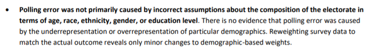
```

---

```{r, echo = FALSE, out.width="90%", fig.retina = 1, fig.align='center', fig.alt="AAPOR Task Force finding 4: The 2020 polling error was not primarily caused by 'shy Trump voters' hiding their support. Democratic overstatement occurred regardless of survey mode (phone vs. online), and the overstatement was larger in senatorial and gubernatorial races not involving Trump — ruling out social desirability bias around Trump specifically."}
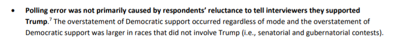
```

---

```{r, echo = FALSE, out.width="90%", fig.retina = 1, fig.align='center', fig.alt="AAPOR Task Force finding 5: The 2020 polling error was not caused by too few Election Day voters or too many early voters in polling samples. Among 23 state-level presidential polls in the final two weeks, the proportion of respondents saying they planned to vote on Election Day closely matched the certified vote."}
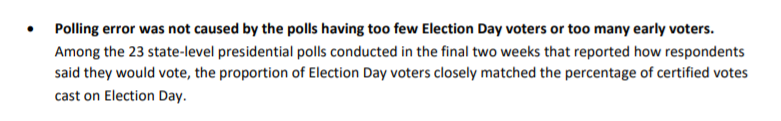
```

---

```{r, echo = FALSE, out.width="90%", fig.retina = 1, fig.align='center', fig.alt="AAPOR Task Force finding 6: At least some of the 2020 polling error was caused by unit nonresponse — too many Democrats and too few Republicans responding, within-party nonresponse differences, or issues with new and unaffiliated voters. Without data on nonrespondents, the primary cause cannot be conclusively identified."}
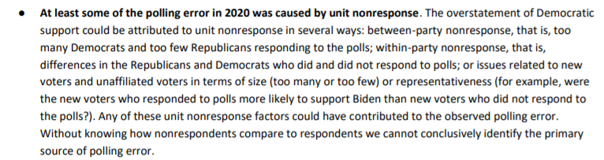
```

---

```{r, echo = FALSE, out.width="90%", fig.retina = 1, fig.align='center', fig.alt="AAPOR Task Force finding 7: The 2020 polls may not have correctly accounted for new voters. Many new voters participated in 2020, and it is unclear whether those who responded to polls had similar opinions to those who did not. Self-reported new voter behavior in poll data pushed margins in the Democratic direction; mis-measuring this group could explain the observed polling error."}
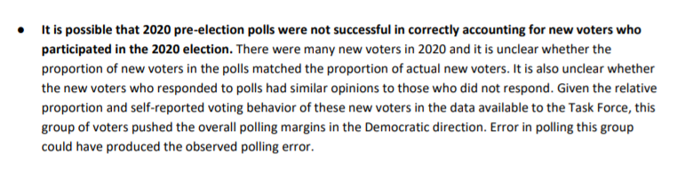
```

---

How much does question wording matter?

---

```{r, echo = FALSE, out.width="90%", fig.retina = 1, fig.align='center', fig.alt="Bruinsma (2023), 'Measuring Congruence Between Voters and Parties in Online Surveys: Does Question Wording Matter?' Methods, Data, Analyses 17(1), pp. 71–92. Author: Bastiaan Bruinsma, Chalmers University of Technology."}
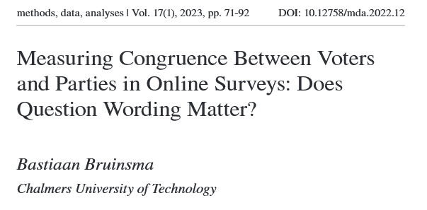
```

---

```{r, echo = FALSE, out.width="90%", fig.retina = 1, fig.align='center', fig.alt="Bruinsma Table 3: OLS regression coefficients for 12 policy survey items, showing an intercept and a positive/negative wording coefficient (Pos/Neg) for each, with percentage of variance explained by wording (salience). Most items show near-zero wording effects, but items q22 (19.4% salience) and q25 (18.3% salience) show large wording effects — demonstrating that question framing matters substantially for some policy domains but not others."}
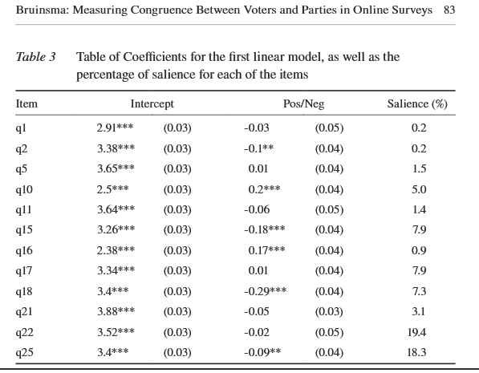
```

---

There's no way to generate a perfectly neutral survey question, but the key is to
ask things as simply as possible.