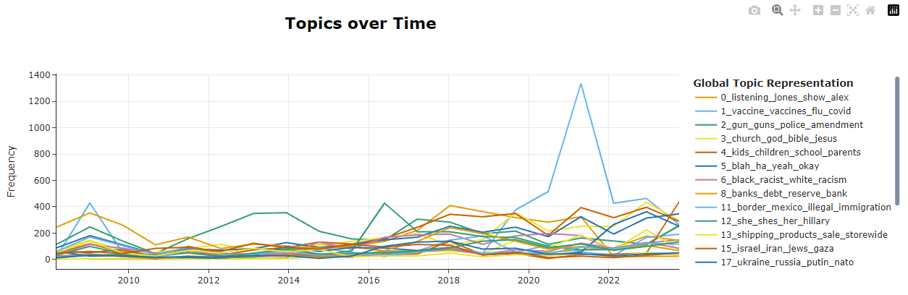
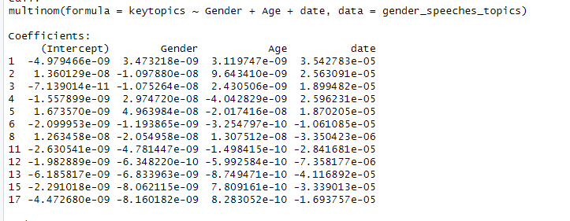
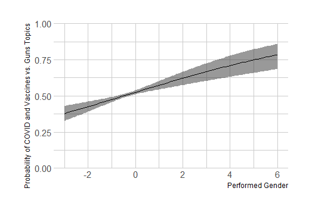
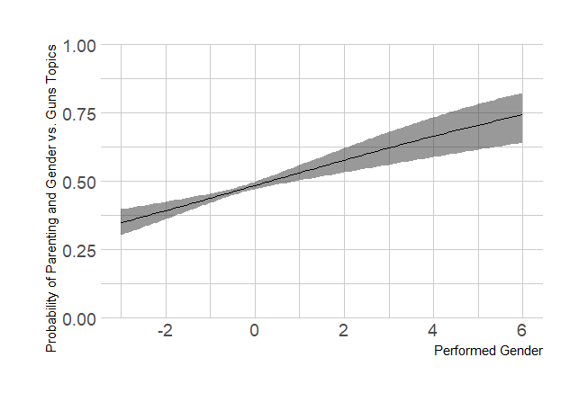
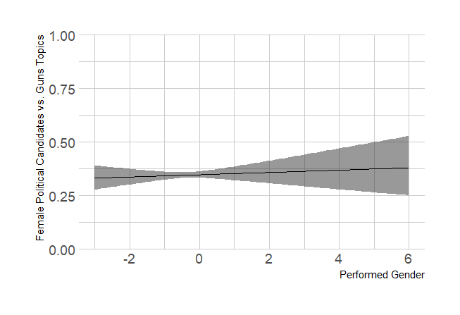
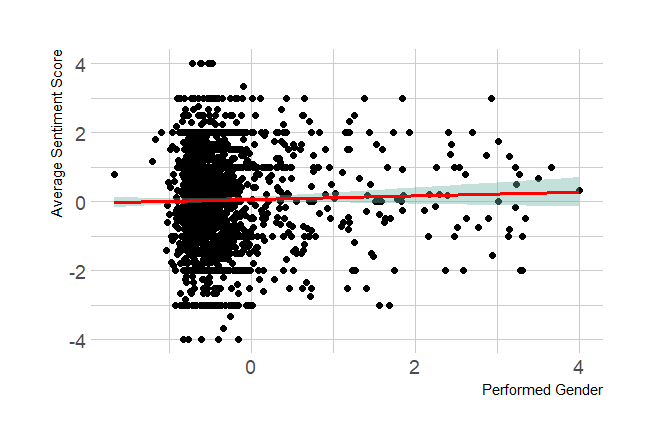
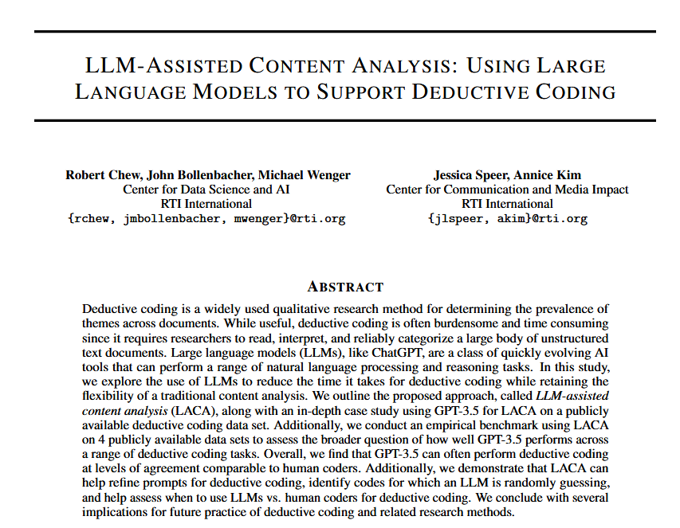
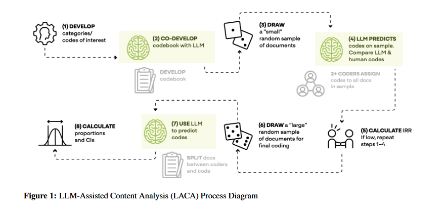
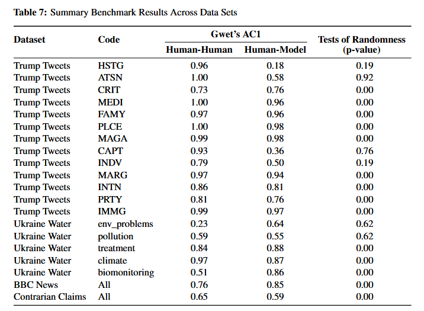
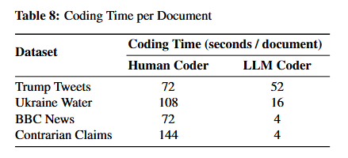

class: center, middle

```{css, echo=FALSE}
pre {
  max-height: 400px;
  overflow-y: auto;
}

pre[class] {
  max-height: 200px;
}
```

```{r, load_refs, include=FALSE, cache=FALSE}
# Initializes
library(RefManageR)

library(ggplot2)
library(dplyr)
library(readr)
library(nlme)
library(jtools)
library(hrbrthemes)
library(mice)
library(knitr)
library(DiagrammeR)
library(extrafont)
loadfonts(device="win")

BibOptions(check.entries = FALSE,
           bib.style = "authoryear", # Bibliography style
           max.names = 3, # Max author names displayed in bibliography
           sorting = "nyt", #Name, year, title sorting
           cite.style = "authoryear", # citation style
           style = "markdown",
           hyperlink = FALSE,
           dashed = FALSE)

```
```{r xaringan-themer, include=FALSE, warning=FALSE}
library(xaringanthemer,MnSymbol)
style_mono_accent(
  base_color = "#1c5253",
  header_font_google = google_font("Josefin Sans"),
  text_font_google   = google_font("Montserrat", "300", "300i"),
  code_font_google   = google_font("Fira Mono"),
  text_font_size = "1.6rem"
)

```

A lot of the things we care about in politics naturally come in the form of text, not numbers.

---
### Quantitative Text Methods

-   We can use large pools of text to summarize themes and topics, then generate data
-   We can use pre-trained AI models to analyze texts and code them, generating data

---
### Identifying Topics

-   We can learn a lot about texts by looking at which words occur a lot
-   Does a text say ''munitions'' a lot? Then it's probably not about cooking

---
### Identifying Topics

-   We can learn even more by noticing which words hang together
-   A text that talks about ''munitions,'' ''JDAM,'' ''MK 84,'' and ''Boeing'' is likely discussing technical details of Air Force weapons.
-   A text that talks about ''munitions,'' ''no-scope,'' ''spawn campers,'' and ''trolls'' is likely discussing a PvP shooter video game.

---
### Identifying Topics

-   Statistical topic models turn every word in a text into a number and look at the patterns of which numbers repeatedly show up together.
-   They then aggregate those groupings into topics, and assign each text into its most likely topic.

---
### Seawright and Good 2025 

How do U.S. women navigate the overtly misogynistic space of the far right?

---

What do women talk about within male-dominated insurgent right spaces?
* Women attempt to advance outcomes for women? (Paxton et al. 2007)
* Undermine the sexist intent of the insurgent right (Blee 2003) as in electoral politics, peace negotiations, etc. (Asiedu et al. 2018; Thomas 1991; True and Riveros-Morales 2019)

---

Or women engage in sexist rhetoric
* Means of belonging, inclusion, and approval from male leadership (Oak and Nielsen 2024)
* Demonstrates women's unique value as a legitimizing force (Darby 2020; Leidig 2023)
* Offers ambitious women an opportunity for personal gain (career growth, etc.)

---

Data: 1000 podcast episodes by Alex Jones???s InfoWars network, the Proud Boys, and Ben Shapiro

1. Transcribe podcasts using the medium-sized WhisperAI transcription model (Radford et al. 2022)
2. Identify and code speech acts to women or men based on voice-based gender performance (Burkhardt et al. 2023)
3. Identify topics discussed using BERTopic (Grootendorst 2022)
4. Case studies of four women's careers before and after their podcast appearances

---



---
###Selecting a high-probability transcript from Topic 1.

---

On the vaccine said I'm gonna stop but I noticed a lot of calls are on that Because they're coming all the world before inoculations just people are waking up 50 years ago in new guinea or places in Africa or wherever people went up to the white witch doctors and they wanted shots They wanted help now they run My baby died at the shot Her baby died at the shot They don't need medical degrees to know what's going on and then in Africa and India They test the shot and they find what they're adding to it hormones So your body creates an autoimmune response to the hormone so then your body has an autoimmune response attacking your ovaries That's the woman's wavos 

---

That's what Gardasil attacks what it all does and to understand this i remember like 10 years ago the h1n1 virus They admitted that it was a live virus Not attenuated live engineered But not to quote not hurt you so they could quote track it to the next year Then you had the giant h1n1 outbreak because it mutated into something bad. It was all planned Now they're putting out they approved a month ago a month ago. It was in the middle of December Live ebola vaccines people are taking them here in the us It sheds Yeah But You it sheds the ebola and you get it and they have no freaking idea what it's going to do big pharma bill them When the gates say just just take it and trust us 

---

It's genetically engineered and then the un says in our own videos They go we don't we're not testing any of this We just believe them and we don't have any studies and we don't know They don't even know what the adjuvants are doing but they do But now all these big sinister big pharma companies those are the folks that brought you Hitler his main financiers literally look it up They had something special for you that an electron microscope can't read little something special they made and if you try to sue them they go oh CRISPR is patented and proprietary We're not going to let you know and anyone that ever tries to scan because they have other machines like CRISPR now An Italian firm was last year trying to scan Some of the these vaccines Read what they've done and they got swat teamed.

---

-   The opening monologue of the episode was also about how vaccines were allegedly killing people.

-   The theme of vaccine scientists, bureaucrats, and pharmaceutical companies conspiring to deliberately kill people came up at least six more times scattered through the episode.

---
###Selecting a high-probability transcript from Topic 4.

---

i've seen the product of the leftist indoctrination in k through 12 schools i go to school with these people um and i want to stop that and i also i mean i want to protect kids like the name says um so i'm going to be going to these local dfw school board meetings and testifying um right now there's so many school districts in dfw that are allowing sexually explicit books in their libraries they're promoting crt even though they're not allowed to they kind of sneak it in um as well as gender theory that shouldn't be being discussed in k through 12 schools so i'm going to go testify against that stuff 

---

um we're also planning on um coming up going to a board of trustees member from ut southwestern medical center um they recently had a gender clinic shut down but they kind of just like took the name off the website and integrated the um gender for me care for minors into other programs to kind of get people off their case so um yeah i'm really just planning on going on advocating for children and um you know hopefully kind of taking back um some of the culture

---



---

```{r, echo = FALSE, out.width="90%", fig.retina = 1, fig.align='center'}

```

---

```{r, echo = FALSE, out.width="90%", fig.retina = 1, fig.align='center'}

```

---

```{r, echo = FALSE, out.width="90%", fig.retina = 1, fig.align='center'}

```

---

```{r, echo = FALSE, out.width="90%", fig.retina = 1, fig.align='center'}

```

---
### Using Pre-Trained Models

-   We can feed an LLM or other similar model a hand-coded sample of texts, or a carefully written codebook, and then ask it to code a large body of texts for us

---

```{r, echo = FALSE, out.width="90%", fig.retina = 1, fig.align='center'}

```

---

```{r, echo = FALSE, out.width="90%", fig.retina = 1, fig.align='center'}

```

---

```{r, echo = FALSE, out.width="90%", fig.retina = 1, fig.align='center'}

```

---

```{r, echo = FALSE, out.width="90%", fig.retina = 1, fig.align='center'}

```

---

After reading through the Rossiter article, which tools did she use? What did she do that you liked, what maybe that you didn't like, and what that you'd like to learn more about?
