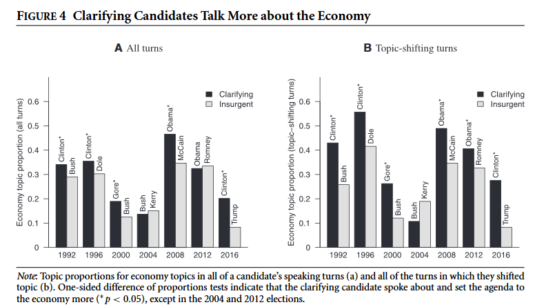

class: center, middle

```{css, echo=FALSE}
pre {
  max-height: 400px;
  overflow-y: auto;
}

pre[class] {
  max-height: 200px;
}
```

```{r, load_refs, include=FALSE, cache=FALSE}
# Initializes
library(RefManageR)

library(ggplot2)
library(dplyr)
library(readr)
library(nlme)
library(jtools)
library(mice)
library(knitr)
library(DiagrammeR)
library(extrafont)
loadfonts(device="win")

BibOptions(check.entries = FALSE,
           bib.style = "authoryear", # Bibliography style
           max.names = 3, # Max author names displayed in bibliography
           sorting = "nyt", #Name, year, title sorting
           cite.style = "authoryear", # citation style
           style = "markdown",
           hyperlink = FALSE,
           dashed = FALSE)

```
```{r xaringan-themer, include=FALSE, warning=FALSE}
library(xaringanthemer,MnSymbol)
style_mono_accent(
  base_color = "#1c5253",
  header_font_google = google_font("Josefin Sans"),
  text_font_google   = google_font("Montserrat", "300", "300i"),
  code_font_google   = google_font("Fira Mono"),
  text_font_size = "1.6rem"
)

```

### Today's Goals

By the end of this session, you should be able to:

1. Describe the four main approaches to text as data — dictionary methods, topic models, word embeddings, and LLMs — and identify the strengths and weaknesses of each
2. Explain how statistical topic models work and interpret a topic-over-time visualization
3. Interpret multinomial regression output linking speaker gender to topic choice
4. Explain how LLMs can be used for deductive content analysis, and evaluate reliability using inter-rater agreement benchmarks
5. Describe what supervised text classification is and interpret precision, recall, and F1 score as validation metrics

---
### A lot of the things we care about in politics naturally come in the form of text, not numbers.

- Party platforms
- Legislative speeches
- Social media posts
- News articles
- Podcast transcripts
- Government documents

---
### Quantitative Text Methods

-   We can use large pools of text to summarize themes and topics, then generate data
-   We can use pre-trained AI models to analyze texts and code them, generating data

---
### Four Approaches to Text as Data

**1. Dictionary Methods**
- Count words in pre-defined categories (e.g., "negative emotion," "economic concern")
- Pros: Simple, transparent, replicable
- Cons: Misses context, requires careful dictionary design

---
### Four Approaches to Text as Data

**2. Topic Models** (unsupervised)
- Let statistical patterns reveal latent themes
- Pros: Data-driven, no prior coding needed
- Cons: Topics need interpretation, can be unstable

---

### Four Approaches to Text as Data

**3. Word Embeddings**
- Represent words as vectors in semantic space
- Capture relationships: "king" - "man" + "woman" ≈ "queen"
- Pros: Powerful for measuring similarity, change over time
- Cons: Requires large corpora, "black box" interpretation

---
### Four Approaches to Text as Data

**4. Large Language Models** (supervised or few-shot)
- Use pre-trained models (GPT, BERT, etc.) to classify or generate text
- Pros: Flexible, captures context, can be "few-shot"
- Cons: Expensive, validation challenges, bias concerns

---
### Identifying Topics

-   We can learn a lot about texts by looking at which words occur a lot
-   Does a text say ''munitions'' a lot? Then it's probably not about cooking

---
### Identifying Topics

-   We can learn even more by noticing which words hang together
-   A text that talks about ''munitions,'' ''JDAM,'' ''MK 84,'' and ''Boeing'' is likely discussing technical details of Air Force weapons.
-   A text that talks about ''munitions,'' ''no-scope,'' ''spawn campers,'' and ''trolls'' is likely discussing a PvP shooter video game.

---
### Identifying Topics

-   Statistical topic models turn every word in a text into a number and look at the patterns of which numbers repeatedly show up together.
-   They then aggregate those groupings into topics, and assign each text into its most likely topic.

---
### Seawright and Good 2025 

How do U.S. women navigate the overtly misogynistic space of the far right?

---

What do women talk about within male-dominated insurgent right spaces?
* Women attempt to advance outcomes for women? (Paxton et al. 2007)
* Undermine the sexist intent of the insurgent right (Blee 2003) as in electoral politics, peace negotiations, etc. (Asiedu et al. 2018; Thomas 1991; True and Riveros-Morales 2019)

---

Or women engage in sexist rhetoric
* Means of belonging, inclusion, and approval from male leadership (Oak and Nielsen 2024)
* Demonstrates women's unique value as a legitimizing force (Darby 2020; Leidig 2023)
* Offers ambitious women an opportunity for personal gain (career growth, etc.)

---

Data: 1000 podcast episodes by Alex Jones???s InfoWars network, the Proud Boys, and Ben Shapiro

1. Transcribe podcasts using the medium-sized WhisperAI transcription model (Radford et al. 2022)
2. Identify and code speech acts to women or men based on voice-based gender performance (Burkhardt et al. 2023)
3. Identify topics discussed using BERTopic (Grootendorst 2022)
4. Case studies of four women's careers before and after their podcast appearances

---

![Line chart titled 'Topics over Time' showing frequency of 15 LDA topics from InfoWars, Proud Boys, and Ben Shapiro podcast transcripts from approximately 2007 to 2024. The vaccine/COVID topic (light blue) spikes dramatically to approximately 1,300 frequency around 2021–2022 before declining. Topics include gun rights, immigration (border_mexico_illegal_immigration), partisan identity, religion, and antisemitism/geopolitics. Most topics remain relatively stable at lower frequencies throughout the period.](images/topics.PNG)

---
###Selecting a high-probability transcript from Topic 1.

---

On the vaccine said I'm gonna stop but I noticed a lot of calls are on that Because they're coming all the world before inoculations just people are waking up 50 years ago in new guinea or places in Africa or wherever people went up to the white witch doctors and they wanted shots They wanted help now they run My baby died at the shot Her baby died at the shot They don't need medical degrees to know what's going on and then in Africa and India They test the shot and they find what they're adding to it hormones So your body creates an autoimmune response to the hormone so then your body has an autoimmune response attacking your ovaries That's the woman's wavos 

---

That's what Gardasil attacks what it all does and to understand this i remember like 10 years ago the h1n1 virus They admitted that it was a live virus Not attenuated live engineered But not to quote not hurt you so they could quote track it to the next year Then you had the giant h1n1 outbreak because it mutated into something bad. It was all planned Now they're putting out they approved a month ago a month ago. It was in the middle of December Live ebola vaccines people are taking them here in the us It sheds Yeah But You it sheds the ebola and you get it and they have no freaking idea what it's going to do big pharma bill them When the gates say just just take it and trust us 

---

It's genetically engineered and then the un says in our own videos They go we don't we're not testing any of this We just believe them and we don't have any studies and we don't know They don't even know what the adjuvants are doing but they do But now all these big sinister big pharma companies those are the folks that brought you Hitler his main financiers literally look it up They had something special for you that an electron microscope can't read little something special they made and if you try to sue them they go oh CRISPR is patented and proprietary We're not going to let you know and anyone that ever tries to scan because they have other machines like CRISPR now An Italian firm was last year trying to scan Some of the these vaccines Read what they've done and they got swat teamed.

---

-   The opening monologue of the episode was also about how vaccines were allegedly killing people.

-   The theme of vaccine scientists, bureaucrats, and pharmaceutical companies conspiring to deliberately kill people came up at least six more times scattered through the episode.

---
###Selecting a high-probability transcript from Topic 4.

---

i've seen the product of the leftist indoctrination in k through 12 schools i go to school with these people um and i want to stop that and i also i mean i want to protect kids like the name says um so i'm going to be going to these local dfw school board meetings and testifying um right now there's so many school districts in dfw that are allowing sexually explicit books in their libraries they're promoting crt even though they're not allowed to they kind of sneak it in um as well as gender theory that shouldn't be being discussed in k through 12 schools so i'm going to go testify against that stuff 

---

um we're also planning on um coming up going to a board of trustees member from ut southwestern medical center um they recently had a gender clinic shut down but they kind of just like took the name off the website and integrated the um gender for me care for minors into other programs to kind of get people off their case so um yeah i'm really just planning on going on advocating for children and um you know hopefully kind of taking back um some of the culture

---


---

```{r, echo = FALSE, out.width="90%", fig.retina = 1, fig.align='center', fig.alt="Marginal effects plot from multinomial regression. X-axis: Performed Gender (roughly -3 to 6); Y-axis: Probability of COVID and Vaccines vs. Guns Topics (0 to 1.00). An upward-sloping sigmoid curve with gray confidence band shows that speakers with higher performed gender scores are substantially more likely to discuss COVID and vaccines than guns topics compared to speakers with lower performed gender scores."}
include_graphics("images/covidguns.png")
```

---

```{r, echo = FALSE, out.width="90%", fig.retina = 1, fig.align='center', fig.alt="Marginal effects plot from multinomial regression. X-axis: Performed Gender (-3 to 6); Y-axis: Probability of Parenting and Gender vs. Guns Topics (0 to 1.00). An upward-sloping curve with gray confidence band shows that speakers with higher performed gender scores are significantly more likely to discuss parenting and gender topics than guns topics, with the probability rising from about 0.35 to 0.75 across the range."}
include_graphics("images/parentingvguns.png")
```

---

```{r, echo = FALSE, out.width="90%", fig.retina = 1, fig.align='center', fig.alt="Marginal effects plot from multinomial regression. X-axis: Performed Gender (-3 to 6); Y-axis: Female Political Candidates vs. Guns Topics (0 to 1.00). The nearly flat line at approximately 0.35, with a widening confidence band at high performed gender values, indicates no significant relationship between performed gender and the probability of discussing female political candidates versus guns topics."}
include_graphics("images/femcand.png")
```

---

```{r, echo = FALSE, out.width="90%", fig.retina = 1, fig.align='center', fig.alt="Scatterplot with two overlaid trend lines. X-axis: Performed Gender (-3 to 4+); Y-axis: Average Sentiment Score (-4 to 4). The dense cloud of points clusters near zero sentiment for low performed gender values, becoming sparse at higher values. A red linear regression line and a blue LOESS curve are nearly flat, indicating little to no relationship between performed gender and sentiment score across speakers."}
include_graphics("images/gendersentiment.png")
```

---
### Using Pre-Trained Models

-   We can feed an LLM or other similar model a hand-coded sample of texts, or a carefully written codebook, and then ask it to code a large body of texts for us

---
### What Are Large Language Models?

- Trained on massive text corpora (much of the public internet)
- Learn statistical patterns of language—which words follow which
- Can be "fine-tuned" for specific tasks with relatively little data

**Key capability for social science:** They can classify text according to complex conceptual schemas with minimal training.

---

### How Researchers Use LLMs for Content Analysis

**Approach 1: Zero-shot classification**
- Provide a prompt describing the categories
- Ask the model to assign each text to a category
- No project-specific training data needed, but results may need to be checked

---

### How Researchers Use LLMs for Content Analysis

**Approach 2: Few-shot classification**
- Provide a handful of hand-coded examples
- Model learns the pattern and applies to the rest
- Often performs nearly as well as fully supervised models

---

### How Researchers Use LLMs for Content Analysis

**Approach 3: Fine-tuning**
- Train the model on hundreds or thousands of hand-coded examples
- Most accurate, but requires more labeled data and compute

---

```{r, echo = FALSE, out.width="90%", fig.retina = 1, fig.align='center', fig.alt="Title page of 'LLM-Assisted Content Analysis: Using Large Language Models to Support Deductive Coding' by Robert Chew, John Bollenbacher, Michael Wenger, Jessica Speer, and Annice Kim (RTI International). The abstract describes the LLM-assisted content analysis (LACA) approach, which uses LLMs like ChatGPT to reduce the burden of deductive coding while retaining the flexibility of traditional content analysis. The paper benchmarks GPT-3.5 across four datasets and finds human-comparable agreement on many coding tasks."}
include_graphics("images/llmcontentanalysis1.png")
```

---

```{r, echo = FALSE, out.width="90%", fig.retina = 1, fig.align='center', fig.alt="Figure 1: LLM-Assisted Content Analysis (LACA) Process Diagram. An 8-step flowchart: (1) Develop categories/codes of interest; (2) Co-develop codebook with LLM; (3) Draw a small random sample of documents; (4) LLM predicts codes on the sample, compared to human codes from 2+ coders; (5) Calculate inter-rater reliability — if low, repeat steps 1–4; (6) Draw a large random sample for final coding; (7) Use LLM to predict codes; (8) Calculate proportions and confidence intervals."}
include_graphics("images/llmcontentanalysis2.png")
```

---

```{r, echo = FALSE, out.width="90%", fig.retina = 1, fig.align='center', fig.alt="Table 7: Summary Benchmark Results Across Data Sets. Rows show datasets (Trump Tweets coded for HSTG, ATSN, CRIT, MEDI, FAMY, PLCE, MAGA, CAPT, INDV, MARG, INTN, PRTY, IMMG; Ukraine Water; BBC News; Contrarian Claims) with columns for Gwet's AC1 human-human agreement, human-model agreement, and tests-of-randomness p-values. Human-model agreement ranges from 0.18 (HSTG) to 0.98 (PLCE, MAGA), showing LLMs achieve near-human reliability on some coding tasks but not others."}
include_graphics("images/llmcontentanalysis3.png")
```

---

```{r, echo = FALSE, out.width="90%", fig.retina = 1, fig.align='center', fig.alt="Table 8: Coding Time per Document. Compares Human Coder versus LLM Coder coding time in seconds per document across four datasets: Trump Tweets (72 vs. 52 seconds), Ukraine Water (108 vs. 16 seconds), BBC News (72 vs. 4 seconds), Contrarian Claims (144 vs. 4 seconds). LLMs are dramatically faster, especially for longer documents."}
include_graphics("images/llmcontentanalysis4.png")
```

---

### Rossiter (2022): Measuring Agenda Setting in Interactive Political Communication

**Research question:** How do members of Congress shape the agenda during committee hearings? Do they ask questions that force witnesses to address their preferred topics?

**Data:** Transcripts of 137 House committee hearings (2011–2016)

---

### Rossiter (2022): Measuring Agenda Setting in Interactive Political Communication

**Method:** Supervised machine learning (not LLMs, but similar logic)
- Hand-coded a sample of question–answer pairs
- Trained a classifier to identify which questions were "agenda-setting"
- Applied to all hearings to measure variation across members, committees, and topics

---

### What Rossiter Did

* Hand-coded 2,500 question–answer pairs for whether the question was "agenda-setting" (i.e., introduced a new topic rather than following up)

* Trained a classifier (support vector machine) using n-grams and other text features

* Validated the model against held-out hand-coded data

* Applied to all 20,000+ exchanges in the corpus

* Analyzed variation across committees, party control, and individual members

---

### Why This Approach?

* Manual coding of 20,000+ exchanges would be impossible

* Simple keyword searches would miss the complexity of "agenda-setting"

* Supervised learning captures the concept rather than just word counts

This is the same logic as using LLMs today, but with older statistical techniques.

---

### Validation: How Do We Know It Worked?

Rossiter reports:

  * Precision: When the model said "agenda-setting," how often was it right? (0.72)

  * Recall: Of all truly agenda-setting questions, how many did the model catch? (0.70)

  * A more technical result, F1 score: Harmonic mean of precision and recall (0.71)

These are strong results for text classification—comparable to human coder reliability.

---

```{r, echo = FALSE, out.width="90%", fig.retina = 1, fig.align='center', fig.alt="Figure 4 from Rossiter (2022): 'Clarifying Candidates Talk More about the Economy.' Two side-by-side bar charts spanning 1992–2016. Panel A (All turns) and Panel B (Topic-shifting turns) show economy topic proportion for Clarifying candidates (dark bars) vs. Insurgent candidates (light bars). In most elections Clarifying candidates show higher economy proportions, with statistically significant differences (* p < 0.05) in several cycles. The 2016 election is a notable exception where Insurgent candidate Trump has a higher economy proportion than Clinton."}

```

---

Your Turn: Reflecting on Rossiter

After reading the Rossiter article, consider:

  * What tools did she use? (What kind of text analysis is this?)

  * What did she do that you liked? (What made the research convincing?)

  * What did she do that you didn't like? (Any limitations or concerns?)

  * What would you like to learn more about? (What questions does this raise for you?)
  
---
### How Do We Know If Our Text Analysis Is Working?

**For unsupervised methods (topic models):**
- Do the topics make substantive sense?
- Are they stable across different model specifications?
- Can you validate against external measures?

---
### How Do We Know If Our Text Analysis Is Working?

**For supervised methods (including LLMs):**
- Hold out a test set. Don't evaluate on training data
- Report precision, recall, F1 (like Rossiter)
- Check for bias: does the model perform equally well across subgroups?

---

### Common Pitfalls

**Overinterpreting topics**
- Topic 7 is labeled "healthcare" but includes words about insurance, doctors, *and* budgets
- Is it really about healthcare, or about government spending?

---

### Common Pitfalls

**Ignoring model uncertainty**
- A text assigned to Topic 3 with 0.51 probability is *barely* in that topic
- Sensitivity analyses matter

---

### Common Pitfalls

**LLM-specific concerns**
- Reproducibility (models change, APIs update)
- Cost (scaling to millions of documents can be expensive)
- Bias (LLMs inherit biases from training data)

---
### Text as Data: Key Takeaways

- Text is everywhere in politics, and it's a rich source of evidence
- The toolkit has expanded dramatically: from dictionaries to topic models to LLMs
- Your choice of method depends on your research question and resources
- All methods require validation. Don't just trust your computer!
- The same conceptual challenges (measurement, validity, inference) apply to text data as to any other data