class: center, middle

```{css, echo=FALSE}
pre {
  max-height: 400px;
  overflow-y: auto;
}

pre[class] {
  max-height: 200px;
}
```

```{r, load_refs, include=FALSE, cache=FALSE}
# Initializes
library(RefManageR)

library(ggplot2)
library(dplyr)
library(readr)
library(nlme)
library(jtools)
library(mice)
library(knitr)
library(DiagrammeR)

BibOptions(check.entries = FALSE,
           bib.style = "authoryear", # Bibliography style
           max.names = 3, # Max author names displayed in bibliography
           sorting = "nyt", #Name, year, title sorting
           cite.style = "authoryear", # citation style
           style = "markdown",
           hyperlink = FALSE,
           dashed = FALSE)

```
```{r xaringan-themer, include=FALSE, warning=FALSE}
library(xaringanthemer,MnSymbol)
style_mono_accent(
  base_color = "#1c5253",
  header_font_google = google_font("Josefin Sans"),
  text_font_google   = google_font("Montserrat", "300", "300i"),
  code_font_google   = google_font("Fira Mono"),
  text_font_size = "1.6rem"
)
```
What is research?

What is a human subject?

What makes research ethical?

---

After a quarter spent analyzing tools used to study society, in this session, we will ask about our obligations to society when using those tools.

---

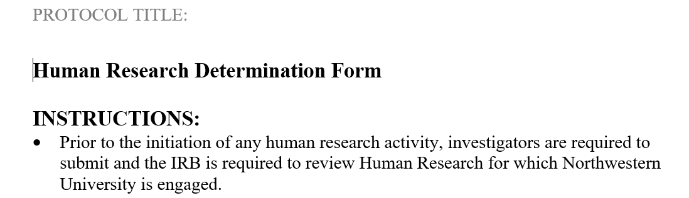

---

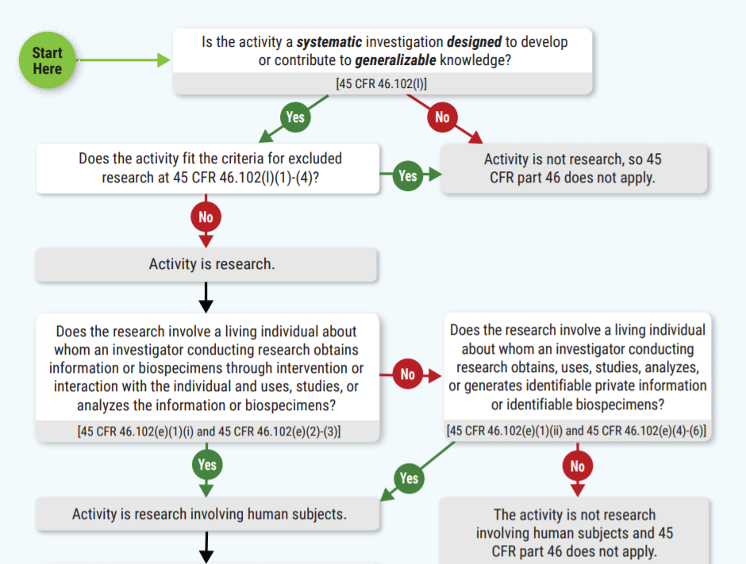

---

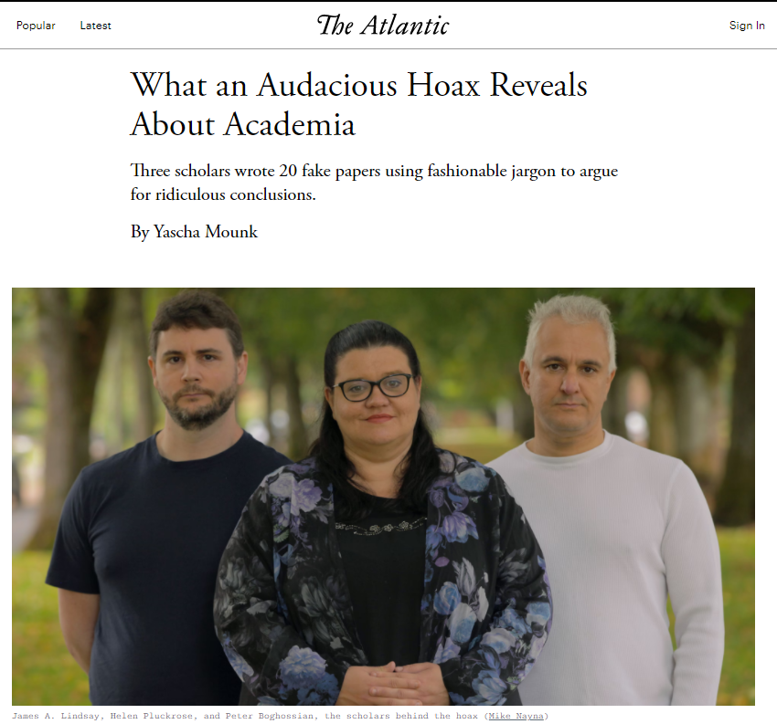

---


---

A group of scholars submitted fake, absurd papers to academic journals to expose what they saw as low standards in certain fields. The hoax revealed ethical gray areas: Is it acceptable to deceive editors to make a point?

* Was this *fabricating research*?
* Was this *unapproved human-subjects research*?

---

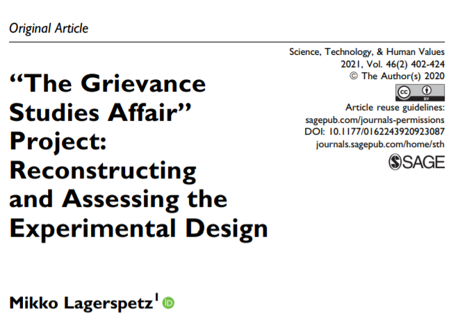

---

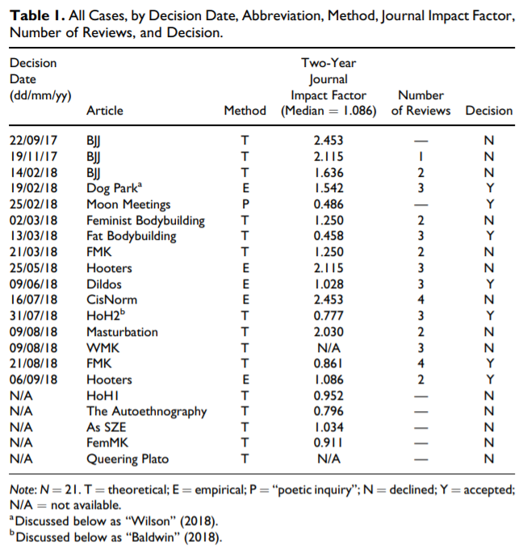

---

If an IRB approves of our research, does that mean we are ethically all
set?

---

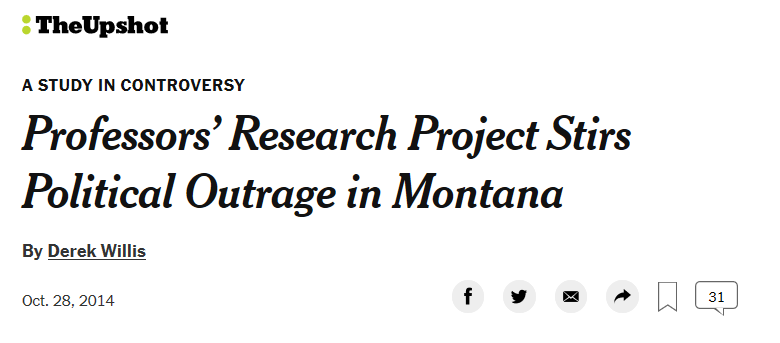

---

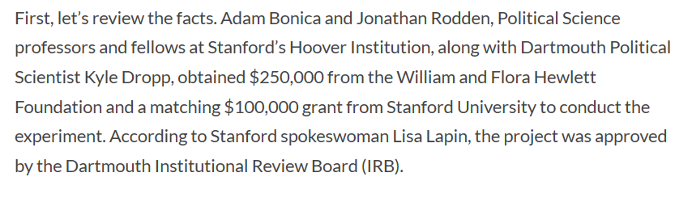

---

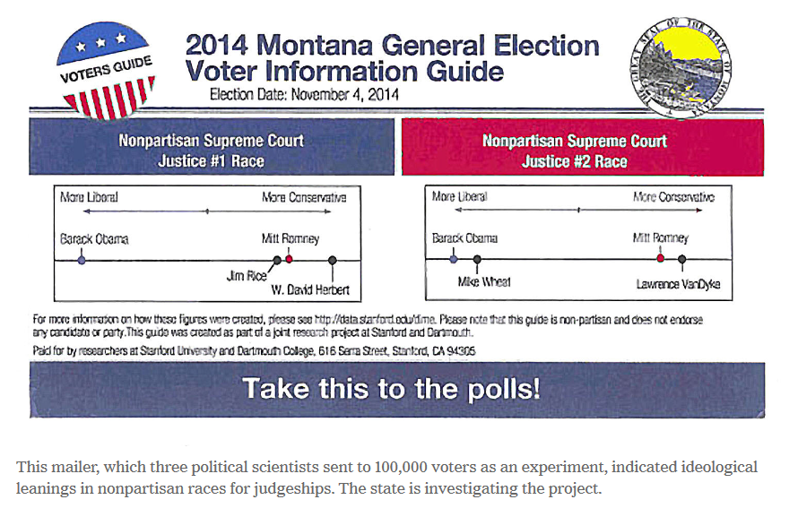

---

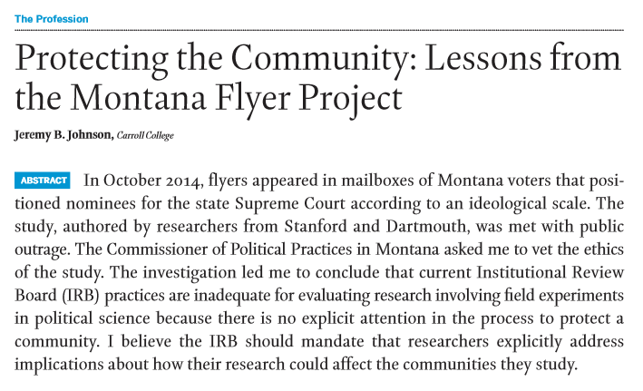

---
### Fabrication

Inventing research data or analytic results from scratch, and
distributing them in some way.

---

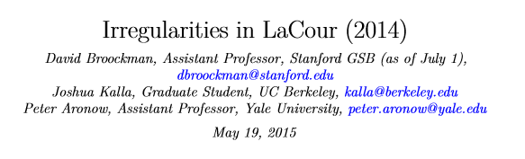

---

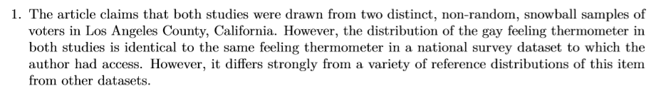

---

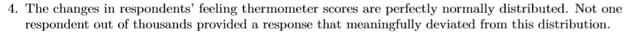

---

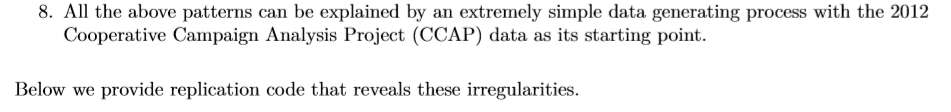

---

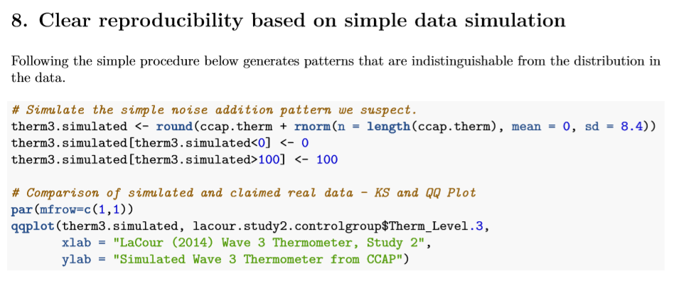

---

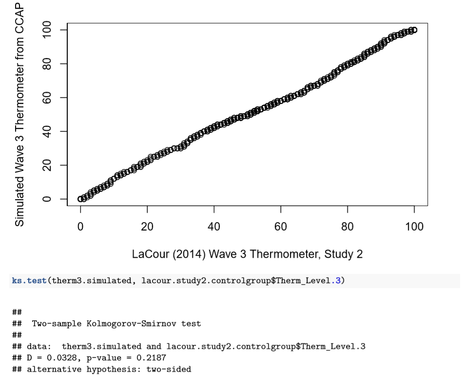

---

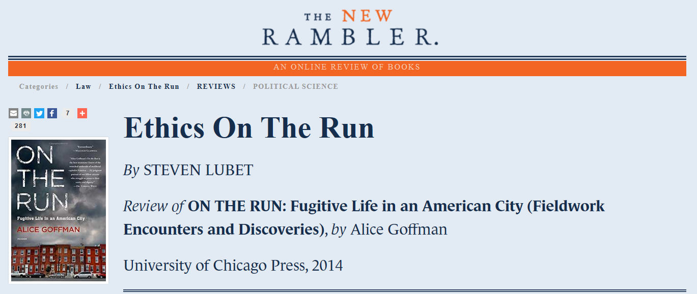


---

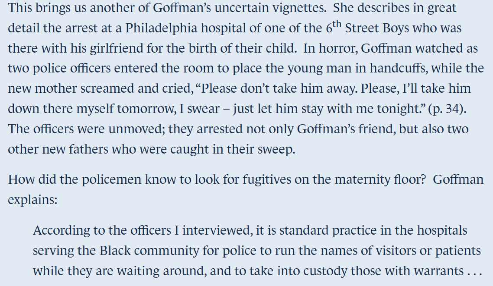


---

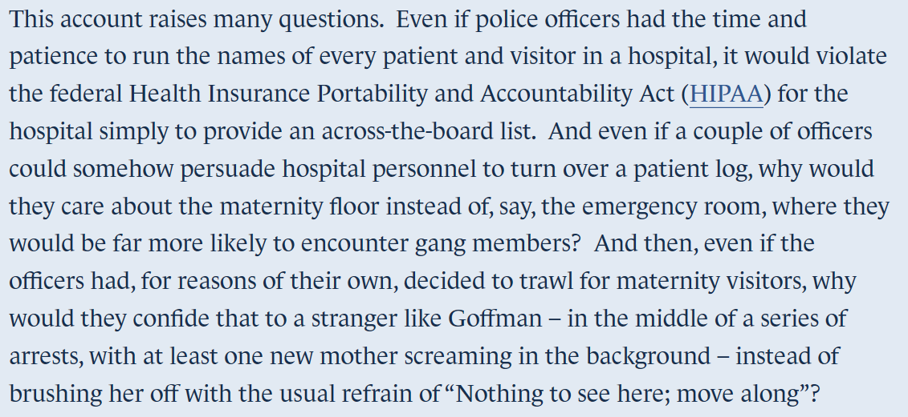


---

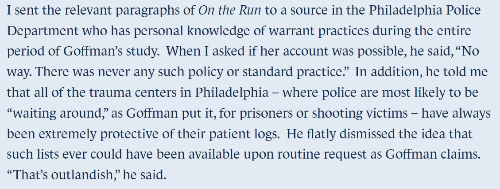


---

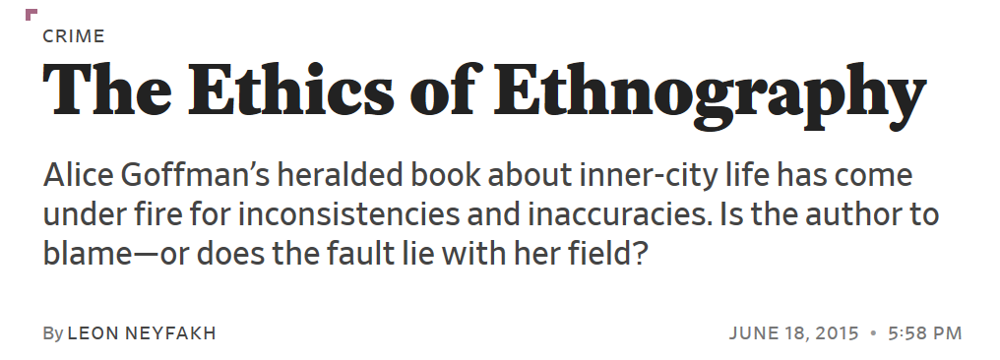


---

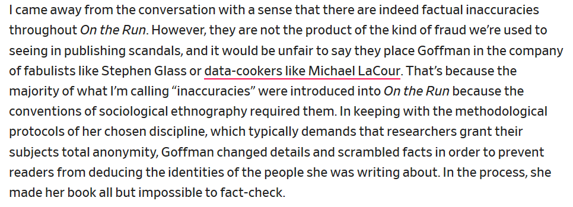


---

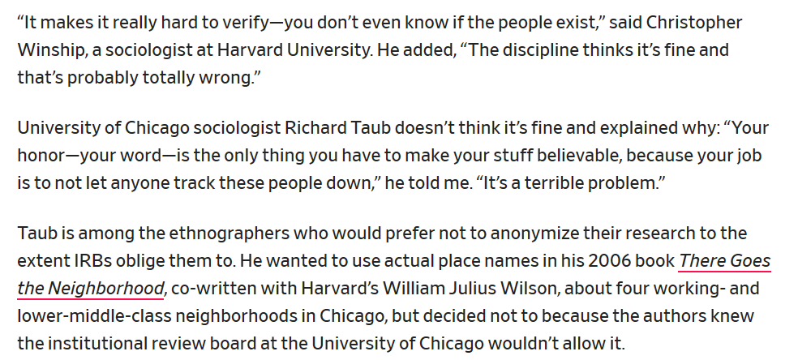

---
### Questions to Consider

* Did Goffman do anything illegal?

* Did she violate sociological norms about researcher distance?

* Did her presence put her subjects at risk?

* Could she have studied the same question differently?

* What would you have done?

---

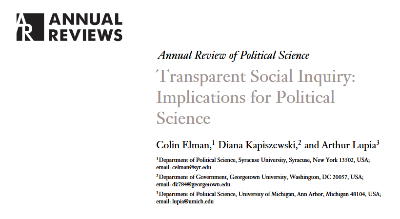

---

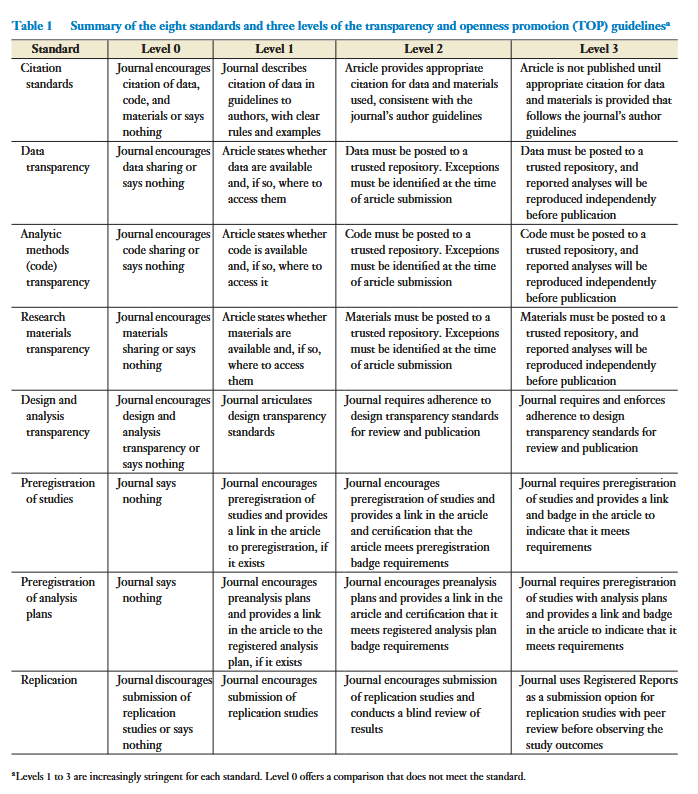
---
### Transparency in Practice

* Posting replication data and code

* Pre-registering study designs

* Disclosing funding sources

* Sharing materials for peer review

---

So, what makes research ethical?

* Institutional approval (IRB) is necessary but not sufficient

* Honesty in design, data collection, analysis, and reporting

* Respect for subjects' well-being and communities

* Transparency so others can build on your work

---

Ethics isn't a one-time checklist. It's about how we live our relationships with the communities of which we're part.