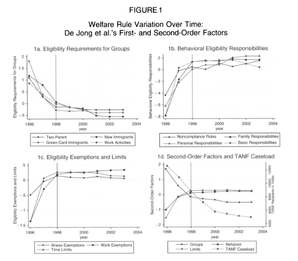

class: center, middle

```{css, echo=FALSE}
pre {
  max-height: 400px;
  overflow-y: auto;
}

pre[class] {
  max-height: 200px;
}
```

```{r setup, include=FALSE}
knitr::opts_chunk$set(echo = FALSE, warning = FALSE, message = FALSE)
library(tidyverse)
library(knitr)
```

```{r xaringan-themer, include=FALSE, warning=FALSE}
library(xaringanthemer)
style_mono_accent(
  base_color = "#1c5253",
  header_font_google = google_font("Josefin Sans"),
  text_font_google   = google_font("Montserrat", "300", "300i"),
  code_font_google   = google_font("Fira Mono"),
  text_font_size = "1.6rem"
)
```

### Where We've Been

All quarter, we've learned tools:
- Surveys and sampling
- Experiments
- Regression and machine learning
- Text analysis
- Qualitative methods

**Today:** A reminder that tools are just tools. The questions and substance come first.

---

### The Article

Soss, Condon, Holleque, and Wichowsky (2006)
"The Illusion of Technique: How Method-Driven Research Leads Welfare Scholarship Astray"
*Social Science Quarterly*

A critique of De Jong et al.'s factor analysis of state TANF rules

---

### The Research They Critique

De Jong et al. wanted to understand how state TANF (welfare) rules varied across states and over time.

**Their approach:**
- Used the Urban Institute's Welfare Rules Database
- Applied factor analysis to identify "underlying dimensions" of policy
- Then used these dimensions to study policy diffusion and welfare migration

---

### The Problem, in Brief

Soss et al. argue that De Jong et al. made a series of choices that:

1. **Privileged statistical convenience** over substantive knowledge
2. **Excluded important policies** because they didn't vary enough
3. **Included trivial policies** because they correlated nicely
4. **Created misleading dimensions** with no theoretical or substantive grounding
5. **Produced a distorted picture** of welfare reform

---

The result: a method-driven analysis that looked sophisticated but missed the story.

---

### The Core Argument

> "The compromises and insights that arise through a dialogue with substance and theory do not detract from the skillful use of method; they enrich and improve the use of method."

> "By choosing instead to privilege statistical concerns, the authors have inadvertently corrupted their test of the race to the bottom thesis and distorted their account of policy development."

---

### The "Illusion of Technique"

The term comes from William Barrett (1979):

The tendency to treat deep substantive and philosophical questions **as if they were essentially technical matters**.

In research: handling key analytic choices as if they were merely technical, neutral with regard to theory and substance.

This "illusion" doesn't put findings on neutral ground—it puts them into question.

---

### Decision Point 1: What Rules to Include?

De Jong et al. limited analysis to rules "from the clients' perspective," then applied two statistical filters:

1. Drop rules with less than 10% variation across states
2. Drop rules that correlate weakly with other measures

---

### What Gets Dropped?

**Noncitizen eligibility:** When federal TANF created this option, every state except Alabama made pre-1996 immigrants eligible.

- Profound consequences for poor immigrants
- But **no variation** → dropped from analysis

---

### What Gets Dropped?

**Diversion policies** that deflect applicants from program participation

**Family caps** that deny benefits to children conceived by TANF recipients

Both have substantial impact on clients
Both are **dropped** because of weak interitem correlations

---

### What Gets Included?

If a rule varies and correlates with other rules, it stays—regardless of importance.

Imagine a factory that:
- Cuts wages 10%
- Raises health insurance contributions 15%
- Adds a $100 employee-of-the-month award
- Adds free coffee in the break room

Count the policies: 50% harmful, 50% beneficial. But is that the right description?

---

### The 60-40 Conclusion

De Jong et al.: No "systematic shift toward more stringent welfare policy" because between 1996-2003:

- 40% of policy dimensions became more lenient
- 60% became more stringent

But if the dimensions are as unequal as wage cuts vs. free coffee, this conclusion misleads.

---

### The Race to the Bottom Thesis

Theory: States compete to offer less generous welfare to avoid becoming "magnets" for poor migrants.

**Prediction:** Convergence toward less generous policies

---

### How De Jong et al. Test It

They look for patterns across *all* their policy dimensions.

**Problem 1:** They dropped rules that showed convergence (because they lacked variation)

**Problem 2:** They included many minor rules that no one thinks would drive migration

> "How many poor families could give weight to the VISTA-volunteer rule when deciding where to live?"

---

### What a Fair Test Would Require

Identify policies that are:
- Highly salient
- Consequential for clients
- Easily perceived by officials as potential magnets

Time limits, work requirements, sanctions—not VISTA exemptions or co-resident grandparent income rules.

By giving equal weight to all, De Jong et al. diluted any signal and raised the chance of finding a "mixed pattern."

---

### Methodological Problems

**Serial correlation:** State policies in year t often just persist from year t-1.

Of the 153 first-order series underlying one factor:
- 74.5% show only one change or no change at all

Pooling years creates an illusion of more information than actually exists.

---

### When Did Change Actually Happen?

```{r, echo=FALSE, out.width="80%", fig.align='center'}
# This would be a placeholder for Figure 1 from the article
# You'd need to recreate or screenshot it

```

Dramatic change 1996-1998, then near-constancy 1998-2003.

For one dimension, 101% of the eight-year move toward stringency occurred by 1998.

The story isn't gradual evolution—it's a sharp transition followed by tinkering.

---

### The Factor Structure: Replication Attempt

Soss et al. tried to replicate De Jong et al.'s three-dimensional structure.

**Results:**
- Principal factors method → **one dimension** in every analysis
- Principal components → 2, 3, or 4 factors depending on years
- **None** matched the published three-dimensional structure

The dimensions appear to be hand-constructed, not empirically discovered.

---

### What Does This Mean?

If different rules were to load together, the trends might look very different.

Only 4 of the 11 first-order dimensions trend toward lenience. De Jong et al. grouped these together, producing a crisp contrast.

Alternative groupings might show trends canceling out.

---

### The Missing Grounding

Three possible ways to ground dimensions:

1. **Empirical** – the data's actual structure (didn't work)
2. **Theoretical** – operationalize specific constructs (not done)
3. **Substantive** – based on policy history (not done)

Instead, we get labels with no stories.

---

### Example: "Eligibility Requirements for Groups"

This dimension includes:
- Immigrant eligibility rules
- Work rules for two-parent families
- "Work-related activities" for all clients

**What single "policy attitude" connects these?**

---

### Three Separate Stories

**Immigrant rules:** Federal government imposed strict limits in 1996. States later softened them—not returning to AFDC levels, but easing the initial shock.

---

### Three Separate Stories

**Two-parent family rules:** Welfare reform sought to reverse "marriage penalties." States moved to soften stricter requirements for this group.

---

### Three Separate Stories

**Work activities:** As caseloads fell, states became less concerned about "work means work" and more concerned about actually moving clients into jobs.

These are separate dynamics, not one underlying philosophy.

---

### The Deeper Point

> "We see three alternative paths that the authors could have pursued, each of which would have allowed for a more effective balancing of theory, method, and substance."

The authors chose to privilege statistical concerns, and in doing so, lost the thread of their test of theory and failed to follow promising leads about policy.

---


### The Illusion of Technique

The danger: treating method as a substitute for thinking.

The reality: Good research requires constant dialogue between method, theory, and substance.

Technique is essential. Technique is not enough.

---

### So What's the Lesson for Us?

**1. Start with the question, not the method.**

Don't ask "What can I do with factor analysis?" Ask "What do I need to know about welfare policy?"

**2. Know your substance.**

You can't evaluate whether a measure is meaningful if you don't understand the thing you're measuring.

---

### Lessons (cont.)

**3. Theory matters for measurement.**

How you group items should reflect theoretical expectations, not just statistical correlations.

**4. Validity isn't just statistical.**

A finding can have great statistical properties and still be substantively meaningless.

**5. Replicate and probe.**

If you can't reproduce someone's quantitative results, something is wrong.

---

### The Course in Retrospect

We've learned many methods. But **none** of them work on autopilot.

Every method requires:
- Judgments about what to include and exclude
- Theoretical grounding
- Substantive knowledge
- Critical reflection

---

#### The Core Challenge

**We want to know things about the political world.**

But we can't just observe and trust our impressions.

**The fundamental problem:** We can't observe counterfactuals. We can't see the same case both with and without a cause.

All our methods are strategies for getting around this problem.

---

#### Strategy 1: Ask Good Questions

**Lecture 1:** Not all questions are answerable. Not all answerable questions are worth asking.

- Descriptive: What is happening?
- Causal: What causes what?
- Mechanistic: How does it happen?

The question shapes everything that follows.

---

#### Strategy 2: Measure Well

**Lecture 2:** Data isn't found—it's created.

- Conceptualization: What do we really mean by "democracy" or "racism"?
- Operationalization: How do we measure it?
- Validity: Are we measuring what we think we're measuring?

**The Global Terrorism Database** showed us that data sources have perspectives and limitations.

---

#### Strategy 3: Design for Comparison

**Lecture 3:** The causal inference framework

Four questions for any causal claim:

1. Is there a relationship?
2. Could the outcome cause the treatment?
3. Is there evidence of a causal pathway?
4. Have confounders been ruled out?

These questions work for any method.

---

#### Strategy 4: Experiments

**Lectures 4-5:** Randomization solves the confounding problem—if you can do it.

- Internal validity: High (if randomization works)
- External validity: Often limited
- Types: Lab, field, survey experiments

**Key insight:** Experiments are powerful but not always possible or ethical.

---

#### Strategy 5: Surveys and Sampling

**Lectures 6-7:** When we can't experiment, we try to observe systematically.

- Random sampling: Each case has known probability of selection
- But non-response ruins random samples
- Convenience samples can be useful for some questions (Ellis et al.) but not for estimating population parameters

**Remember:** As surveys evolve, our strategies change, but transparency remains essential.

---

#### Strategy 6: Quantitative Observation

**Lectures 8-10:** Regression as a tool for observational data.

- Bivariate regression: Quantify relationships between two variables
- Multivariate regression: Control for confounders
- But you can only control for what you think to measure

**The four questions** still apply, and regression can be a tricky tool for causal inference.

---

#### Strategy 7: Machine Learning

**Lecture 11:** When prediction, not always causal inference, is the goal.

- CART, random forests, LASSO
- Flexible, powerful for complex patterns
- But "black box" tradeoffs and different goals (sometimes but not always causal inference)

---

#### Strategy 8: Text as Data

**Lecture 12:** Politics happens in language.

- Dictionary methods, topic models, embeddings, LLMs
- Seawright & Good: Women in far-right spaces
- Rossiter: Measuring agenda-setting in hearings

**Validation matters:** Precision, recall, F1; know if your model works.

---

#### Strategy 9: Qualitative Methods

**Lectures 13-14:** Depth over breadth.

- Types of evidence: interviews, archives, observation
- Comparative case studies (Mill's methods, natural experiments)
- Process-tracing (theory-testing, theory-building)

**Within is better than between:** Process-tracing is the state of the art, not Mill's methods.

---

#### Strategy 10: Applied Examples

**Lecture 15:** Qualitative research in practice

- Gibson: Boundary control and subnational authoritarianism
- Thurston: Policy feedback and advocacy groups
- Gerzso: Judicial networks and authoritarianism

Each study asks: What is the evidence? What kind of process-tracing design? What makes it convincing?

---

#### Strategy 11: Ethics

**Lecture 16:** Our obligations when using these tools.

- IRB is necessary but not sufficient (Montana milfoil)
- Fabrication (LaCour) vs. ambiguity (Goffman)
- Transparency: data, code, pre-registration

**Ethics isn't a checklist.** It's about how we live our relationships with the communities we study.

---

#### Strategy 12: The Illusion of Technique

**Today's reading:** Methods are tools, not masters.

Soss et al. remind us:
- Statistical convenience ≠ substantive importance
- Theory and substance must guide method choice
- The fanciest analysis can still be wrong

---

### What Unites These Strategies

**They're mostly attempts to answer the same core questions:**

- What's happening?
- Why is it happening?
- How can we know?

---

### What Unites These Strategies

**They require judgment:**
- What to measure
- How to measure it
- What to compare
- What to control for
- What counts as evidence

---

### What Unites These Strategies

**None of them work on autopilot.**

---

### What You Should Take Away

**1. A toolkit.** You've seen the major methods political scientists use.

**2. A framework.** The four questions for causal inference work for any study.

**3. A critical eye.** You can now identify strengths and weaknesses in empirical arguments.

---

### What You Should Take Away

**4. A sense of tradeoffs.** Every method involves choices—and every choice closes off some possibilities while opening others.

**5. Humility.** No single study answers a question definitively. Knowledge accumulates slowly, through many studies using many methods.

---

### Open Q&A

**What questions do you have?**

- About specific methods?
- About the readings?
- About research design?
- About the course?
- About what comes next?


---

### One Final Question

As you leave this course and encounter research—in other classes, in the news, in your own future work—ask:

**Is this analysis driven by the question, or by the method?**

The answer will tell you a lot about whether to trust the conclusions.

---

### Looking Forward

You now have a toolkit for evaluating and producing empirical research.

More importantly, you have a framework for thinking about what makes research credible—and what can lead it astray.

Use it well.

* If you go on to do research, I'd love to hear what you find. Office hours are always open.