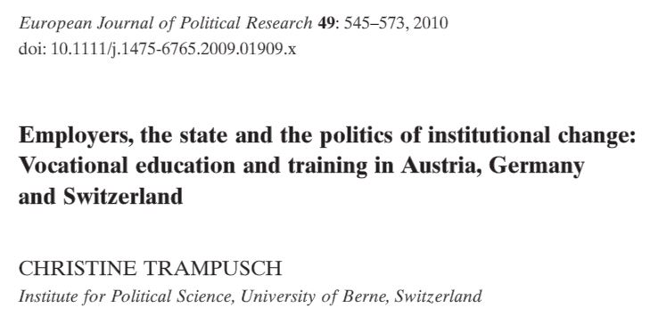
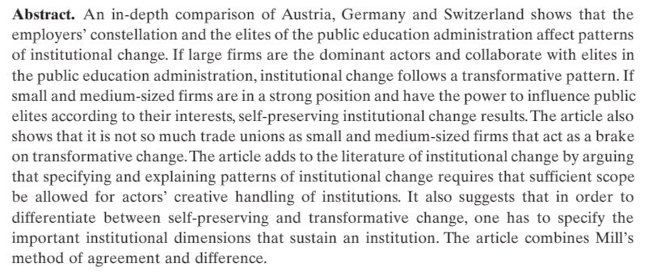
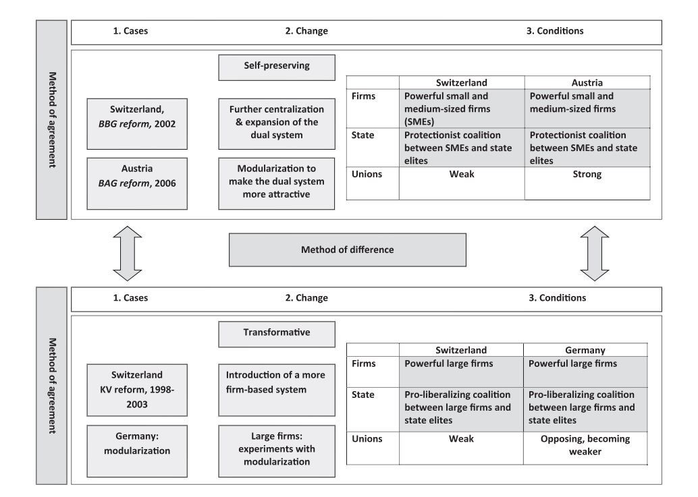
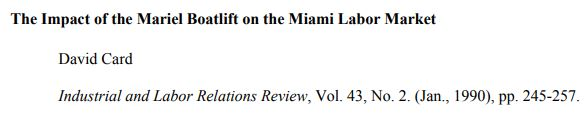
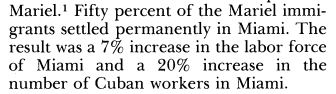
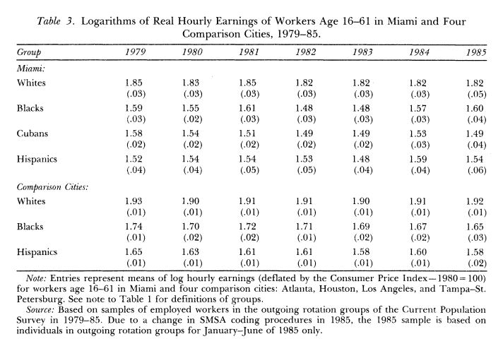
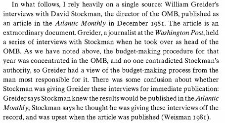
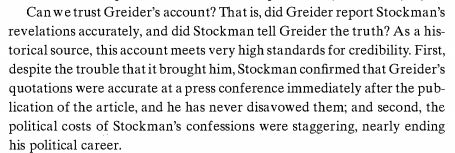
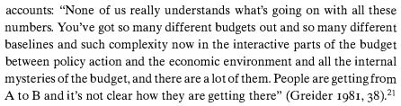
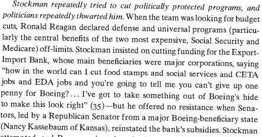

class: center, middle

```{css, echo=FALSE}
pre {
  max-height: 400px;
  overflow-y: auto;
}

pre[class] {
  max-height: 200px;
}
```

```{r, load_refs, include=FALSE, cache=FALSE}
# Initializes
library(RefManageR)

library(ggplot2)
library(dplyr)
library(readr)
library(nlme)
library(jtools)
library(mice)
library(knitr)
library(DiagrammeR)

BibOptions(check.entries = FALSE,
           bib.style = "authoryear", # Bibliography style
           max.names = 3, # Max author names displayed in bibliography
           sorting = "nyt", #Name, year, title sorting
           cite.style = "authoryear", # citation style
           style = "markdown",
           hyperlink = FALSE,
           dashed = FALSE)

```
```{r xaringan-themer, include=FALSE, warning=FALSE}
library(xaringanthemer,MnSymbol)
style_mono_accent(
  base_color = "#1c5253",
  header_font_google = google_font("Josefin Sans"),
  text_font_google   = google_font("Montserrat", "300", "300i"),
  code_font_google   = google_font("Fira Mono"),
  text_font_size = "1.6rem"
)
```

### Qualitative Methods

Looking at description and processes in *depth* instead of analyzing large data sets to achieve *breadth*.

---
### Types of Qualitative Data

-   Historical methods

-   In-depth interviews

-   Focus groups

-   Participant observation

---

```{r, echo=FALSE, out.width="80%", fig.retina = 1, fig.align='center'}
quant_graph <- create_graph() %>%
    add_node(label="State Weakness") %>%
    add_node(label="Rural Poverty") %>%
    add_node(label="Revolution") %>%
    add_edge(from = 1, to = 2) %>%
    add_edge(from = 1, to = 3) %>%
    add_edge(from = 2, to = 3)
 
render_graph(quant_graph, layout="nicely")
```

---

```{r, echo=FALSE, out.width="80%", fig.retina = 1, fig.align='center'}
elab_graph <- create_graph() %>%
    add_node(label="State Weakness") %>%
    add_node(label="Rural Poverty") %>%
    add_node(label="Landlord Conflict") %>%
    add_node(label="Revolution") %>%
    add_edge(from = 1, to = 2) %>%
    add_edge(from = 1, to = 4) %>%
    add_edge(from = 2, to = 3) %>%
    add_edge(from = 3, to = 4)
    
render_graph(elab_graph, layout="nicely")
```


---
### Even More Elaboration
```{r, echo = FALSE, out.width="70%", fig.retina = 1, fig.align='center'}
include_graphics("images/mahoneyskocpol.png")
```

---
### Comparative Case Studies

Can we structure the in-depth study of a few cases together to teach us more than we would get from studying each case in isolation?

---
### The Method of Difference

> If an instance in which the phenomenon under investigation occurs, and
> an instance in which it does not occur, have every circumstance in
> common save one, that one occurring only in the former; the
> circumstance in which alone the two instances differ is the effect, or
> the cause, or an indispensable part of the cause, of the phenomenon.
> (Mill 1843/2002)


---



---



---



---
### The Method of Difference

Debunking the Method of Difference


---

<div style="display: flex; gap: 10px;">
  
  
</div>

---

<div style="display: flex; gap: 10px;">
  
  
</div>

<div style="display: flex; gap: 10px;">
  
  
</div>

---

<div style="display: flex; gap: 10px;">
  
  
</div>

<div style="display: flex; gap: 10px;">
  
  
</div>


---

<div style="display: flex; gap: 10px;">
  
  
</div>

<div style="display: flex; gap: 10px;">
  
  
</div>

---
### The Method of Difference

The key weakness: in a qualitative paired comparison, even small differences are enough to destabilize the comparison. We don't have an error term to absorb these!

---
### The Method of Agreement

Mill had other methods, less frequently used. One is the Method of Agreement, in which scholars study cases that have the same score on the outcome but are as different as possible in terms of circumstances. Then they search for commonalities to try to discern the cause.

* What are the weaknesses with this approach?

---
### Natural Experiments as Improved Method of Difference

Sometimes, a shock to a case can create before-after and cross-case comparisons that improve on the Method of Difference. We call these natural experiments.

---



---


---



---



---


---


---
### Process-Tracing I: Theory-Testing

---


---


---

---


---

---
### Process Tracing 2: Theory-Building

---


---
### Example: Prasad on Reagan

Were Reagan's spending cuts based on economic analysis, conservative
ideology, or pragmatism?


---



---



---



---



---

Using the typology of variants of process tracing we introduced above, which type is Prasad's example?

---
### Case Selection for Process Tracing

How do people choose cases for in-depth study? How *should* they choose cases to maximize learning?

---
### Case Selection for Process Tracing

According to Seawright and Gerring (2008), common approaches include choosing cases that are:

  * Typical: a case that fits an established theory well
  * Deviant: a case that is an especially poor fit for an established theory
  * Extreme: a case that has an unusually high or low value on the outcome or treatment variable
  * Influential: a case that substantially affects cross-case relationships when it is dropped from the data
  
---
### Case Selection for Process Tracing

In subsequent work, Seawright (2016) has argued that there is usually more to learn from deviant cases and cases that are extreme on the treatment variable than from others.

* Deviant cases are the ones that don't fit existing knowledge, so there is more to learn.

* Extreme cases on the treatment are ones where the causal path will be especially clear and easy to trace.

---
### Case Selection for Process Tracing

So when you're designing qualitative research, think about where the most leverage is. This will usually not be in the typical cases!

---
### Qualitative Methods: Key Takeaways

**1. Qualitative evidence takes many forms**
- Historical documents, in-depth interviews, focus groups, participant observation
- Each provides different kinds of insight into political processes

**2. Qualitative research is fundamentally about causal elaboration**
- Adding theoretical nuance and mechanism to quantitative findings
- Opening the "black box" between cause and effect

**3. Comparative case studies approximate experimental logic**
- Mill's methods provide an ideal, but perfect matching is impossible
- Natural experiments offer stronger comparisons when nature provides the shock

---

### Qualitative Methods: Key Takeaways

**4. Process-tracing designs within cases**
- Different kinds of designs pursue different aims
- Theory-testing, theory-building, theory-revising, and outcome-explaining process-tracing have different goals and typically different designs

**5. Case selection can help optimize our learning**
- Typical cases at best confirm what we already know
- Deviant and extreme cases teach us something new
- Choose cases for *leverage*, not convenience

**6. Qualitative methods aren't just broken quantitative research**
- They answer questions quantitative methods can't
- Description, mechanism, process, context all matter

---

### Next Time: Applied Qualitative Examples

- **Gibson (2005):** Boundary control and subnational authoritarianism in democratic countries
- **Thurston (2015):** Policy feedback and advocacy groups' access to homeownership programs

*How do these scholars use the tools we've discussed today?*