class: center, middle

```{css, echo=FALSE}
pre {
  max-height: 400px;
  overflow-y: auto;
}

pre[class] {
  max-height: 200px;
}
```

```{r, load_refs, include=FALSE, cache=FALSE}
# Initializes
library(RefManageR)

library(ggplot2)
library(dplyr)
library(readr)
library(nlme)
library(jtools)
library(hrbrthemes)
library(mice)
library(knitr)
library(DiagrammeR)

BibOptions(check.entries = FALSE,
           bib.style = "authoryear", # Bibliography style
           max.names = 3, # Max author names displayed in bibliography
           sorting = "nyt", #Name, year, title sorting
           cite.style = "authoryear", # citation style
           style = "markdown",
           hyperlink = FALSE,
           dashed = FALSE)

```
```{r xaringan-themer, include=FALSE, warning=FALSE}
library(xaringanthemer,MnSymbol)
style_mono_accent(
  base_color = "#1c5253",
  header_font_google = google_font("Josefin Sans"),
  text_font_google   = google_font("Montserrat", "300", "300i"),
  code_font_google   = google_font("Fira Mono"),
  text_font_size = "1.6rem"
)
```

```{r, echo=FALSE, out.width="80%", fig.retina = 1, fig.align='center'}
quant_graph <- create_graph() %>%
    add_node(label="State Weakness") %>%
    add_node(label="Rural Poverty") %>%
    add_node(label="Revolution") %>%
    add_edge(from = 1, to = 2) %>%
    add_edge(from = 1, to = 3) %>%
    add_edge(from = 2, to = 3)
 
render_graph(quant_graph, layout="nicely")
```

---

```{r, echo=FALSE, out.width="80%", fig.retina = 1, fig.align='center'}
elab_graph <- create_graph() %>%
    add_node(label="State Weakness") %>%
    add_node(label="Rural Poverty") %>%
    add_node(label="Landlord Conflict") %>%
    add_node(label="Revolution") %>%
    add_edge(from = 1, to = 2) %>%
    add_edge(from = 1, to = 4) %>%
    add_edge(from = 2, to = 3) %>%
    add_edge(from = 3, to = 4)
    
render_graph(elab_graph, layout="nicely")
```


---
### Even More Elaboration
```{r, echo = FALSE, out.width="70%", fig.retina = 1, fig.align='center'}
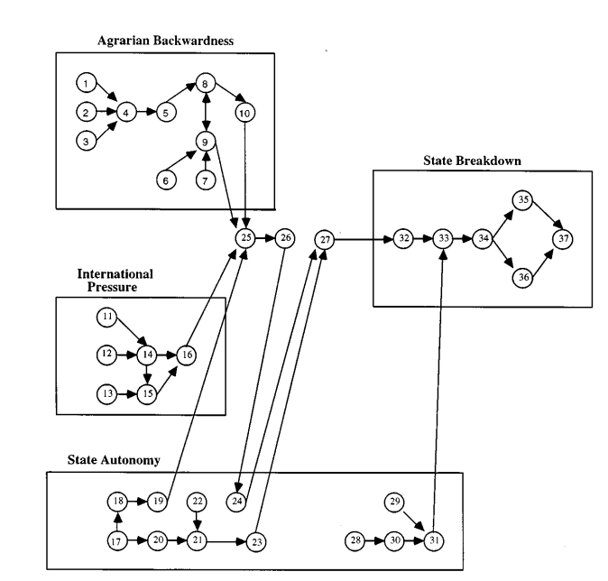
```

---
### Qualitative Data Collection

-   Historical methods

-   In-depth interviews

-   Focus groups

-   Participant observation


---
### Looking Directly at Counterfactuals


---


---


---


---


---


---


---
### Process-Tracing I: Theory-Testing

---
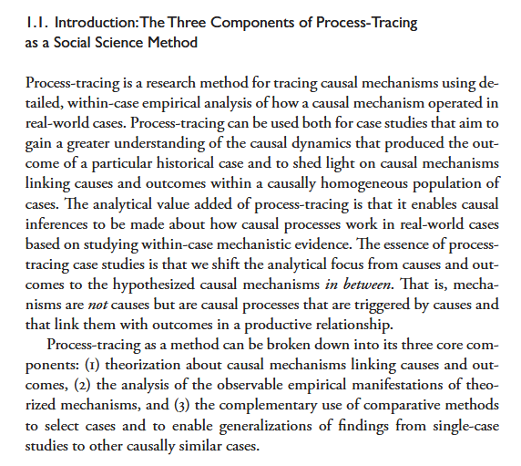


---
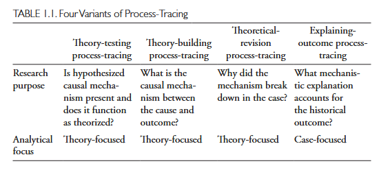

---
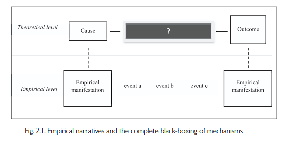
---
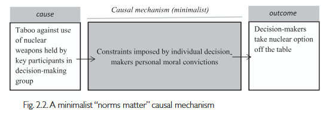


---
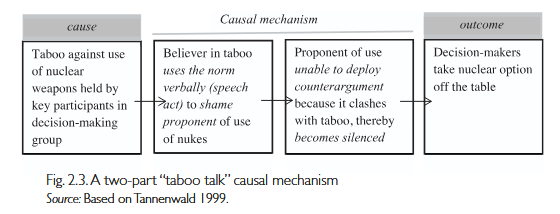
---
### Process Tracing 2: Theory-Building

---
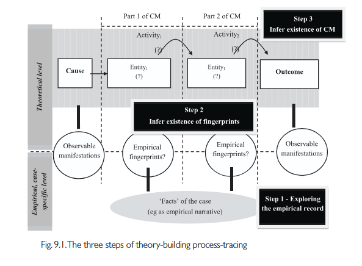

---
### Example: Prasad on Reagan

Were Reagan's spending cuts based on economic analysis, conservative
ideology, or pragmatism?


---


---


---


---


---
### The Method of Difference

> If an instance in which the phenomenon under investigation occurs, and
> an instance in which it does not occur, have every circumstance in
> common save one, that one occurring only in the former; the
> circumstance in which alone the two instances differ is the effect, or
> the cause, or an indispensable part of the cause, of the phenomenon.
> (Mill 1843/2002)


---


---


---


---
### The Method of Difference

Debunking the Method of Difference


---

<div style="display: flex; gap: 10px;">
  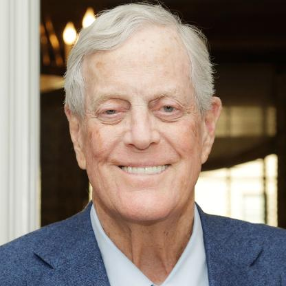
  
</div>

---

<div style="display: flex; gap: 10px;">
  
  
</div>

<div style="display: flex; gap: 10px;">
  
  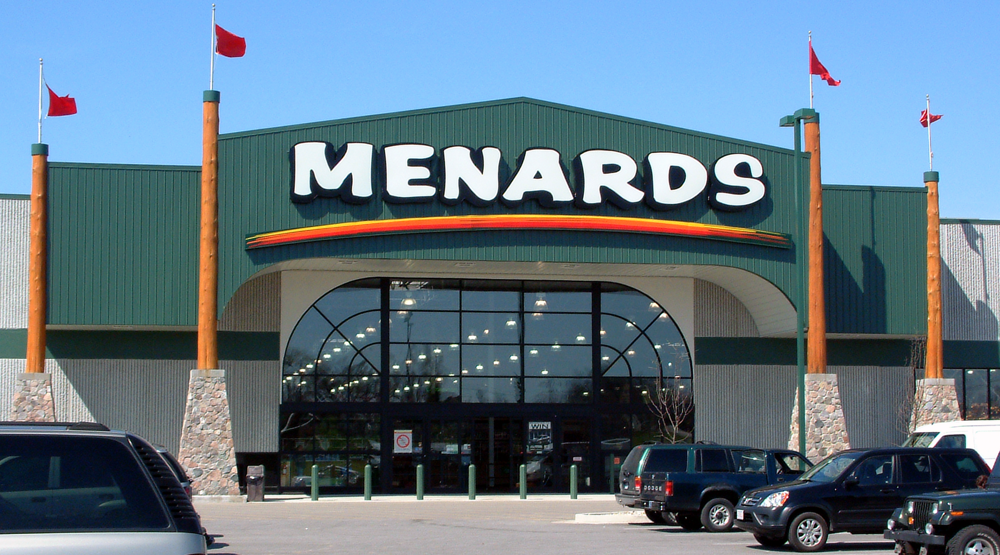
</div>

---

<div style="display: flex; gap: 10px;">
  
  
</div>

<div style="display: flex; gap: 10px;">
  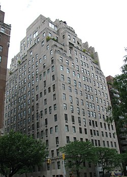
  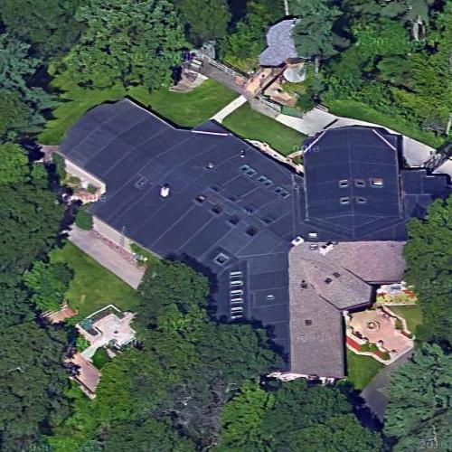
</div>


---

<div style="display: flex; gap: 10px;">
  
  
</div>

<div style="display: flex; gap: 10px;">
  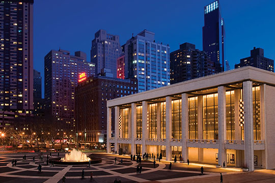
  
</div>
