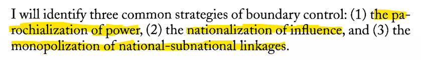
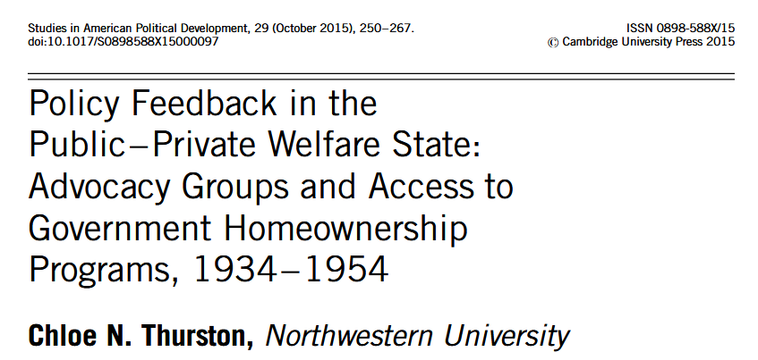
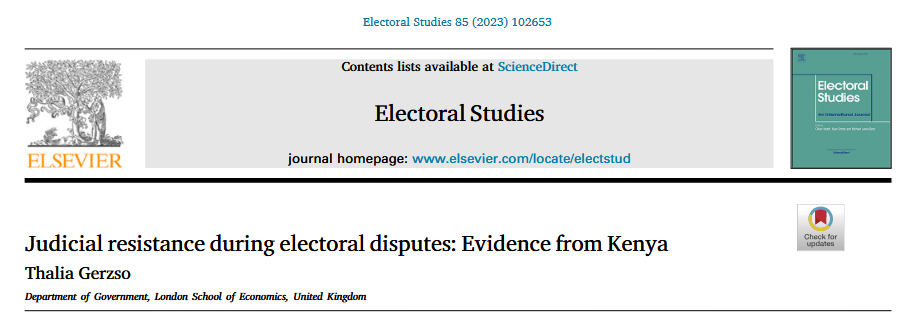
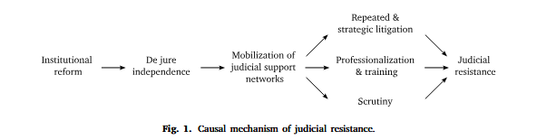
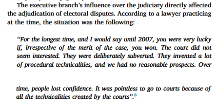
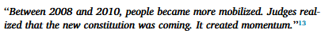
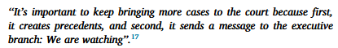
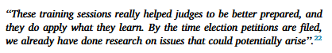
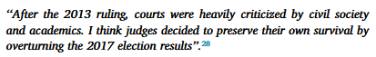

class: center, middle

```{css, echo=FALSE}
pre {
  max-height: 400px;
  overflow-y: auto;
}

pre[class] {
  max-height: 200px;
}
```

```{r, load_refs, include=FALSE, cache=FALSE}
# Initializes
library(RefManageR)

library(ggplot2)
library(dplyr)
library(readr)
library(nlme)
library(jtools)
library(hrbrthemes)
library(mice)
library(knitr)
library(DiagrammeR)

BibOptions(check.entries = FALSE,
           bib.style = "authoryear", # Bibliography style
           max.names = 3, # Max author names displayed in bibliography
           sorting = "nyt", #Name, year, title sorting
           cite.style = "authoryear", # citation style
           style = "markdown",
           hyperlink = FALSE,
           dashed = FALSE)

```
```{r xaringan-themer, include=FALSE, warning=FALSE}
library(xaringanthemer,MnSymbol)
style_mono_accent(
  base_color = "#1c5253",
  header_font_google = google_font("Josefin Sans"),
  text_font_google   = google_font("Montserrat", "300", "300i"),
  code_font_google   = google_font("Fira Mono"),
  text_font_size = "1.6rem"
)
```

```{r, echo = FALSE, out.width="70%", fig.retina = 1, fig.align='center'}

```

---
```{r, echo = FALSE, out.width="70%", fig.retina = 1, fig.align='center'}
include_graphics("images/pt3.png")
```

---

```{r, echo = FALSE, out.width="70%", fig.retina = 1, fig.align='center'}

```

---

```{r, echo = FALSE, out.width="70%", fig.retina = 1, fig.align='center'}

```

---

```{r, echo = FALSE, out.width="70%", fig.retina = 1, fig.align='center'}

```

---

```{r, echo = FALSE, out.width="70%", fig.retina = 1, fig.align='center'}

```

---

```{r, echo = FALSE, out.width="70%", fig.retina = 1, fig.align='center'}

```

---

-   What is the *evidence*?

---
```{r, echo = FALSE, out.width="70%", fig.retina = 1, fig.align='center'}
include_graphics("images/pt3.png")
```

---

```{r, echo = FALSE, out.width="70%", fig.retina = 1, fig.align='center'}

```

---

```{r, echo = FALSE, out.width="70%", fig.retina = 1, fig.align='center'}

```

---
```{r, echo = FALSE, out.width="70%", fig.retina = 1, fig.align='center'}

```

---
```{r, echo = FALSE, out.width="70%", fig.retina = 1, fig.align='center'}

```

---

```{r, echo = FALSE, out.width="70%", fig.retina = 1, fig.align='center'}

```

---

```{r, echo = FALSE, out.width="70%", fig.retina = 1, fig.align='center'}

```


---
### Thurston Article

-   What is the *evidence*?

---

```{r, echo = FALSE, out.width="70%", fig.retina = 1, fig.align='center'}

```

---

```{r, echo = FALSE, out.width="70%", fig.retina = 1, fig.align='center'}

```

---

```{r, echo = FALSE, out.width="70%", fig.retina = 1, fig.align='center'}

```

---

```{r, echo = FALSE, out.width="70%", fig.retina = 1, fig.align='center'}

```

---

```{r, echo = FALSE, out.width="70%", fig.retina = 1, fig.align='center'}

```

---

```{r, echo = FALSE, out.width="70%", fig.retina = 1, fig.align='center'}

```

---

```{r, echo = FALSE, out.width="70%", fig.retina = 1, fig.align='center'}

```

---

```{r, echo = FALSE, out.width="70%", fig.retina = 1, fig.align='center'}

```

---

```{r, echo = FALSE, out.width="70%", fig.retina = 1, fig.align='center'}

```
